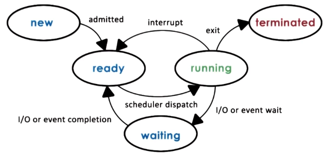
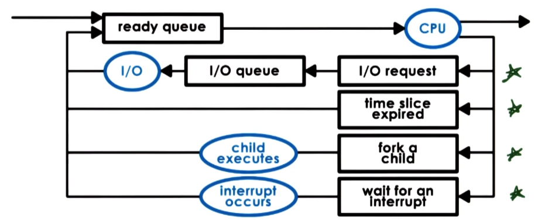

# Week 2 - Processes and Process Management

![[Process]]

### Aside

![[Heap (OS)]]

![[Stack (OS)]]

![[Address space (OS)|address space]]

## Metaphor

A process is line an order of toys:
- State of execution:
	- Completed,
	- waiting, or
	- In progress.
- Parts and temporary holding area
	- Pieces used to make the toy, or
	- Containers to put the pieces.
- May require special hardware:
	- Sewing machine or
	- glue gun.

This is analogy to an [[Operating system (OS)|OS]] where a [[Process|process]] has:
- State of execution:
	- Program counter, or
	- Stack
- Parts and temporary holding area
	- data, or
	- registered state in memory.
- May require special hardware:
	- I/O, or
	- access to sound output.

## Process execution state

For the [[Operating system (OS)|OS]] to stop and start running [[Process|processes]] it must keep track of what it is doing. For this it uses:
- [[Program counter (PC)]]
- [[CPU register]]
- [[Stack Pointer (SP)]]

All this information is stored in the [[Process control block (PCB)|PCB]]:

![[Process control block (PCB)|PCB]]

This block is fully instantiated when a [[Process|process]] starts however it is frequently updated as the process is executing. It is the job of the [[Operating system (OS)|OS]] to keep this up to date and correct - it will need this when it starts and stops [[Process|processes]].

### Switching [[Process|process]]

When running a given [[Process|process]] that [[Central processing unit (CPU)|CPU]] has the [[Process control block (PCB)|PCB]] loaded into the [[CPU register|CPU registers]]. If the [[Central processing unit (CPU)|CPU]] were to suspend that process it would have to write that [[Process control block (PCB)|PCB]] to memory and load the new [[Process|processes]] [[Process control block (PCB)|PCB]] into the [[CPU register|CPU registers]]. This is called a [[Context switch (CPU)]].

![[Context switch (CPU)]]

Context switching is costly for two reasons:
- Direct costs: This comes from physically having to write the [[Process control block (PCB)|PCB]] from the [[CPU register|CPU registers]] into memory and vice versa.
- Indirect costs: The [[Central processing unit (CPU)|CPU]] has multiple layers of [[Cache|caches]]. When switching from one process to another you have to switch the data present in all these [[Cache|caches]] normally making data access temporarily very costly.

### Process life cycle

During a processes time it goes through multiple different stages.
- New: Once the user issues a process that they want to start a [[Process control block (PCB)|PCB]] is made and it is admitted to the [[Central processing unit (CPU)|CPU]].
- Ready: This is a [[Process|process]] that has something to do but is not being ran on the [[Central processing unit (CPU)|CPU]] yet.
- Waiting: If the process has to wait on some event from the network or I/O then it will be moved into a waiting stating for that to finish.
- Running: It will have been [[Context switch (CPU)|context switched]] onto and the [[Process control block (PCB)|PCB]] loaded into the [[CPU register]].
- Terminated: Once a process has exited or error-ed it moves state to terminated to be cleaned up. 

### Creation

When you start the computer the [[Operating system (OS)|OS]] starts a number of processes that have privileged access. These in tern create the application that you run on your computer. There are two [[System call|system calls]] to create a new [[Process|process]]:
- Fork: This creates an exact copy of the current process, including the [[Program counter (PC)|program counter]].
- Exec: This replaces a [[Process|processes]] [[Process control block (PCB)|PCB]] with that of a new program.
The normal flow for a [[Process|process]] to start another one is to call fork followed by exec.

### CPU Scheduler

This is a process that determines which one of the ready processes will be dispatched next to the CPU and how long it should run for. This is done via 3 operations:
- **Preempt**: Interrupt and save the current context.
- **Schedule**: Run the scheduler to choose the next process.
- **Dispatch**: dispatch a process and switch to its context.
An efficient [[Operating system (OS)|OS]] wants to spend as much time running processes the user wants to run and the least time possible running the above 3 operations.

There are two important decisions that you must take when deciding on the scheduler.
- How long should processes run for?
- What metrics to choose the next process to run?
### I/O scheduling

When a process is stopped by an [[Input output (IO)|IO]] operation this is then handled by the [[Device driver|device driver]] associated with that [[Input output (IO)|IO]] task. The [[Process|process]] will enter the waiting state until the [[Device driver|device driver]] interrupts the [[Central processing unit (CPU)|CPU]] to let it know the operation has been completed and the [[Process|process]] can move back to the ready state. Though there are other ways this waiting state can end - for example a time out.

## Inter-process communication

As modern applications get more complex they are being structured to be multiple processes communicating with on another. However, the [[Operating system (OS)|OS]] is on purposely structured to isolate different applications from one another. Therefore they need to communicate to each other using [[Inter-process communication (IPC)|IPC]]

![[Inter-process communication (IPC)|IPC]]
