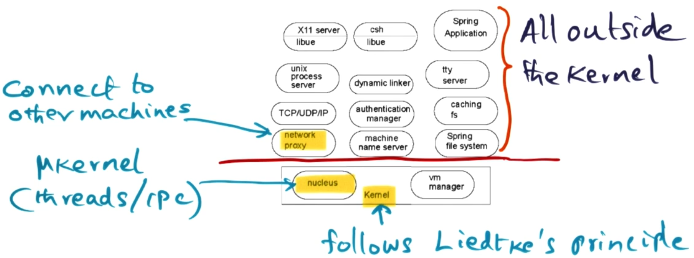
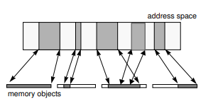
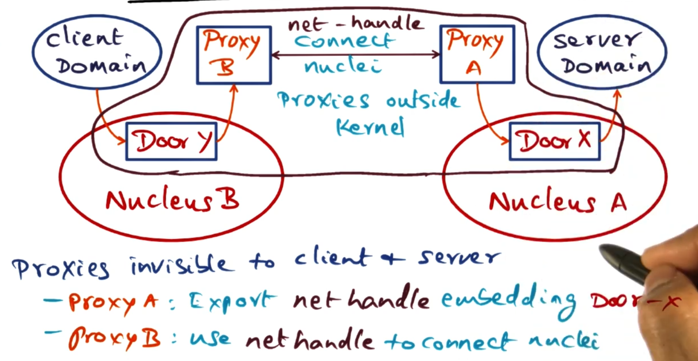
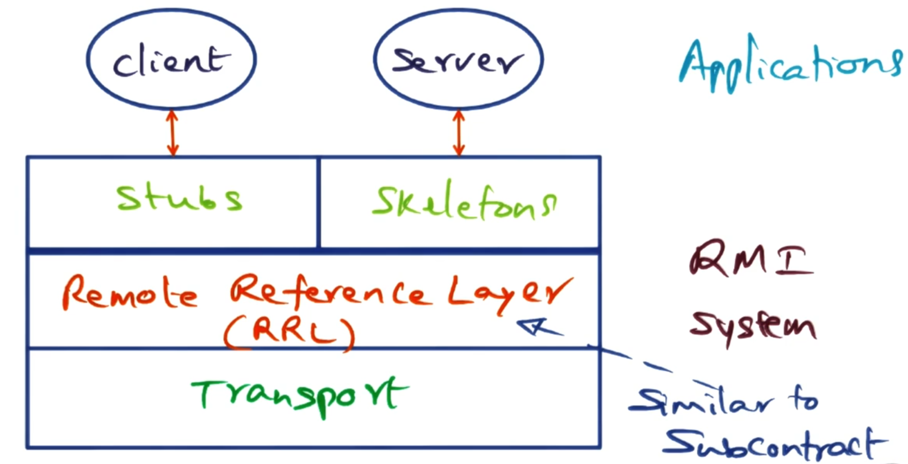
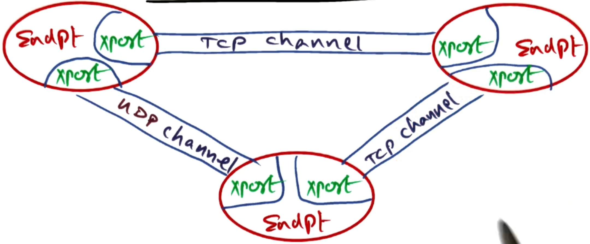
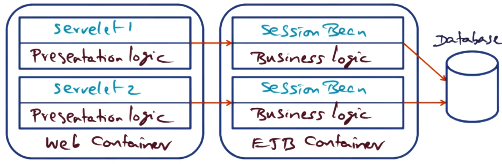
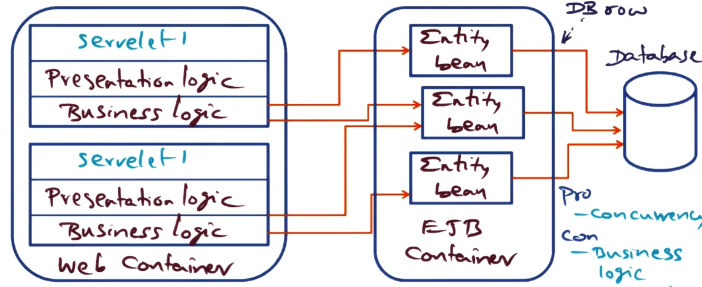
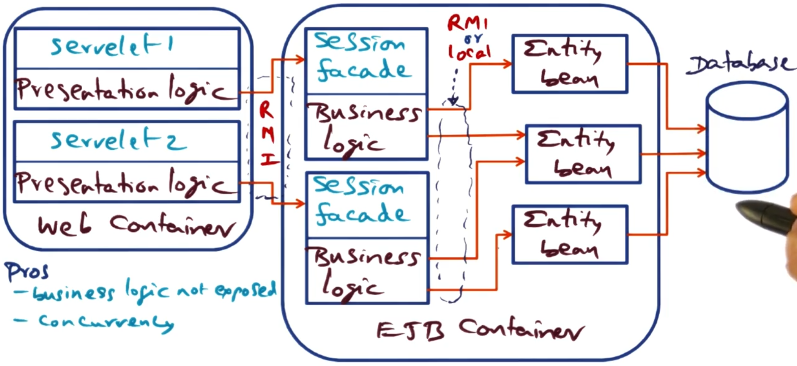

---
aliases:
checked: false
course: "[[CS6210 Advanced Operating Systems]]"
created: 2025-10-23
last_edited: 2025-10-23
draft: true
tags:
  - OMSCS
type: lecture
week: 6
---

# Week 6 - Distributed objects and middle ware

## Spring OS

When innovating as a company in the OS space you have two options:

1. Build a new OS from scratch.

2. Build a better implementation of an existing OS.

This decision is normally constrained by your customer base.
In the company Sun Microsystem, they choose to keep the unix interface but try for better 'under the hood' implementations.
This is similar to CPU's which are said to be 'Intel inside' but have different implementations.
In this case it was 'Unix inside' but they changed the implementation.

### Procedural vs Object design

The distinction between procedural and object-oriented design is often oversimplified.

**Procedural Design (Traditional Unix):**
- You have **data structures** (file descriptors, process control blocks, etc.)
- You have **functions** that operate on those structures (open(), read(), write())
- The function doesn't "belong to" the data - you pass data to functions
- System calls are essentially: `function(handle, parameters) → result`

**Object-Oriented Design (Spring OS):**
- You have **objects** with their own identity and lifecycle
- Each object **owns its operations** - you don't pass it to functions, you invoke methods on it
- The object's implementation is hidden behind the interface
- Invocations look like: `object.method(parameters) → result`

### Why This Matters for Spring OS

The crucial difference emerges in **distributed systems**:

1. **Location Transparency**: In Spring's object model, an object can live anywhere (different process, different machine). When you call `object.method()`, the middleware handles whether that's local or remote. In procedural design, you're calling a function in your address space that operates on local data.

2. **Identity**: Objects have unique identities (object references). In procedural design, you just have handles/pointers to data structures that only make sense in your address space.

3. **Multiple Implementations**: An interface in Spring can have different implementations with the same calling pattern. In procedural Unix, you often need different function calls for different underlying implementations.

### Spring OS approach

Within Spring OS, they go for a Microkernel approach but the idea was to make a Networked OS.
Therefore they wanted a clear separation between the kernel and other services - as these services could be running on a different machine.

For this to work they needed to encapsulate state and have a strong interface between the services.
They reduce the size of the kernel to something they call the 'nucleus' and a vm manager.
This follows the ideas of Liedtke's microkernel where all that is offered by the kernel is threads, IPC and address spaces.
One thing to highlight though is the network proxy will become increasingly important as we wish to distribute services across a network.

### Nucleus (Microkernel)

This is the core part of the Spring OS - it offers two services, IPC and threads.
However, it does this in a very decoupled way.

In Spring OS, there is a concept of a domain that acts as an address space.
Domains contact each other through the Nucleus using 'Doors' - these are a capability-based permission to access a part of the interface of another domain.
When trying to use the door they have to go via the nucleus as a protected procedure call and this runs a thread in the target domain's address space.
As a door is a capability, these can be shared between domains.
Similar to the lightweight RPC paper, Spring OS tries to make the use of these doors as fast as possible to keep the system performant.
Each domain holds a door table that contains the door handles it can use.

### Authorisation in Spring OS

As previously mentioned, doors are capabilities that allow access to a domains interface.
Permissioning of these doors are supported by two mechanisms:

1. Access control lists (ACL's): These are lists of users or domains to permissions they have on operations within this object.

2. 'Front objects': These are objects within a domain that encapsulate permissions within the domain.

When an application first tries to create a door for an application, that application compares the user against the ACL and assigns it an appropriate 'front object' for their permissions.
The door given out is attached to that 'front object' within the applications domain.
That way upon using the door the application already has applied permissions - so the front object can check the users is doing an allowed operation.

As a door reference can be shared - this means a user who is permissioned on the ACL can give permission to a user who is not on the ACL to access this application.
This is useful for operations like printing - or any time another application wants to give out temporary permissions to another application.
These temporary permissions can be limited to one time use or to have limited access like to read on particular file.

### VM Manager (Virtual Memory Manager)

Notice that the nucleus handles IPC and threading but does not handle the address space management.
This is where the other core component of Spring OS comes in - the VM Manager.

Each application/domain has an address space which in the VM Manager is represented by an address space object.
This maintains a mapping between regions of this address space and Memory objects.
Memory objects are interfaces for different places you may get memory from such as, RAM, network, or other I/O devices.

Whilst the Memory object represents memory from that source it does not fetch it.
This is delegated to the pager object - which conforms to a standard interface but is implemented by the external pager (e.g., file server) that controls the memory.
These pager objects are paired with cache objects to create a two-way connection between the VMM and external pager.
The cache object is a callback interface implemented by the VMM that allows the external pager to perform coherency actions (e.g., invalidate cached pages).
When a user wants to read memory, the VMM calls get_page from the pager object, which retrieves the data from the external pager (e.g., disk), and the VMM then caches it in DRAM.

So in summary:

- The Address Space Object: Maps virtual address space regions to Memory Objects.

- The Memory Object: Is an interface for different memory sources (RAM, network, I/O).

- The Pager Object: Is constructed by the application to retrieve the memory from the source and provide it to the VMM to map into the DRAM.

- The Cache Object: A callback interface that the external pager uses to maintain coherency (invalidate pages, etc.).

- The Cache_Rights Object: Tracks the pager-cache connection and any cached pages for a memory object at a specific VMM.

**NOTE**: Cache coherence is delegated to the pager object - so if it needs to maintain coherence between one Memory Object that have multiple pagers it is the responsibility of the memory manager for that type to do it.

#### Example: User maps file into address space

Step 1: Creating the connection.

- Users wants to map file into address space.

- VMM calls: Uses the memory object and finds a region in the address space for it to bind to.

- File server creates a pager object for this file, VMM creates a cache object for caching. Then they both exchange these objects and the connection is formed.

- VMM receives cache_rights object (tracks the connection)

Step 2: Reading the file

- User tries to read address -> page fault.

- VMM handles the page fault.

- If it does not have the page in DRAM it calls the pager object to fetch it.

- File server reads the data from disk and returns it to the VMM via the pager object call.

- VMM puts the returned data into DRAM and maps it into the user's address space.

- Users operation completes.

### Object invocation Across the network

To make cross network domain calls, Spring OS uses network proxies.
These are domains that sit on each machine and mirror the calls that can be made across the network.

When a client on a different machine wants to make a call to a server elsewhere, it uses a door into its local Proxy.
This door then starts the proxy to forward the request to the target machine's proxy - which in turn uses a door on its local nucleus to access the requested service.
This happens transparently to the client that just makes a local door call.

### Subcontracts

In Spring OS, when a client invokes a method on an object, the system needs to decide **how** to actually perform that invocation. Should it be a local function call? A door invocation through the nucleus? A network request? Should it go to one server or be load-balanced across replicas?

This is where **subcontracts** come in. A subcontract is a pluggable component that controls the implementation of object invocations.

#### How Subcontracts Fit Into Object Invocation

When a client calls a method on an object, the call flows through several layers:

1. **Client Application** calls the method

2. **IDL Interface & Client Stubs** marshal the arguments

3. **Client Subcontract** determines how to invoke the remote object

4. The actual invocation happens (via doors, network, or local call)

5. **Server Subcontract** receives the invocation

6. **Server Stubs** unmarshal the arguments

7. **Server Application** executes the method

Both client and server have subcontracts that cooperate to implement the invocation strategy.

#### Why Subcontracts Are Useful

**Location Transparency**: The most common subcontract is the "singleton" subcontract. It automatically optimizes based on where the object lives:

- Same address space → direct local call (no kernel involvement)

- Different address space, same machine → door invocation through nucleus

- Different machine → network invocation via proxies

**Replication**: Subcontracts can route a single client invocation to multiple replicated servers. This enables load balancing and fault tolerance without the client or server needing to implement any replication logic.

**Caching**: The Caching File System (CFS) uses a caching subcontract to automatically interpose on remote file objects. When a remote file is passed to a local client, the subcontract redirects all operations through the local CFS cache.

**Other Strategies**: Subcontracts have also been used to implement serverless objects (where the object state is copied between address spaces), crash recovery, and custom invocation semantics.

The key advantage is that these strategies are **completely transparent** to the application code - the client just invokes methods on objects without knowing or caring how the invocation is actually implemented.

## Java RMI

Java took the idea of subcontracts from Spring OS and implemented it in their Remote Method Invocation (RMI) system.
The goal of it was to allow Java objects to be turned into services that could be accessed from remote clients as if it was local.

### Java distributed object model

Below we define the terms that will be used within the RMI system:

- Remote object: An object that is accessible from different address spaces.

- Remote interface: declarations for methods in a remote object.

- Failure semantics: How clients deal with RMI exceptions.

Remote objects are similar to local ones, in the sense that you can pass references to them as parameters.
However, for remote objects these parameters are sent over as a copy of the object - instead of a pointer to the object in memory.
This is handled the RMI system automatically.

### Why remote?

There are two options you have when making an local object public.
You can either start with the local or start with the remote.

#### Starting with the local object

Lets say you write a local object that handles all your methods correctly.
What are the next steps to offer this as a service over your network?

1. The server engineer needs to write an API to run on the server that gives outside users access to your inside object.

2. The client then needs to write some code to connect to that API.

3. The client then needs to write a local representation of this object which uses the API to connect to the remote object.

This means there needs to be cross collaboration between the server engineer and the client engineer.
These also need to stay in sync otherwise there will be compatibility issues.

#### Starting with the remote object

Suppose you write the remote object first (i.e. the object others can use to represent it in their code).
What are the next steps you need to take?

1. The server engineer need to extend this remote object in Java to a class that can handle these methods on the server side.

2. The server engineer needs to extend the 'remote server' class to offer these actions up through the network.

In the remote case it is all on the server engineer job to implement everything.
This centralises the responsibility of the server engineer to the server.
This also allows us to use a lot of 'Java magic' which can auto-generate code for offering this as a server and making connections from the client.

### RMI implementation

RMI is implemented similarly to subcontracts in Spring OS.
Below we have a diagram which looks very similar to the Spring OS one.
Instead of the subcontracts we instead use the Remote Reference Layer (RRL) which will handle getting the requests to the correct server.

The connection management between different servers is handled by the RMI transport layer.

The transport layer uses the following abstractions:

- Endpoint: Represents a protection domain. This has a table of remote objects that is accessible from this endpoint.

**Note**: The endpoint could be on the same server as the client.

- Connection manager: This is responsible for all stages of the connection, setting the up, checking that they are still alive, tearing them down, and listening for connections.
This also sets up the connect to the server (e.g. TCP, UDP, message passing). The RRL chooses which method is best for the connection.

- Channel: This is the construct that can have I/O carried out on it. This makes the interaction with this connection easier as it takes away the details of the connection.

### Other issues

There are more techniques in RMI that are not covered here:

- Distributed garbage collection.

- Dynamic loading of stubs.

- Sandboxing of the client and server for security.

## Enterprise Java Beans (EJB)

**Note:** The paper used in this section is [Enterprise JavaBeans: Architecture and Design](https://www.researchgate.net/publication/221200920_Enterprise_JavaBeans_Architecture_and_Design).

Running services at a large scale is difficult - this is the issue enterprise level services face all the time.
We need to structure code so it is scalable but maintainable.
This is the problem EJB tried to solve.
It does this by enabling the reuse of components between different parts of the application.

### N-tier applications

This is the structure of web-based commercial applications.
They are called N-tier applications as they are structured into different layers.
For example, a classic web application would have 3 distinct tiers:

- Presentation tier: This is the front end of the application that the user interacts with.

- Business logic tier: This is where the core logic of the application is handled.

- Database tier: This is where the data is stored and retrieved from.

This means this application stack needs to handle a lot of things that may appear in different parts of the stack, such as: session persistence, transactions between states, caching, clustering of requests, security for requests, and increasing parallelism.

### Java Enterprise Edition (JEE)

JEE is a framework for handling enterprise applications in Java.
It is broken down into 4 different containers:

- Client container: This is where the client application runs.

- Applet container: This is where applets run (small java applications that run in a browser).

- Web container: This is where web applications run (e.g., servlets, JSP).

- EJB container: This is where the enterprise beans run.

Within this framework we structure the means into 3 categories:

- Entity beans: These represent persistent data that is stored in a database.

- Session beans: These represent transient data that is not stored in a database.

- Message-driven beans: These represent asynchronous messages that are sent between different parts of the application.

The goal with all the beans is to make them fine-grained to increase their reusability throughout the stack.
Though some beans can be bigger if they encapsulate business logic.
You can choose to either:

- Keep you business logic simple and put the work into some beans.

- Keep your beans simple and increase the size of the business logic outside the bean.

Next we will discuss different design approaches for the Web container and EJB container.

### Design approach 1: Coarse grained session beans

In this design we split the logic between the presentation logic kept in the servelet, and the business logic kept in a session bean which the presenter talks to.
The session bean then can make any calls to the database that it needs to persist state.

The only interaction between two different sessions only needs to happen if they wish to access the same data in the database.

Pros:

- Minimal container services (all contained in the session bean),

- Business logic is not exposed, and

- Simple to implement.

Cons

- App structure is monolithic, and

- Hard to use concurrency.

### Design approach 2: Data access object (DAO) separation with Entity Beans

In this approach we extract the data access code from the servlets and move it into Entity Beans in the EJB container.
The business logic remains in the servlets, which now directly invoke methods on the entity beans to access and persist data.
Each entity bean typically represents a row in a database table (e.g., a User bean, Item bean, Bid bean).

Entity beans persist state, however where that persistence is handled is up to how the implementer wants to implement it:

- Bean Managed Persistence (BMP): This puts the responsibility of persistence on the bean itself. The developer writes SQL queries inside the bean code.

- Container Managed Persistence (CMP): This puts the responsibility of persistence on the EJB container. The container automatically generates SQL queries based on deployment descriptors.

**Architectural characteristics:**

Pros:

- Clear separation of data access logic from presentation logic

- Entity beans can be reused across different servlets

- Container handles persistence concerns (with CMP)

- Fine-grained data model maps naturally to database schema

Cons:

- Business logic remains in the web container (not separated from presentation)

- Each entity bean access requires a remote call from servlet to EJB container

- Exposes fine-grained data access over the network (many small calls)

### Design approach 3: Session Façade pattern

This design applies the Session Facade pattern, which uses stateless session beans as a façade to access entity beans.
The presentation logic stays in the servlets, but now the business logic moves into session facade beans in the EJB container.
These session facade beans then delegate data access operations to entity beans (also in the EJB container).

This creates a three-tier architecture within the application server:
1. Servlets (presentation) → Session facade beans (business logic) → Entity beans (data access)

All communication uses RMI:
- Servlets call session façade beans via RMI
- Session facade beans call entity beans via RMI (unless using EJB 2.0 local interfaces)

**Architectural characteristics:**

Pros:

- Clean separation of concerns: presentation, business logic, and data access are all separated

- Business logic is encapsulated and not exposed to the web tier

- Provides a coarse-grained interface to clients (servlet calls are coarse, façade handles fine-grained entity access)

- Session facade can coordinate operations across multiple entity beans in a single transaction

- Entity beans remain reusable and can be shared by multiple session façades

Cons:

- Increased complexity: more beans to develop and maintain (the paper shows 107 classes vs 73 for session beans)

- Adds an additional layer of indirection

- Communication between session facade and entity beans can become a bottleneck

- Requires careful design to determine proper granularity of facade methods

**Note:** The paper also evaluates a variant using **EJB 2.0 local interfaces**, where entity beans have only local interfaces (not remote). This allows calls between session facade beans and entity beans to bypass the RMI communication layers when both are in the same JVM, reducing overhead.

### Comparison of design approaches

The paper evaluated all five EJB implementations using an auction site benchmark (RUBiS), testing on JBoss and JOnAS containers with different communication optimizations.

**Peak Throughput (requests/minute) - Browsing Mix:**

| Design Approach | Peak Throughput | Relative Performance |
|----------------|-----------------|---------------------|
| Servlets-only (reference) | ~12,000 | 18% better than session beans |
| **Session beans (Design 1)** | ~10,150 | **Baseline (best EJB)** |
| Entity beans CMP/BMP (Design 2) | ~1,850 | **5.5× slower** |
| Session facade - unoptimized (Design 3) | ~690 | **14.7× slower** |
| Session facade - optimized | ~3,970 | 2.6× slower |
| EJB 2.0 local interfaces | ~4,600 | 2.2× slower |

**Key Result:** Performance correlates directly with **number of network round-trips**.
Session beans make one RMI call per operation (servlet → session bean → database).
Entity beans require two (servlet → entity bean, entity bean → database).
Session facade without optimization requires three (servlet → façade → entity bean → database), making it the worst performer.
The poor performance of entity beans is NOT due to container-managed persistence (CMP and BMP performed identically) but rather the fine-grained network access pattern that exposes row-level database access over RMI.

**Optimization Impact:** EJB 2.0 local interfaces bypass RMI for intra-JVM calls (façade <-> entity beans), improving session façade performance 6.7× over unoptimized.
Container design matters for entity beans (pre-compiled containers 3× faster than reflection-based) but has minimal impact on session beans where communication dominates 40-60% of execution time.
The programmer's bean code represents <2% of total execution time—most time is spent in middleware (RMI, container, database).

**Recommendation:** Use session beans for best performance.
If using entity beans or session facade, you must use EJB 2.0 local interfaces or accept significant performance penalties.
