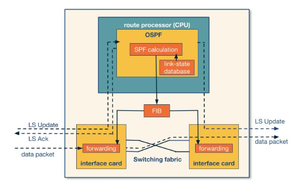

# Week 3 - Intradomain routing

###Important Readings

Experience in Black-box OSPF Measurements  
[http://conferences.sigcomm.org/imc/2001/imw2001-papers/82.pdfLinks to an external site.](http://conferences.sigcomm.org/imc/2001/imw2001-papers/82.pdf)

## Book References

If you have access to the Kurose-Ross book and the Peterson book, you can find the list of chapters discussed in this lecture. As mentioned in the course schedule, purchasing the books is not required.

- Kurose-Ross (6e)
    - 4.5.1:The Link-State (LS) Routing Algorithm
    - 4.5.2: The Distance- Vector (DV) Routing Algorithm
    - 4.6.1: Intra-AS Routing in the Internet: RIP
    - 4.6.2: Intra-AS Routing in the Internet: OSPF
- Kurose-Ross (7e)
    - 5.2.1The Link-State (LS) Routing Algorithm
    - 5.2.2: The Distance- Vector (DV) Routing Algorithm
    - 5.3: Intra-AS Routing in the Internet: OSPF

- Kurose-Ross (8e)
    - 5.2.1: The Link-State (LS) Routing Algorithm
    - 5.2.2: The Distance- Vector (DV) Routing Algorithm
    - 5.3: Intra-AS Routing in the Internet: OSPF

## Optional Readings

Hot Potatoes Heat Up BGP Routing  
[https://www.cs.princeton.edu/~jrex/papers/hotpotato.pdfLinks to an external site.](https://www.cs.princeton.edu/~jrex/papers/hotpotato.pdf "Link")  

Traffic Engineering With Traditional IP Routing Protocols  
[https://www.cs.princeton.edu/~jrex/teaching/spring2005/reading/fortz02.pdfLinks to an external site.](https://www.cs.princeton.edu/~jrex/teaching/spring2005/reading/fortz02.pdf "Link")  

Dynamics of Hot-Potato Routing in IP Networks  
[https://www.cs.princeton.edu/~jrex/papers/sigmetrics04.pdfLinks to an external site.](https://www.cs.princeton.edu/~jrex/papers/sigmetrics04.pdf "Link")  

OSPF Monitoring: Architecture, Design and Deployment Experience  
[https://www.cs.princeton.edu/~jrex/teaching/spring2005/reading/shaikh04.pdfLinks to an external site.](https://www.cs.princeton.edu/~jrex/teaching/spring2005/reading/shaikh04.pdf "Link")

## Routing

![[Routing]]

![[Intradomain routing]]

![[Interdomain routing]]

## Intradomain routing

Here are two main algorithms, these use two different approaches to how route [[Packets|packets]].

![[Link-state routing algorithms]]

![[Distance vector routing algorithms]]

![[Count to infinity problem]]

![[Routing Information Protocol (RIP)]]

![[Open Shortest Path First (OSPF)|OSPF]]

When using [[Open Shortest Path First (OSPF)|OSPF]] the computation is handled by the [[Router|router]] processor as apposed to the [[Switching fabric|switching fabric]] which handles message forwarding.

The process the router goes through is:
1. Collect [[Open Shortest Path First (OSPF)|LSA]]'s from other routers.
2. Use [[Dijkstra's algorithm]] to calculate new shortest paths and update [[Forwarding information base (FIB)]]
3. Forward messages using the [[Switching fabric|switching fabric]]

This can be summarised by the following flow chart.

![[Hot potato routing]]

## Traffic Engineering

The process of deciding the weights between [[Router|routers]] can be complicated as small changes in weights can have a large impact to the traffic flow. There is a framework for this.

![[Traffic Engineering Framework]]
