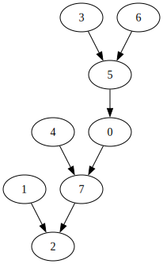
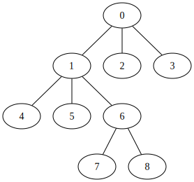

---
aliases:
course_code: CSE6220
course_name: Introduction to High Performance Computing
created: '2026-02-12'
date_checked:
draft: false
last_edited: '2026-02-12'
tags:
  - OMSCS
title: Week 6 - Tree computations
type: lecture
week: 6
---

In this lecture, we will look at how to speed up algorithms run on trees through the use of parallel algorithms.

# Root finder

It is useful to express a tree as an array - which I for one find counter intuitive!
Suppose we have a [tree](/content/notes/tree_%28graph%29.md) $T$ if we label the vertices of the tree $0 \ldots n-1$ then we can define an array $A$ of length $n$ by $A[i]$ to be $i$'s parent with it being empty if there is no parent.

> [!example] Example
> Suppose we have a tree, as below.
> 
> Taking the definition above this could also be expressed as the array below.
> ```
> Index: 0 1 2 3 4 5 6 7
> Array: 7 2 - 5 7 0 5 2
> ```

This representation could be for a forest as well as a tree.
A common problem within forests is grouping nodes or 'finding the root' of each vertex.
For a single node there is the classic linear algorithm to do this - go to its parent and find their parent until there is no parent!

Suppose instead we wanted to find the root for every vertex.
We can use the jumps we used in the last lecture to do this.
Repoint every vertex to their grand parent if it exists - otherwise leave it.
If we do this repeatedly then it will end with every vertex pointing to their root.

```
Input: Tree T in parent pointing format
Output: An array with each vertex labeled with its root
findRoot(Tree T):
  grandParent = copy(T)
  adopt(T, grandParent)
  while (T != grandParent):
    T, grandParent = grandParent, T
    adopt(T, grandParent)
  return grandParent

hasGrandparent(Tree T, int node):
  return T[node] is not empty and T[T[node]] is not empty

adopt(Tree T, Tree output):
  par-for node in [0, len(T)):
    if hasGrandparent(T, node):
      output[node] = T[T[node]]
    else:
      output[node] = T[node]
```

As for each hop we halve the distance between any node and its root we have $W(n) = n \log(n)$.
By a similar logic, as par-for has span $\log(n)$ we have $D(n) = \log^2(n)$.

# List scan (revisited)

We saw in the previous lecture that the list ranking problem can be parallelised using `Wyllie's algorithm` in $W(n) = O(n \log(n))$ and $D(n) = O(\log^2(n))$.
This is not work optimal however, as the 'naive' algorithm has $W(n) = O(n)$.

To try and mitigate this some more we want to use a trick which is used on other problems as well:

1. Shrink the input size to $m < n$ - in a representative way.

2. Run Wyllie on the smaller problem $O(m \log(m))$.

3. Extend the solution to the full list.

Assuming step 2 dominates the run time then we can choose $m = \frac{n}{\log (n)}$ so that we get $W(n) = O(n)$.

What follows is how we might approach this.
Remember the input is an array where the values of the array point to the next neighbour.

## Shrinking the problem

Whilst shrinking the problem itself is not a problem, we need to do this in parallel.
So we choose to do this by recursively deleting [independent sets](/content/notes/independent_set_%28graph%29.md)
We will choose these independent sets in parallel - randomly!
(One caveat here, we will never remove the 'root' of the tree.)
This is done in a two step process:

1. Flip a coin for each node.
Every vertex with a head will be considered as a potential vertex in the independent set.

2. Going through each node in the independent set, if a neighbour is in the potential vertex set - remove it.

In code this would be:

```
Input: Array P[0,n-1] where P[i] is the parent of node i.
Output: An independent set given by an array where T indicates a member of the set.
ParIndSet(Array P[0,n-1]):
  Let Independent[0,n-1], IndependentCopy[0,n-1] be null arrays
  par-for i \in [0,n-1]:
    if P[i] != null then:
      Independent[i] = IndependentCopy[i] = Random(0,1) # either 0 or 1 with probability 1/2
    else:
      Independent[i] = IndependentCopy[i] = 0
  par-for i \in [0,n-1]:
    if Independent[i] == 1, P[i] != null, and IndependentCopy[P[i]] = 1 then:
      Independent[i] = 0
  return Independent
```

This algorithm has $W(n) = O(n)$ as it needs to do a couple operations per node.
This also has $D(n) = \log(n)$ as we use a par-for loop.

For a linked list this means each node has $1/4$ probability of ending up in the independent set.
With 1/2 chance coming from it being selected by the `Random(0,1)` and then 1/2 chance coming from its parent being selected from `Random(0,1)`.
Therefore, the expected size of the independent set is $n/4$.

If we remove this independent set then we have a set of size $(3/4)n$.
Therefore we need to do this $\log(\log(n))$ times to reduce $n$ to the size of $\frac{n}{\log(n)}$.

Each time we do this, we need to perform the `push forward` described within the Wyllie algorithm.
So the subset we calculate the list scan on represents the actual value of the list scan.

So this step has $W(n) = O(n \log\log(n))$ and $D(n) = O(\log\log(n) \log(n))$ - therefore not making our improvement perfectly work optimal - but we are now only a factor of $\log\log(n)$ off.

## Extending the list scan

Suppose when doing the removals we keep track of which nodes have been removed, what value they had when they were removed and what node they were pointing to when they were removed.
To extend back out we now undo the removals in reverse pulling the value back down the array.

> [!example] A simple example
> Lets take the example from the previous lecture:
> ```
> index  = [0,1,2,3,4,5,6,7 ,8,9,10,11,12,13]
> next   = [1,2,5, ,9,6,3,12,0,7,  ,4 ,8 ,  ]
> rank_1 = [1,1,1,1,1,1,1,1 ,1,1,  ,0 ,1 ,  ]
> ```
> This is length $n = 12$ so we want a sub-problem of size $\frac{12}{\log(12)} \approx 3$ (but for demonstration we'll use a larger subset).
> So lets pick an independent set:
> ```
> index  = [0,1,2,3,4,5,6,7 ,8,9,10,11,12,13]
> next   = [1,2,5, ,9,6,3,12,0,7,  ,4 ,8 ,  ]
> Ind1   = [1,1,1,0,0,0,1,0 ,0,1,  ,0 ,0 ,  ]
> Ind2   = [0,0,1,0,0,0,1,0 ,0,1,  ,0 ,0 ,  ]
> ```
> Then we remove this independent set and push forward its values.
> ``` 
> index  = [0,1,2,3,4,5,6,7 ,8,9,10,11,12,13]
> next_1 = [1,2,5, ,9,6,3,12,0,7,  ,4 ,8 ,  ]
> rank_1 = [1,1,1,1,1,1,1,1 ,1,1,  ,0 ,1 ,  ]
> Ind2   = [0,0,1,0,0,0,1,0 ,0,1,  ,0 ,0 ,  ]
> ---
> next_2 = [1,5, , ,7,3, ,12,0, ,  ,4 ,8 ,  ]
> rank_2 = [1,1, ,2,1,2, ,2 ,1, ,  ,0 ,1 ,  ]
> ```
> Now we apply Wyllie's algorithm.
> ```
> index  = [0,1,2,3 ,4,5,6,7 ,8,9,10,11,12,13]
> next_2 = [1,5, ,  ,7,3, ,12,0, ,  ,4 ,8 ,  ]
> rank_2 = [1,1, ,2 ,1,2, ,2 ,1, ,  ,0 ,1 ,  ]
> ---
> rank_3 = [6,7, ,11,1,9, ,3 ,5, ,  ,0 ,4 ,  ]
> ```
> Next we back track to undo the removals.
> To do this we look at `rank_1` and `next_1` for the nodes that are removed, then taking `rank_3` of `next_1` we subtract `rank_1` to get the original value.
> We give the calculation for the 3 nodes below:
> | Node (x) | `n := next_1[x]` | `d := rank_1[x]` | `b := rank_3[n]` | `rank_4[x] := b - d` |
> | --- | --- | --- | --- | --- |
> | 2 | 5 | 1 | 9 | 8 |
> | 6 | 3 | 1 | 11 | 10 |
> | 9 | 7 | 1 | 3 | 2 |
> This now gives us our final list scan.
> ```
> index  = [0,1,2,3 ,4,5,6 ,7 ,8,9,10,11,12,13]
> next   = [1,2,5,  ,9,6,3 ,12,0,7,  ,4 ,8 ,  ]
> rank_3 = [6,7,8,11,1,9,10,3 ,5,2,  ,0 ,4 ,  ]
> ```

Below we formalise the algorithm.

```
Input:
  Array Rank[0,n-1] of the partial list scan results
  Int removalRounds the number of rounds of removals there were
  Array Removed[0,n-1] the array containing the round a node was removed
  Array OldRank[0,n-1] the array containing the rank when it was removed
  Array OldNext[0,n-1] the array containing the next when it was removed
Backout(Rank, removedRounds, Removed, OldRank, OldNext):
  for i = removedRounds - 1 to 0:
    par-for j in [0,n-1] if Removed[j] == i:
      Rank[j] = Rank[OldNext[j]] - OldRank[j]
```

This takes $W(n) = O(n\log\log(n))$ and has $D(n) = O(\log\log(n)\log(n))$.

## Combining it all

In total this speed up has:

$$
W(n) = O(n\log\log(n) + n + n \log\log(n)) = O(n\log\log(n)), \hspace{1em} D(n) = O(\log\log(n)\log(n) + \log^2(n) + \log\log(n)\log(n)) = O(\log^2(n)).
$$

This is closer to work optimal!
We will use this other trick elsewhere in tree algorithms.

# Euler techniques

Suppose we need to calculate a [post-order traversal](/content/notes/postorder_traversal.md) on a tree.
The 'naive' algorithm is just by using depth first search.
However, similar to above we can use a cleverly designed scan to it in parallel.
To do this we will take the tree and unwind it into a list of nodes - using the ordering of the nodes parents we can turn a tree into a 'Euler tour' of the graph.
To enable this we double each edge of the graph with one edge going down and the other up.
Then we can turn this into a linked-list of nodes by adding a node as the source/sink of each edge like below:


Then with this we can now use our scans from before.
To solve the post-order traversal we can add a 1 on each node before an 'upward' edge.
Like below:


Doing a scan on this and taking the 'last' node at each vertex gives us exactly the ordering we need.


We can solve other problems like this such as finding the depth of a node.

The real advantage of this technique is that we still have $W(n) = n$ but we get $D(n) = \log^2(n)$ - giving us parallelisation.
This is regardless of the structure of the tree - which you may think should factor into how hard the problem is as unbalanced trees intuitively make problems harder.

## Building the Euler tour

This whole technique relies upon being able to build the Euler tour in the first place.
To do this we need to represent the tree in adjacency list format.
Here we describe a tree by a set of vertices $V$ and a map $A: V \rightarrow \mathcal{P}(V)$ mapping a vertex $v$ to an ordered list of its neighbours (the ordering giving the ordering in which we visit its children anchored by the parent).

> [!example] A simple example
> Suppose we have the tree we were considering above.
> 
> This can be represented as a adjacency list as below:
> | Vertex | Neighbours |
> | --- | --- |
> | 0 | 1, 2, 3 |
> | 1 | 4, 5, 6, 0 |
> | 2 | 0 |
> | 3 | 0 |
> | 4 | 1 |
> | 5 | 1 |
> | 6 | 7, 8, 1 |
> | 7 | 6 |
> | 8 | 6 |

Then we can define the euler tour using the 'successor function'.
To define this let $d_v = \vert A(v) \vert$ and then label $A(v)$ by $u^v_i$ for $i \in [0, \ldots, d_v - 1]$ - which contains the ordering.
Then define the successor function $s: E(T) \rightarrow E(T)$ by $s(u^v_i, v) = (v, u^v_{i + 1 \mod d_v})$. 
For example $s(0, 1) = s(u^1_3, v = 1) = s(1, u^1_{0}) = (1, 4)$.
Due to the switching of roles from u and v if we repeatedly apply the successor function we perform a Euler tour of the graph.

> [!warning] Additional information
> With just the adjacency list representation of a graph we can not repeatedly apply $s(e)$ in a $O(1)$ fashion - as we would need to search each adjacency list for the related vertex index. 
> However, we can enrich this representation with a map from each edge (u,v) (i.e. the index of $v$ in $A(u)$) to the index of (v,u) (i.e. the index of $u$ in $A(v)$) making iterative calls to the successor function run in $O(1)$.

