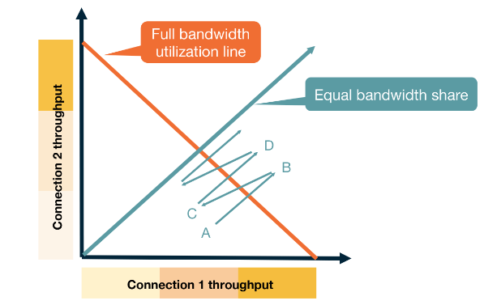
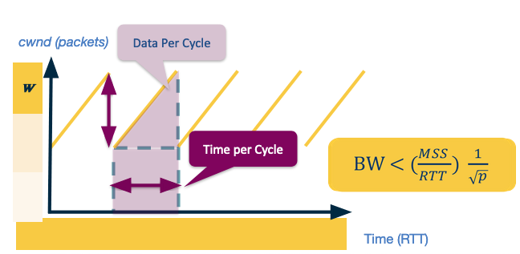

# Congestion control in [[Transmission Control Protocol (TCP)|TCP]]

Congestion control is use to utilise the network with the following goals in mind:
- Efficiency: We should try to have high utilisation of the network at all times.
- Fairness: Each user should have a fair share of the network.
- Low delay: We should not overwhelm the switches and routers buffers causing a large delay within the network.
- Fast convergence: We want to get to a stable point that achieves all the above quickly.

There are two approaches when it comes to congestion control. 
- Network assisted: You rely on the network to provide some signal about how congested it is. This could be done via:
	- ICMP source quench.
- End-to-end congestion control: Hosts need to infer congestion from the traffic they receive. This can use different signal such as:
	- Packet delay based on acknowledgement times.
	- Packet loss using the acknowledgement sequence numbers.
	- Major network delay based on the time out window.

[[Transmission Control Protocol (TCP)|TCP]] uses the end-to-end approach. It mainly uses packet loss to detect congestion as packet delay can have quite a bit of noise in the system. It uses major network delay to reset itself.

[[Transmission Control Protocol (TCP)|TCP]] uses ACK messages as a probes and adopts a probe-and-adapt approach to adjusting the window size (number of unacknowledged packets) for congestion control. 

![[Additive increase Multiplicative Decrease (AIMD)]]

![[TCP Reno]]

## Fairness

This achieves fairness through [[Additive increase Multiplicative Decrease (AIMD)|AIMD]]. As the punishment for dropping a packet is exponential vs an increase which is linear. If you are using more of the network your probability of dropping a packet is higher and equally that punishment is larger. Whilst you are not dropping packets your increase is the same as every other network participant. 

This exponential vs linear dynamic allows for fast convergence to an equilibrium. 

>[!attention] Fairness between connections not applications
>If one application has multiple open connections each connection will reach a fair state but an application with many connections will have an unfair share of the network.

![[TCP CUBIC]]

## Throughput

Assuming we have a probability of $p$ of dropping a message - we can model what our expected throughput is for [[TCP Reno]]. For this model we assume the network delivers $1/p$ packets then drops one. This provides the following saw-tooth diagram.

Assume the max window size is $W_{max}$, then as the number of packets is increasing linearly we have the width and height of the saw is $W_{max}/2$. Therefore the total packets sent is
$$
\left(\frac{W_{max}}{2}\right)^2 + \frac{1}{2} \left(\frac{W_{max}}{2}\right)^2 = \frac{3}{8} W_{max}^2 
$$
Which using our assumption means that
$$
\frac{1}{p} = \frac{3}{8} W_{max}^2, \ \mbox{ giving } \ W_{max} = 2 \sqrt \frac{2}{3p}.
$$
Therefore we can compute the bandwidth of this connection.
$$
\begin{align*}
BW & = \frac{\mbox{data per cycle}}{\mbox{time per cycle}}\\
& = \frac{MSS \cdot \frac{1}{p}}{RTT \cdot \frac{W}{2}}\\
& = \frac{MSS}{RTT} \cdot \frac{\sqrt{\frac{3}{2}}}{\sqrt{p}}\\
& = \frac{MSS}{RTT} \cdot \frac{C}{\sqrt{p}}
\end{align*}
$$
We set $C$ to be a constant as we can study this in practice rather than just in theory. In practice we see that $C$ is regularly less than 1, so we say
$$
BW < \frac{MSS}{RTT} \cdot \frac{1}{\sqrt{p}}.
$$
>[!Note] Data Centres
>In Data Centres we see a lot of developments in [[Transmission Control Protocol (TCP)|TCP]] implementations for congestion control. There are two main reasons for this:
>- Data centres make lots of delay sensitive short messages that normal [[Transmission Control Protocol (TCP)|TCP]] wouldn't handle well.
>- Data centres are owned by a single entity so they can deploy different algorithms much easier.