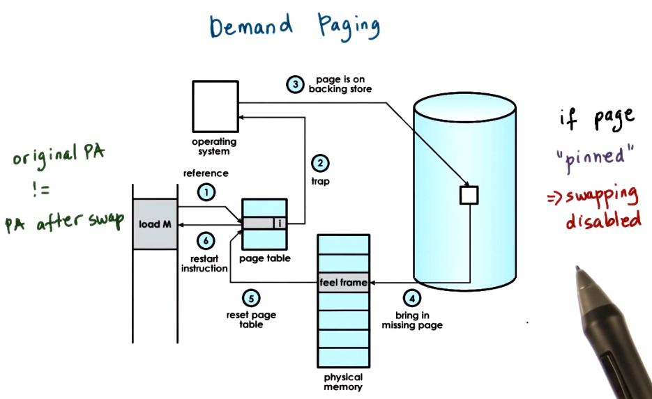

>[!tldr] Demand paging
> As [[Virtual memory|virtual memory]] is far larger than [[Physical memory|physical memory]] to maximize resource usage the [[Operating system (OS)|operating system]] will swap out memory in [[Random Access Memory (RAM)|RAM]] to some secondary storage like the disk. In doing so it updates the [[Page table entry|page table entry]] to reflect this. If the memory is then accessed again it needs to pull it back off the secondary storage. It does this in the following way:
> 1. Memory is referenced.
> 2. The [[Memory Management Unit (MMU)|MMU]] raises a trap to hand control to the [[Operating system (OS)|operating system]].
> 3. The page is recovered from the secondary storage.
> 4. The page is copied into a free [[Memory frame|memory frame]] in [[Random Access Memory (RAM)|RAM]].
> 5. The [[Page table entry|page table entry]] is updated to reflect this change.
> 6. Control is handed back to the [[Process|process]].
>
> 

