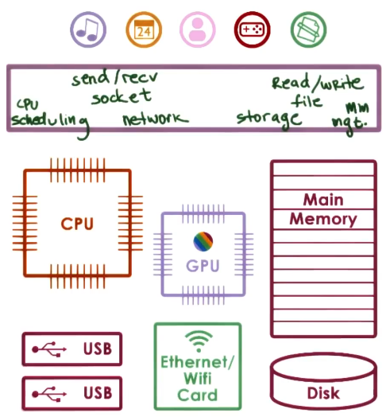

---
aliases:
  - OS
  - Operating system
  - operating system
checked: false
created: 2024-08-26
last_edited: 2024-08-26
draft: false
tags:
  - computer-sciecne
type: definition
---
>[!tldr] Operating system (OS)
>A operating system is a software that abstracts and arbitrates computer hardware away from the software running on it.
>
>
>
>This layer of software:
>- has privileged access to the underlying hardware,
>- hides the hardware complexity,
>- manages hardware on behalf of applications according to predefined policies and,
>- ensures that applications are isolated and protected from one another.
