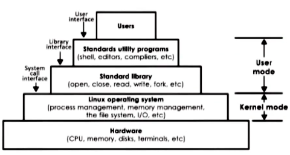
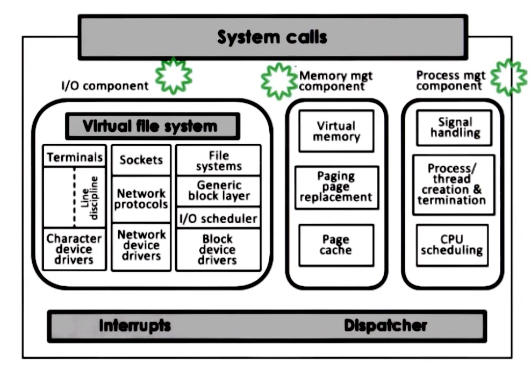
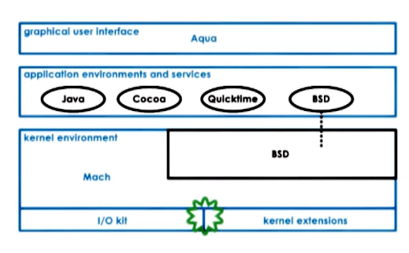

---
aliases:
checked: false
course: '[[CS6200 Graduate introduction to Operating Systems]]'
created: 2024-08-26
draft: false
last_edited: 2024-08-26
tags:
  - OMSCS
type: lecture
week: 1
---
# Week 1 - Introduction to Operating systems

![[Operating system (OS)]]

## Metaphor

The [[Operating system (OS)|OS]] is a lot like a toyshop manager. They are required to:

- Direct the operational resources
	- Controls use of employees time,
	- Distribute tools and parts between workers
- Enforces working policies
	- Ensures fairness between workers,
	- Make sure toys are made safely,
	- How to cleans-up after the job has been completed.
- Mitigates difficulty of complex tasks
	- Simplifies operations for each worker to do,
	- Chooses optimal task allocation to improve performance.

In comparison an [[Operating system (OS)|OS]] does the following:

- Direct the operational resources
	- Controls the use of CPU and memory,
	- Controls the use of peripheral devices.
- Enforces working policies
	- Can ensure fair use of the resources between different processes,
	- Limit resources a certain process has access to.
- Mitigates difficulty of complex tasks
	- Abstracts hardware (system calls).

## Examples

- Desktop
	- Microsoft Windows
	- UNIX-based
		- Mac OS X (BSD)
		- Linux
- Embedded
	- Android
		- A form of linux
	- IOS
	- Symbian

We will focus on Linux in this course.

## OS elements

There are 3 main OS elements:

Abstractions:
- process,
- thread,
- file,
- socket, and
- memory page.

Mechanisms:
- create,
- schedule,
- open,
- write, and
- allocate.

Policies:
- [[Least-recently used (LRU)]],
- [[Earliest deadline first (EDF)]]

### Example: Memory management

## Design principles

- Separation of mechanism and policy
	- Implement flexible mechanisms that support many policies
	- In different settings different policies make more sense.
- Optimise for common case
	- Where will the [[OS]] be used?
	- What will the user want to execute on that machine?
	- What are the workload requirements?

## User/Kernel protection

![[Proccess modes]]

![[Trap instruction]]

User mode application have to access hardware through system calls. The [[Operating system (OS)|OS]] can notify applications through signals.

## System call flow chart

![[System call]]

## OS architecture

At first [[Operating system (OS)|OS]] included all the features within one monolithic application. This had the following advantages:
- You have everything already, you do not need to go somewhere else, and
- You can use compile time optimizations to improve efficiency.
Though had the following downsides:
- Lower customisation, portability and manageability,
- Higher memory footprint to run the OS, and
- Lower performance when you do not need all aspects of the OS.

[[Operating system (OS)|OS]] such as LINUX instead have gone for a modular approach, where [[Operating system (OS)|OS]] applications have to conform to a standard interface for system calls. The user then can add the modules to the [[Operating system (OS)|OS]] that they want to use. This had the following advantages:
- Easier to maintain as it is less code,
- Smaller footprint in memory,
- Less resources used to run the [[Operating system (OS)|OS]],
Though comes with the following down sides:
- Indirection can effect performance,
- Maintenance can be an issue as you rely on lots of different code bases that can introduce bugs.

For embedded devices another architecture is common called a Micro-kernel. These typically only handle memory and process management. Though adds a standard Inter process communication call - as services such as file systems or disk drivers are now application level processes rather than handled by the OS. This has the following advantages:
- They are normally a very small code base.
- It is easy to verify behaviour, so you can be sure the [[Operating system (OS)|OS]] behaves well.
Though they come with a lot of down sides:
- They are not normally portable as they are designed for a specific bit of hardware.
- Software development is more complex as they need to interact with difference processes that normally would be part of the [[Operating system (OS)|OS]].
- There is lots of user/kernel crossing as they need to use the IPC a lot.

### Linux

The linux [[Operating system (OS)|OS]] is built in a layer architecture to make it simpler to use.

The kernel itself has a couple of components that can all be switched out for specific users needs.

### Mac

Mac uses a micro-kernel for all low level operations with a BSD component provides a unix interface for the rest of the OS.

