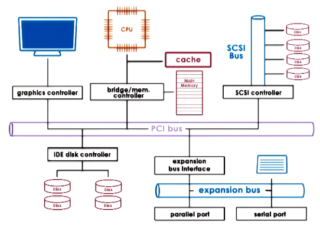
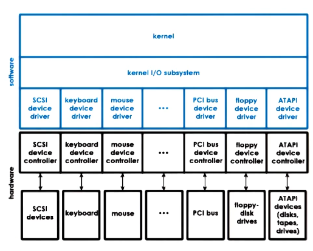
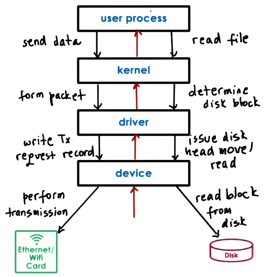
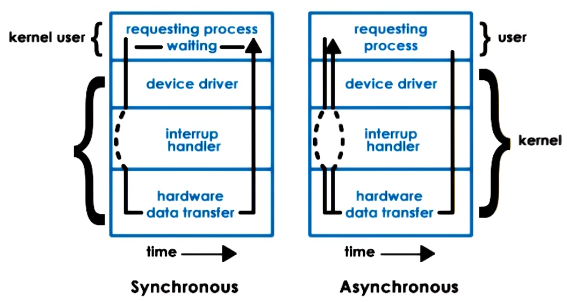
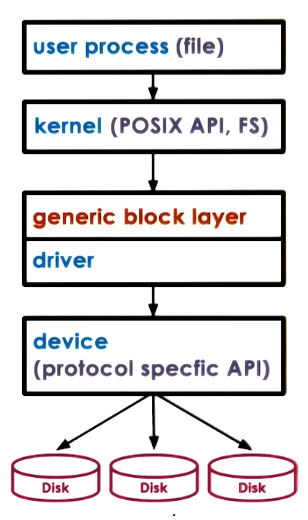
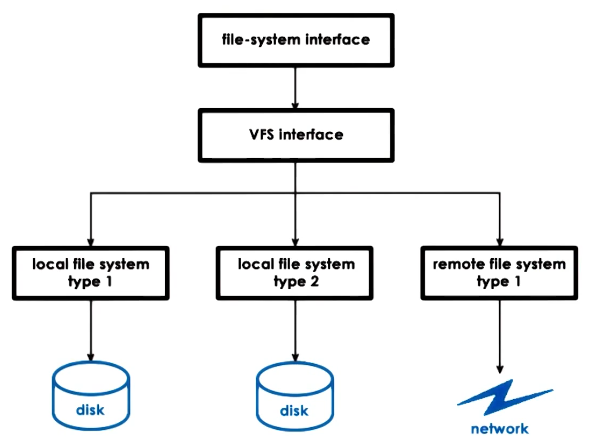
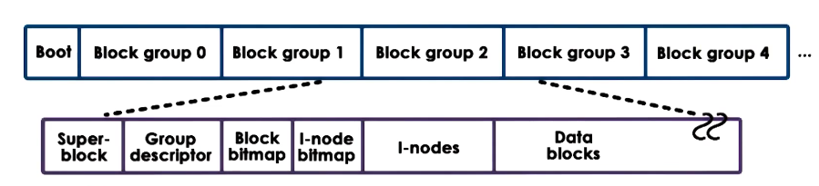
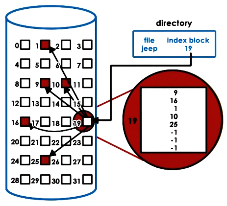
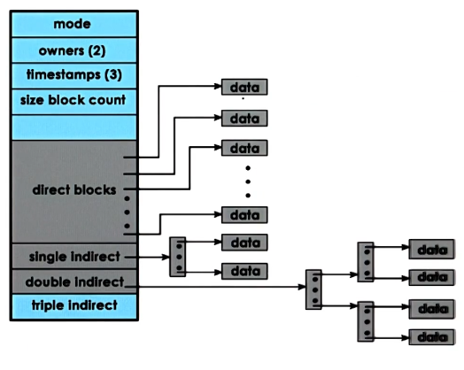

---
aliases:
checked: false
course: 'CS6200 Graduate introduction to Operating Systems'
created: 2025-04-09
draft: false
last_edited: 2025-04-09
title: Week 11 - IO management
tags:
  - OMSCS
type: lecture
week: 11
---
# Week 11 - IO management

## Model of a [IO device](../../general/input_output_(io).md)

Whilst an [IO](../../general/input_output_(io).md) device can come in many forms we model them similarly.

These have 3 registers:
- Status: Some indicate the state of the device.
- Command: Used by the [CPU](../../general/central_processing_unit_(cpu).md) to control the device.
- Data: Used to transfer data in and out of the device.

 Then what happens internally is controlled by the micro controller on the device.

## Connections to the [CPU](../../general/central_processing_unit_(cpu).md)

Devices are mainly connected to the [CPU](../../general/central_processing_unit_(cpu).md) through the [Peripheral component interconnect (PCI)](../../general/peripheral_component_interconnect_(pci).md) or [PCI Express (PCIe)](../../general/pci_express_(pcie).md). Though depending on the component it may be connected to that via another bus as well.

## Device driver

[Device driver](../../general/device_driver.md)

Devices fall into one of 3 types:
- *Block device*: Read/writes blocks of data and offers an API to access a block at a particular index. E.g. Hard drive
- *Character device*: Offers an API that gets or puts a single character. e.g. keyboard.
- *Network device*: These offer ability to put or get data but no direct access to blocks of indexed data. E.g. [NIC](../../general/network_interface_card_(nic).md)

All these devices are represented as a special type of file. In linux these can be accessed in the `/dev` directory and are stored in a different file system `tempfs` or `devfs`.

[Pseudo devices](../../general/pseudo_devices.md)

There are two methods in which the [CPU](../../general/central_processing_unit_(cpu).md) communicates with devices.

- *Memory-mapped I/O*: On boot some part of the main memory address space is registered for use by a device. The [CPU](../../general/central_processing_unit_(cpu).md) can then write or read to these addresses to interact with the device.
- *Port-mapped I/O*: On boot they get loaded into a separate address space reserved for I/O devices. This uses separate instructions such as IN/OUT. This was more common in legacy systems.

Some architectures do support both.

There are two ways for the device to communicate with the [CPU](../../general/central_processing_unit_(cpu).md):

- *Interrupts*: The device can generate interrupts that the [OS](../../general/operating_system_(os).md) will need to handle. This gives the device the best access to the [OS](../../general/operating_system_(os).md) but can be inefficient in terms of caching if the input is not needed.
- *Polling*: The [CPU](../../general/central_processing_unit_(cpu).md) can poll the device for information by checking its status registers. This means the [CPU](../../general/central_processing_unit_(cpu).md) can only get the information when it needs it - however it can generate delay or overhead if the [CPU](../../general/central_processing_unit_(cpu).md) needs to repeatedly poll the device.

[Programmed IO (PIO)](../../general/programmed_io_(pio).md)

[direct memory access](../../general/direct_memory_access_(dma).md)

## Device access

Device access is an intensive action as we need to parse through many different layers and processes. Thus why [IO](../../general/input_output_(io).md) is considered slow.

Some devices support [OS](../../general/operating_system_(os).md) bypass. This is where the [OS](../../general/operating_system_(os).md) configures the device and the process to communicate directly through the [processes](../../general/process.md) virtual address space with limited functionality. Though the device has some requirements for this:

- The device producer must offer a user-level library to enable this.
- The device must have sufficient registers for the process to have access but also for the [OS](../../general/operating_system_(os).md) to have more fine-grained control over the device.
- If the device supports multiple accesses then it must be sufficiently complex to deduplex the requests and send them to the correct device (i.e. looking at [port](../../general/port.md) numbers).

However, if the device does support this it can increase access speed dramatically.

When accessing [IO](../../general/input_output_(io).md) devices this can either happen synchronously or [async](../../general/asynchronous_programming.md). Normally when issuing commands to a device the process needs to wait for a response from the device. This can either block the process and it gets moved to a wait queue or in a non-blocking way. When using async the process can either poll or get interrupted to get output from the device.

## Block device access

When interacting with block devices, user programs actually interact with files that are on the computers filesystem. Files are considered one 'logical' storage unit. The [OS](../../general/operating_system_(os).md) will specify how to support writing to files through an API - normally the [POSIX](../../general/portable_operating_system_interface_(posix).md) API.

As well as having a device driver for particular devices a further abstraction is placed on top of these to standardize the interaction - this is the generic block layer. This is an [OS](../../general/operating_system_(os).md) standard for interfacing with different block devices.

## Virtual file system

The [OS](../../general/operating_system_(os).md) abstracts the concepts of block devices away from the user through a virtual file system. It uses this to combine potentially different types of block devices into one directory structure which is easy for humans to grasp.

As well as making this easy for human to use - it also offers an API the block device device drivers must conform to.

This virtual file system supports a number of abstractions:

- *File*: The basic elements on which the virtual file system operates.
- *File descriptor*: An [OS](../../general/operating_system_(os).md) representation of a file the supports standard operations like, read, write, lock, close ....
- *inode*: A persistent on block device representation of a file (Index node). This lists all the data blocks that make up this file as well as metadata such as device, permissions, size ....
	- Note: Directories are just special kind of files. They have the same metadata but instead of pointing to the blocks of memory that make the file up they point to blocks of memory that store the director entries (pairs of name and inode number for a file).
- *dentry*: This is an in-memory data structure the [OS](../../general/operating_system_(os).md) uses to represent a directory. There is one for every directory component.
- *superblock*: This contains file-system-specific information regarding the file-system layout. For example the inode blocks, data blocks, and free blocks.

## Second Extended Filesystem (ext2)

The disk is broken down into sections. The first section is the boot section which is used if the disk is 'bootable'.

The rest is broken down into 'block groups' which each have a similar structure.

- Superblock as described above.
- Group descriptor: Keeps track of the number of free nodes and directories.
- Bitmaps: Keeps track of which blocks/inodes are free.
- Inodes: Numbered from 1 to a max number - 1 per file.
- Data blocks: The file data.

## Inodes

Inodes that represent files contain metadata about the file and a list of data-blocks that make up that file.

This structure enables sequential or random access using the size of the data-blocks. However, this provides a fairly hard limit on file size by the number of pointers a block can contain multiplied by the size of each block. To get around this we allow for indirect pointers - which point to blocks of pointers.

This dramatically increases the size of the file we can reference. However, if you use the single, double, or triple indirect pointers this slows down file access.

## Disk access optimizations

To speed up disk access we can deploy multiple techniques:

- Caching/buffering: Keeping discs in memory and only occasionally flushing the cache to disk.
- I/O scheduling: Physically moving the needle on the disk is costly, so instead we order reads to reduce the number of reads.
- Prefetching: If someone is reading block 17 with the next blocks being 18,19 we grab them also in anticipation of the next access.
- Journaling/logging: Instead of immediately committing writes to disk we keep a log of writes that are going to happen. Then when the time is correct applying the log to disk.
