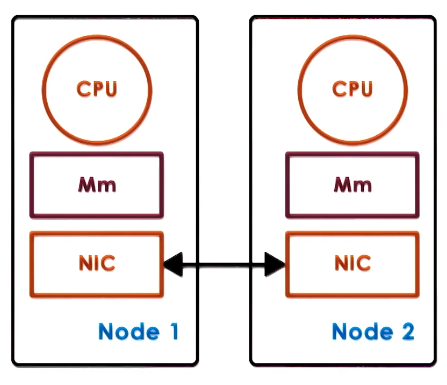
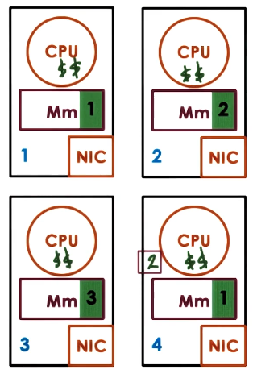

---
aliases:
checked: false
course_code: CS6200
course_name: Graduate introduction to Operating Systems
created: 2025-04-13
draft: false
last_edited: 2025-04-13
tags:
  - OMSCS
title: Week 15 - Distributed shared memory
type: lecture
week: 15
---
# Additional reading

- [Distributed Shared Memory: Concepts and Systems](https://s3.amazonaws.com/content.udacity-data.com/courses/ud923/references/ud923-protic-paper.pdf)

# Distributed shared memory

Distributed shared memory is similar to a [distributed file system](../../general/distributed_file_system_(dfs).md) however all clients are also clients to others. They share the state mutually.

[Peer distributed application](../../general/peer_distributed_application.md)

[Distributed shared memory (DSM)](../../general/distributed_shared_memory_(dsm).md)

This technology is become more relevant in data centers since the development of [Remote direct memory access (RDMA)](../../general/remote_direct_memory_access_(rdma).md).

[Remote direct memory access (RDMA)](../../general/remote_direct_memory_access_(rdma).md)

# Hardware vs software support

The basic concept in distributed shared memory is when memory access is not local it goes via the network.

Whilst in data-centers they use hardware such as [Remote direct memory access (RDMA)](../../general/remote_direct_memory_access_(rdma).md) this is an expensive option. Other applications can achieve the same using software.

# Sharing granularity

When looking at shared memory within a processor the share locations at the variable level. However if we go out to the network for each variable that will cause too large a slowdown for a system. Instead we can to it at a less granular level:
- Page level: The [OS](../../general/operating_system_(os).md) understands memory at the page level which makes this an attractive option.
- Object level: If all nodes are using the same language they can share at a larger object level.

>[!warning] False sharing
>If two clients are using a shared page, one writes and only uses a variable $x$ the other writes and only uses the variable $y$. If $x$ and $y$ are on the shared page the page will have to be kept in sync between the two machines whilst in reality there is no shared state.

# Access patterns

When designing a system to share memory it is good to understand how the memory will be used:

- Single reader/single writer
- Multiple reader/single writer
- Multiple reader/multiple writer

This lecture will cover the last of these.

# State management

There are two techniques for moving state between members of our network.

## Migration

When a new user wants the data we move it off the node it is currently stored onto the node that needs to use it. This makes sense for the single reader/writer case however will require a lot of data movement in the network if multiple entities are using the data at the same time. The cost of moving the data ideally should me amortized across multiple operations on it.

## Replication

Instead of the data just being present on a single node it is copied onto multiple nodes who are using the data. (This is similar to caching.) This will allow multiple users quick access to the data whoever will require consistency management to keep replicated state aligned.

>[!note] Difference between Caching and replicated
>In a cached setup there is a single source of truth and clients hold a copy of that which is backed up by the source of truth. However in replication no one source is privileged over another.

# Consistency management

First lets review the consistency management we have seen before. Shared memory on a processor used:

- Write-invalidate
- Write-update

These both happened as soon as a write happened which may course too much overhead in distributed settings. In [distributed file system](../../general/distributed_file_system_(dfs).md) we saw two different methods.

- Push invalidation's when data is written to. This is considered proactive, eager or pessimistic and will cause more network overhead.
- Pull modifications periodically. This is considered reactive, lazy or optimistic. This should reduce network overhead but risks state being out of sync.

When these methods get triggered depends on the consistency model for the shared state.

# DSM Architecture

We will look at one design for a page based [OS](../../general/operating_system_(os).md)-supported [Distributed shared memory (DSM)](../../general/distributed_shared_memory_(dsm).md) system.

- Each node will share part of its memory pages to the [Distributed shared memory (DSM)](../../general/distributed_shared_memory_(dsm).md).
- It will implement local caches to reduce network latency.
- All nodes are responsible for part of the distributed memory.
- The node where the memory is first created is allocated as its home node. This node will handle all the management for that memory.
- The node that contains the current true state is the memory owner (could be different to the home node).
- Explicit replicas can be generated for load balancing, performance, or reliability.
- The home node tracks replicas and caches to maintain consistency.

To maintain this system we need a way to identify each page of memory and speak to the home node. There are two methods to identifying pages.

1. Let the page ID consist of the home node ID + some local page ID.
2. Give the page a fixed ID and distribute a map from IDs to home nodes.

The first method is simple but means if a node leaves the system for any reason it invalidates all the memory it war managing. The second allows for updates to the home node though relies on replicating that map to all nodes in the system.

For each page we require to store metadata about the page. This will just need to be stored on the home node so can be partitioned.

For this to work we need to intercept all messages that involve writing or reading shared memory.

- When these messages are for memory that is present locally we want to intervene as little as possible.
- However for remote memory we will need to handle that using are network.

To do this we need hardware support in the [MMU](../../general/memory_management_unit_(mmu).md) and [OS](../../general/operating_system_(os).md) support.

- Access to remote memory should trap into the [OS](../../general/operating_system_(os).md).
- This should raise an error if the memory is not available.
- If the access is valid we need to contact the home node for that memory.
- If it is locally cached we need to perform and coherence operations required.
- We can us other [MMU](../../general/memory_management_unit_(mmu).md) state such as dirty pages to assist with this.

# Consistency model

[Consistency model](../../general/consistency_model.md)

[Strict consistency](../../general/strict_consistency.md)

[Sequential consistency](../../general/sequential_consistency.md)

[Causal consistency](../../general/causal_consistency.md)

[Weak consistency](../../general/weak_consistency.md)

