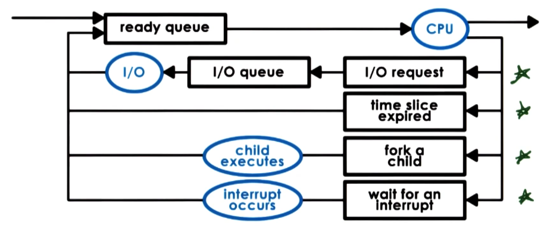

---
aliases:
checked: false
course: 'CS6200 Graduate introduction to Operating Systems'
created: 2024-08-26
draft: false
last_edited: 2024-08-26
title: Week 2 - Processes and Process Management
tags:
  - OMSCS
type: lecture
week: 2
---
# Week 2 - Processes and Process Management

[Process](../../general/process.md)

### Aside

[Heap (OS)](../../general/heap_(os).md)

[Stack (OS)](../../general/stack_(os).md)

[address space](../../general/address_space_(os).md)

## Metaphor

A process is line an order of toys:
- State of execution:
	- Completed,
	- waiting, or
	- In progress.
- Parts and temporary holding area
	- Pieces used to make the toy, or
	- Containers to put the pieces.
- May require special hardware:
	- Sewing machine or
	- glue gun.

This is analogy to an [OS](../../general/operating_system_(os).md) where a [process](../../general/process.md) has:
- State of execution:
	- Program counter, or
	- Stack
- Parts and temporary holding area
	- data, or
	- registered state in memory.
- May require special hardware:
	- I/O, or
	- access to sound output.

## Process execution state

For the [OS](../../general/operating_system_(os).md) to stop and start running [processes](../../general/process.md) it must keep track of what it is doing. For this it uses:
- [Program counter (PC)](../../general/program_counter_(pc).md)
- [CPU register](../../general/cpu_register.md)
- [Stack Pointer (SP)](../../general/stack_pointer_(sp).md)

All this information is stored in the [PCB](../../general/process_control_block_(pcb).md):

[PCB](../../general/process_control_block_(pcb).md)

This block is fully instantiated when a [process](../../general/process.md) starts however it is frequently updated as the process is executing. It is the job of the [OS](../../general/operating_system_(os).md) to keep this up to date and correct - it will need this when it starts and stops [processes](../../general/process.md).

### Switching [process](../../general/process.md)

When running a given [process](../../general/process.md) that [CPU](../../general/central_processing_unit_(cpu).md) has the [PCB](../../general/process_control_block_(pcb).md) loaded into the [CPU registers](../../general/cpu_register.md). If the [CPU](../../general/central_processing_unit_(cpu).md) were to suspend that process it would have to write that [PCB](../../general/process_control_block_(pcb).md) to memory and load the new [processes](../../general/process.md) [PCB](../../general/process_control_block_(pcb).md) into the [CPU registers](../../general/cpu_register.md). This is called a [Context switch (CPU)](../../general/context_switch_(cpu).md).

[Context switch (CPU)](../../general/context_switch_(cpu).md)

Context switching is costly for two reasons:
- Direct costs: This comes from physically having to write the [PCB](../../general/process_control_block_(pcb).md) from the [CPU registers](../../general/cpu_register.md) into memory and vice versa.
- Indirect costs: The [CPU](../../general/central_processing_unit_(cpu).md) has multiple layers of [caches](../../general/cache.md). When switching from one process to another you have to switch the data present in all these [caches](../../general/cache.md) normally making data access temporarily very costly.

### Process life cycle

During a processes time it goes through multiple different stages.
- New: Once the user issues a process that they want to start a [PCB](../../general/process_control_block_(pcb).md) is made and it is admitted to the [CPU](../../general/central_processing_unit_(cpu).md).
- Ready: This is a [process](../../general/process.md) that has something to do but is not being ran on the [CPU](../../general/central_processing_unit_(cpu).md) yet.
- Waiting: If the process has to wait on some event from the network or I/O then it will be moved into a waiting stating for that to finish.
- Running: It will have been [context switched](../../general/context_switch_(cpu).md) onto and the [PCB](../../general/process_control_block_(pcb).md) loaded into the [CPU register](../../general/cpu_register.md).
- Terminated: Once a process has exited or error-ed it moves state to terminated to be cleaned up.

### Creation

When you start the computer the [OS](../../general/operating_system_(os).md) starts a number of processes that have privileged access. These in tern create the application that you run on your computer. There are two [system calls](../../general/system_call.md) to create a new [process](../../general/process.md):
- Fork: This creates an exact copy of the current process, including the [program counter](../../general/program_counter_(pc).md).
- Exec: This replaces a [processes](../../general/process.md) [PCB](../../general/process_control_block_(pcb).md) with that of a new program.
The normal flow for a [process](../../general/process.md) to start another one is to call fork followed by exec.

### CPU Scheduler

This is a process that determines which one of the ready processes will be dispatched next to the CPU and how long it should run for. This is done via 3 operations:
- **Preempt**: Interrupt and save the current context.
- **Schedule**: Run the scheduler to choose the next process.
- **Dispatch**: dispatch a process and switch to its context.
An efficient [OS](../../general/operating_system_(os).md) wants to spend as much time running processes the user wants to run and the least time possible running the above 3 operations.

There are two important decisions that you must take when deciding on the scheduler.
- How long should processes run for?
- What metrics to choose the next process to run?
### I/O scheduling

When a process is stopped by an [IO](../../general/input_output_(io).md) operation this is then handled by the [device driver](../../general/device_driver.md) associated with that [IO](../../general/input_output_(io).md) task. The [process](../../general/process.md) will enter the waiting state until the [device driver](../../general/device_driver.md) interrupts the [CPU](../../general/central_processing_unit_(cpu).md) to let it know the operation has been completed and the [process](../../general/process.md) can move back to the ready state. Though there are other ways this waiting state can end - for example a time out.

## Inter-process communication

As modern applications get more complex they are being structured to be multiple processes communicating with on another. However, the [OS](../../general/operating_system_(os).md) is on purposely structured to isolate different applications from one another. Therefore they need to communicate to each other using [IPC](../../general/inter-process_communication_(ipc).md)

[IPC](../../general/inter-process_communication_(ipc).md)
