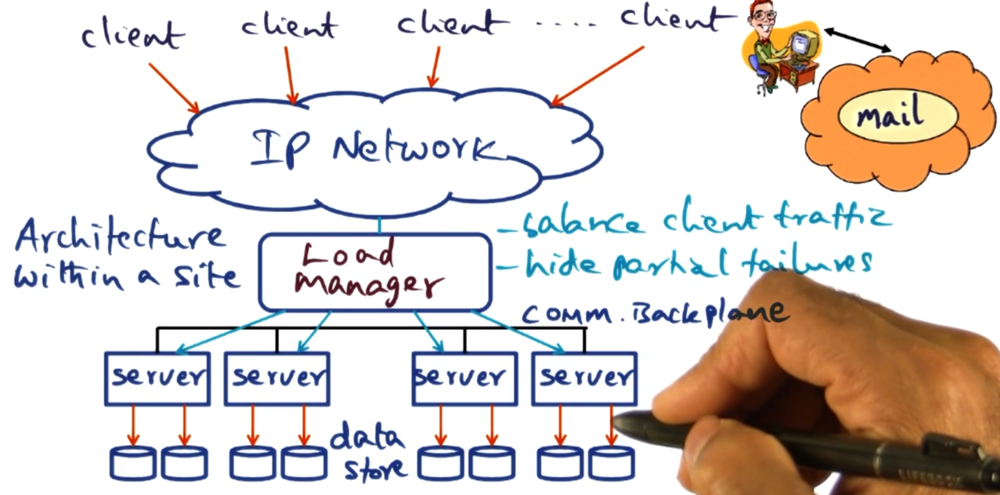

---
aliases:
checked: false
course: '[[CS6210 Advanced Operating Systems]]'
created: 2025-11-20
draft: true
last_edited: 2025-11-20
tags:
  - OMSCS
type: lecture
week: 8
---
# Week 8 - Internet Computing

Normally web based issues are called 'embarrassingly parallel'.

> [!definition] Embarrassingly parallel
> These problems can be broken down into easy to do parallel operations, such as accessing email, doing a web search, or downloading files.
> No two clients rely on each other so all computation can be broken down on the per user level.

## Issues in giant scale systems

The structure of giant scale internet services normally follows the below pattern:

- Clients on the outside of the network.

- You come through some IP network.

- There is some load manager moving load between different back end servers.

- Back end servers, often on the order of 100 to 1000 servers

With running one of these services, you need to know how to handle server failures - as in this case it is when rather than if one happens.

### Sense of scale

As of 2000:

| Service               | Nodes   | Queries    | CPUs/Node |
| --------------------- | ------- | ---------- | --------- |
| AOL Web               | > 1,000 | 10B/day    | 4-CPU     |
| Inktomi search engine | > 1,000 | > 80M/day  | 2-CPU     |
| Geocities             | > 300   | 25M/day    | ???       |
| Anon Web-based email  | > 5,000 | 1B/day     | ???       |

There are distinct advantages of structuring a system like this:

- Horizontal scaling: adding more nodes to the system scales it up.
- Cost control:

### Load manager

There are different strategies we can take for load balancing requests:

- Round robin: Each requests gets sent to a different server to be handled.
This is done at the server level which makes it very efficient.
However, we struggle with handling servers that are down.
This also assume all machines on the network are equal and for the same thing.

- Layer 4 switches (Transport layer): This can inspect who the packet is intended to be for and make decisions on where to send that packet based on that.
For example this allows us to act as a reverse proxy to send packets intended for one application to a specific subset of servers.
This can also hide down servers from the client using a Backplane with the servers it is serving.
This Backplane can also be used for higher level semantics such as sending requests with particular body to different instances - this allows for different nodes to only replicated limited data for their preferred queries.

### DQ Principle

This theory is about matching demand with supply and varying parameters around this.
We start with some definitions:

- Q_0: The total number of queries we need to server in this time step.

- Q_c: The number of queries we handled in this time step.

- Yield: Q = Q_c/ Q_0 \in [0,1] the proportion of the queries we handled in this time step.

- D_f: The full amount of data the system holds to handle this query.

- D_v: The amount of data we use to server requests in this time step.

- Harvest: D = D_v/ D_f \in [0,1] the proportion of the data we used to server requests in this time step.
This is a proxy for how 'well' we handled the request - did we use all possible websites to check against your query or just a limited set of them.

It is assumed for a given set up the product DQ is a constant.
This means that there is a payoff to have if the constant DQ is not 1.
We can either server a limited set of requests at the full quality or we can offer all the queries at a degraded quality.

When thinking about D, what it is in reality depends on how the system is limited.
For example you could be I/O bound, as you simply need to process a lot of data to handle a request.
However, in most giant scale services it is more likely that they are network bound.
This means it is hard to scale up the DQ constant at some points - as getting more network may be out of your control.

There are some metrics people talk about for huge data centers:

- I/O ops per second: How many I/O operations per second the system can handle.

- Mean time to repair: How long does it take for a server to recover after a failure.

- Mean time between failure: How long does it take for a server to go down.

- Uptime: This is defined by MTTR and MTBF as (MTBF - MTTR)/MTBF and expressed as number of 9's so 5 9's is 0.99999 as this ratio.

However, uptime has its limitations.
For example if a failure happens in down time - then no one really cares.

### Replication vs partitioning

Replicating data means we have more servers with each bit of the data.
This makes our systems robust to server failures.
Therefore, when failures occur in a replicated system D remains unchanged but Q goes down.

Partitioning data means we have more servers but they only have access to a subset of the data.
This can be useful if the data itself is too large to be processed on a single machine or we want to keep the cache hot on a particular subset of the data.
Therefore, when a failures occurs in a partitioned system D goes down but Q remains the same.
(In this case, we assume a query still gets served but it does not get the data from the severs that are down.)

NOTE: In both cases, DQ is defined by the number of servers - therefore if we have failures DQ goes down but we get too choose what constant in DQ to reduce.

Exception: If the queries involve 'significant' write traffic then replication is a slower option, due to the need to replicate those writes.
(This is a rare exception.)

### Graceful degradation

When our system is at full saturation system administrators can decide how to degrade their service.
The two options are as expected:

- Keep D fixed and lower Q: Keep the quality of the results the same but lower the number we server.

- Lower F and keep Q fixed: Degrade the quality of results but keep up with demands.

These options practical implementation depends on the service - for example if you are video streaming platform you could either:

- Keep D fixed and lower Q: Keep users in a hold queue until they are able to get their video.

- Lower F and keep Q fixed: Degrade the quality of results but keep up with demands.

### Online evolution and growth

With new releasing getting cut, we need to decide how to release them.
There is a spectrum of options here:

- Fast: Bring down all servers, update them and bring them back up.
(Good option for service with natural down time - such as financial markets or diurnal - sleep times.)

- Rolling: Bring down one server at a time, update it and bring it back up.
(Good for services with high uptime - such as web servers, this is fairly common in industry.)

- Big flip: Bring down half the nodes, then the next half.
(Here half is arbitrary and we can do it in different fractions - essentially this is the middle ground.)

Any strategy will reduce total DQ in the service over time - however different strategies spread this out differently.
It will be very sector dependent what strategy is best and it may change over time.
For example code freezes during busy times to not reduce the total DQ.

## Map Reduce

Computations in internet services are commonly simple but over large data sets.
Map reduce is a framework to handle such computations.
It breaks each computation down into two parts:

- Map: Take some input and produce some key value paired set of outputs.

- Reduce: Take all values associated to the same key and reduce it to a single output value for that key.

These simplistic steps can be parallelised over multiple machines and only require coordination between steps.
This enables the large scale services to work over these computations.

### Example: Counting words

Suppose we want to find the number of occurrences of each word over a large set of documents.
The input is a key value pair being the file name (key) and file content (value).
The output of our application is a key value pair with the key being the word and the value being the number of times it appears in the collection of documents.
For the end user to define this - they just need to provide the map and reduce function.
The framework will handle everything else.

The map function, when ran on a file then goes through the content breaking up the words.
Each time it sees a word it emits a key-value pair, the key will be the word and the value will be 1.
(We could instead implement this counting the number of times the word appears in the file - but this would either take more memory or to parse the content multiple times.)

The reduce function then takes all the key-value pairs for each word and then sums the values of the pairs.
Then it emits a key-value pair being the word and the total times it appears in all collections.

This is all the user needs to provide - however the framework between the map and reduce step aggregates key-value pairs based on the key.
That means whilst multiple map jobs may emit the same word, a single reduce job gets all the emits from all the files for the same word.

### Example: Page links

Part of the page rank algorithm requires we know how many other pages link to a given page.
This has input key-value pairs where the key is the url and the value is the page content.
This expects an key-value pair output of a url and the number of pages that link to it.

The map function takes a url and page content.
It then looks through the page content finding each link within it.
For each link it emits a key-values pair with the url being the key and the value being 1.

The reduce function then takes all the key-value pairs for each url and sums the values.

The advantage of this system is the user just needs to know the business logic of how to find links.
Whereas, as we will see the framework implementer handles all the coordination of the map and reduce steps.

### Why map-reduce?

As we have seen above, map-reduce is sufficiently abstract that we can implement different problems within it.
We also see that the user just needs to know the business logic of the system and the framework handles the rest.
We will see later that this scales very well both in the sense of the query size increasing but also the number of machines available to use.

### Framework

Below is a high level overview of what the framework does for a given execution:

1. Users program spawns a master process to coordinate the work.

2. The master takes the user input and further slits it (optional) this can either be specified by the user or could be automatic like chunking files.

3. The master then allocates these splits to workers.
Likely the number of jobs will exceed the number of workers but then it just iteratively hands out work to the workers.

4. The emits from the maps will be saved to a disk based on the key of the key-value pair.
That way the master knows which files relate to which key.
Once all the maps are completed it can use these key's to start up reduce tasks for each key.
(Normally the number of reducers is specified by the user up front.)

5. Each reduce task hands back its outputs to the master, which can provide these to the user.

### Issues to be handled by the run time.

There is a lot of admin to be handled by the master, this includes:

- Location of the files created by the completed mappers.

- Assignments of mapper/reducer tasks to workers.

- Fault tolerance:

  - If one of the workers bugs or crashes we need to be able to handle this.

  - Slow workers hold up the whole system if for example the reducers are waiting for all the map tasks to finish.
    This can be a cause for serious performance issues, so the master can choose to run multiple jobs for 'straggler' tasks to combat this.

  - The master needs to be able to handle redundant messages for straggler or crashed workers gracefully.

- Locality management: If your workers are on remote nodes, the master needs to make available the files required for map/reduce tasks.

- Task granularity: It might be that we have more tasks than workers, so the master controls how to break up these tasks amongst workers and load balance them correctly.
  Users can also aggregate outputs from map if the so choose - to make similar keys get processed by the same reduce task.

## Content distribution network (CDN)

A content distribution network (CDN) is a network of servers that cache and deliver content to users.
The goal is to reduce load on origin servers and improve latency by serving content from servers close to users.

### The problem: Finding cached content

When a user requests a file (e.g., `http://example.com/image.jpg`), how do we know which CDN servers have cached it?
We need a way to:
1. **Store** information about which servers have cached which content
2. **Retrieve** this information quickly when a user makes a request

This is solved using a distributed hash table (DHT) as a directory service.

### Abstraction layers in a CDN

A DHT-based CDN has several layers of abstraction:

1. **Physical layer**: Actual servers with IP addresses on the real Internet.

2. **Overlay network**: A virtual network where each server has a synthetic "node ID" (160-bit number).

3. **DHT layer**: A distributed key-value store that maps content to servers (these are meta-data servers).

4. **Application layer**: HTTP caches and DNS servers that users actually interact with.

### Key-value pairs in the CDN context

The DHT stores key-value pairs to track where content is cached:

- **Key**: Hash of the content's URL (e.g., `SHA1("http://example.com/image.jpg")` → 160-bit number)
- **Value**: IP address and port of a server that has cached this content
- **Node ID**: Hash of each server's IP address (e.g., `SHA1("192.168.1.1")` → 160-bit number)

**Important**: Keys, values, and node IDs serve different purposes:
- **Keys** identify what content we're looking for
- **Values** tell us where to find it (which server)
- **Node IDs** determine which DHT nodes store which keys

All keys and node IDs use the same 160-bit address space (values can be arbitrary data like IP addresses).

### Distributed hash table (DHT)

A DHT is a distributed system that provides two operations:

- **put(key, value)**: Store a key-value pair in the distributed system
- **get(key)**: Retrieve the value(s) associated with a key

**Key insight**: DHT nodes store keys that are "close" to their node ID.
The closeness is measured using XOR distance in the 160-bit address space.

#### How it works

**Scenario 1: Joining the DHT network as a new node**
- Your server has IP address `192.168.1.1`
- Your **Node ID** = `SHA1("192.168.1.1")` = `75`
- You now participate in the DHT at position `75` in the 160-bit space
- You will be responsible for storing information about keys close to `75`

**Scenario 2: A cache server advertises it has content**
- A cache server at `192.168.1.5:8080` downloads and caches `http://example.com/cat.jpg`
- It wants to advertise: "Hey, I have this file cached!"
- **Key** = `SHA1("http://example.com/cat.jpg")` = `42`
- The system uses `put(42, "192.168.1.5:8080")` to store this information
- The DHT routes to find nodes whose **Node ID** ≈ `42`
  - Node with ID `75` is not that close (`75 XOR 42 = 101`)
  - Keep routing... find node with ID `41` - very close! (`41 XOR 42 = 3`)
- Node `41` stores: Key `42` → Value `"192.168.1.5:8080"`

**Scenario 3: A user requests the content**
- User wants `http://example.com/cat.jpg`
- System computes **Key** = `SHA1("http://example.com/cat.jpg")` = `42`
- The system uses `get(42)` to look up this content
- Routes to node with ID ≈ `42` (finds node `41`)
- Node `41` returns **Value**: `"192.168.1.5:8080"`
- User's browser connects to `192.168.1.5:8080` to download the file

**Key insight**: Your node ID determines which keys you're responsible for storing. Keys close to your node ID (in XOR distance) get stored on your node.
### Overlay network

In a DHT, we refer to nodes by their node ID (a 160-bit number).
However, in reality, nodes are identified by IP addresses on the physical network.

An **overlay network** creates a virtual network topology on top of the physical Internet:
- Each physical server (IP address) is assigned a synthetic node ID
- Routing happens in the virtual 160-bit address space
- The overlay network handles translating between node IDs and actual IP addresses

Each node maintains a **routing table** that maps node IDs to IP addresses for a subset of other nodes.
This table allows nodes to route messages toward any node ID in the system, even if they don't know all nodes.

**Why use an overlay?**
- Uniform routing algorithm regardless of physical network topology
- Decentralized - no central directory needed
- Self-organizing - nodes can join/leave dynamically

### Traditional DHT approach (Greedy routing)

A traditional DHT implementation uses **greedy routing**: at each step, route to the node closest to the target key.

#### How greedy routing works:

Using our earlier example where we want to find key `42`:

**Starting from node `200`**:
1. Node `200` looks at its routing table
2. Finds the closest known node to key `42` - let's say node `100`
3. Routes to node `100` (`100 XOR 42 = 78` - much closer than `200 XOR 42 = 242`)

**Now at node `100`**:
1. Node `100` looks at its routing table
2. Finds an even closer node - node `50`
3. Routes to node `50` (`50 XOR 42 = 24`)

**Now at node `50`**:
1. Node `50` looks at its routing table
2. Finds the closest node - node `41`
3. Routes to node `41` (`41 XOR 42 = 3`)

**Now at node `41`**:
- This is the closest node to key `42`
- All `put(42, value)` operations store the data here
- All `get(42)` operations retrieve the data from here

#### Issue 1: DHT Hot Spots (Tree Saturation)

This greedy approach creates **hot spots** in the DHT when a key becomes very popular:

**Scenario**: 1 million users want to access `cat.jpg` (key `42`)

- All 1 million `get(42)` requests must go through node `41` (closest to key `42`)
- Node `41` gets completely overwhelmed handling lookups
- **Worse**: Intermediate nodes also get overwhelmed
  - Many requests route through node `50` on their way to `41`
  - Node `50` also becomes overloaded
  - This creates a "tree" of congestion converging on node `41`

**Why this happens**:
- The DHT forces ALL traffic for key `42` to converge on node `41`
- Like a tree with all branches leading to the root - the root gets saturated
- This is called **tree saturation** or **hot spot congestion**
- Even just returning metadata ("the cache is at 192.168.1.5:8080") millions of times overloads the DHT nodes

#### Issue 2: Origin Server Overload (The "Slashdot Effect")

Even with traditional web caching, origin servers can still get overwhelmed during flash crowds.

**Traditional (non-cooperative) web caching**:
- Place caching proxy servers between users and origin servers
- When user requests content:
  1. Request goes to local proxy first
  2. If proxy has it cached → serve from cache (no load on origin)
  3. If not cached → proxy fetches from origin, caches it, serves to user

**Why traditional caching works for stable content**:
- Popular content gets cached after first request at each proxy
- Subsequent requests at that proxy hit the cache, not the origin
- Origin server load is dramatically reduced

**Why traditional caching FAILS for new/viral content (the "Slashdot effect")**:

Imagine a news article just got posted and suddenly goes viral:
- 1,000 proxy servers worldwide
- Each proxy has 1,000 users behind it
- Total: 1 million users all want this brand new article **at the same time**

**What happens with non-cooperative proxies**:
1. **First user at Proxy A** requests the article
   - Proxy A doesn't have it cached (it's brand new!)
   - Proxy A fetches from origin server

2. **First user at Proxy B** requests the article (simultaneously)
   - Proxy B doesn't have it cached either
   - Proxy B **independently** fetches from origin server

3. **First user at Proxies C, D, E... all 1,000 proxies**
   - None have it cached
   - **All 1,000 proxies hit the origin server simultaneously**

**The critical problem**:
- **Traditional proxies don't cooperate with each other**
- Each proxy independently fetches from origin on cache miss
- **Even though Proxy A might have the content after 1 second, Proxy B doesn't know to ask Proxy A instead of the origin**
- Origin server gets hammered by 1,000 requests (one from each proxy)
- For under-provisioned servers (home broadband, small organizations), this causes complete overload

### Coral DHT

There are two issues with the 'greedy' DHT approach:

1. Metadata server overload.

2. Non-cooperative caching does not save us from the shlashdot effect.

Therefore, the Coral uses a Distributed Sloppy Hash Table where instead of going directly towards the destination key we instead make incremental progress towards it.
We do this by looking for a key half way between our last check and the destination, starting at our node ID.

This slower approach allows for cooperative caching.
We do this looking at two key states of the nodes we pass on the way to put/get content:

- **full**: A node is considered full for a particular key if it has more than a predefined maximum number (l=4) of values for that key, AND those values all have TTLs at least half of the new value's TTL.
(This prevents short-lived values from blocking long-lived ones.)

- **Loaded**: A node is loaded for a particular key if it has received more than beta=12 requests for that key within the past minute.
(This is about 1 request every 5 seconds - enough to keep values fresh but prevent overload.)

#### Put logic (Two-phase algorithm)

**Forward phase:**
1. Route toward the key using the slow incremental approach
2. At each node, check if it's *full* AND *loaded* for this key
3. Build a **stack** of all nodes visited that are NOT both full and loaded
4. Stop when you reach either:
   - The closest node to the key, OR
   - A node that is both full and loaded

**Reverse phase:**
1. Pop nodes from the stack (starting with the closest to the key)
2. Try to store the key-value pair at the top node
3. If storage fails (due to race conditions), pop and try the next node
4. Repeat until storage succeeds or stack is empty

This 'sloppiness' is why we call this DSHT - values end up stored at varying distances from the key.

**Note**: The DHT doesn't store the original URL - just the key (hash) and value (IP address).
Multiple values for the same key typically represent different cache servers with the same content, not different URLs.
Hash collisions are astronomically rare, and if they occur, the HTTP layer handles verification.
(Here we are ignoring the Birthday problem and just assuming we don't get hash collisions on the keys.)

#### Get logic

To get a key, we follow the same incremental routing approach:
1. Route toward the key, **checking each intermediate node** for the key
2. When we find a node storing the key, it returns the list of values (cache server IPs)
3. Fetch the content from one of these cache servers
4. After successfully getting the content, do a `put(key, "my IP address")`
   - This advertises that we now have the content cached
   - Future requests can fetch from us instead of going further

**Cooperative caching in action**:
- When node A does `get(42)`, it follows a routing path and finds the content
- Node A then does `put(42, "Node A's IP")`
- Later, node B does `get(42)` and follows a similar routing path
- Node B encounters Node A along the way and fetches from Node A
- This creates a natural distribution tree, minimizing load on the origin server

