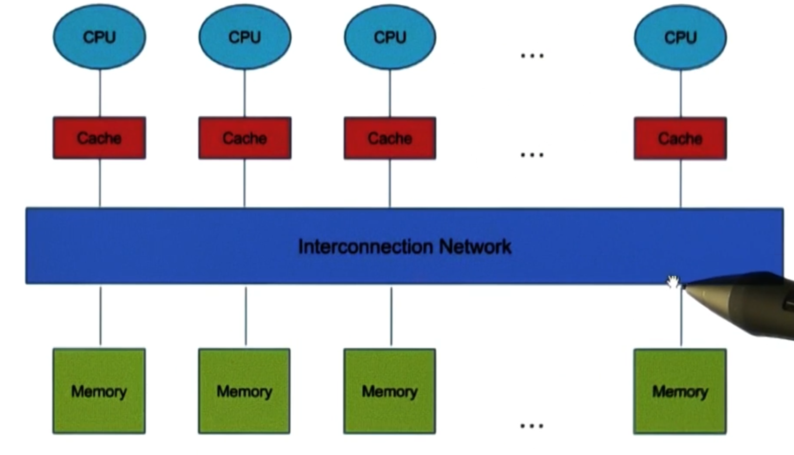
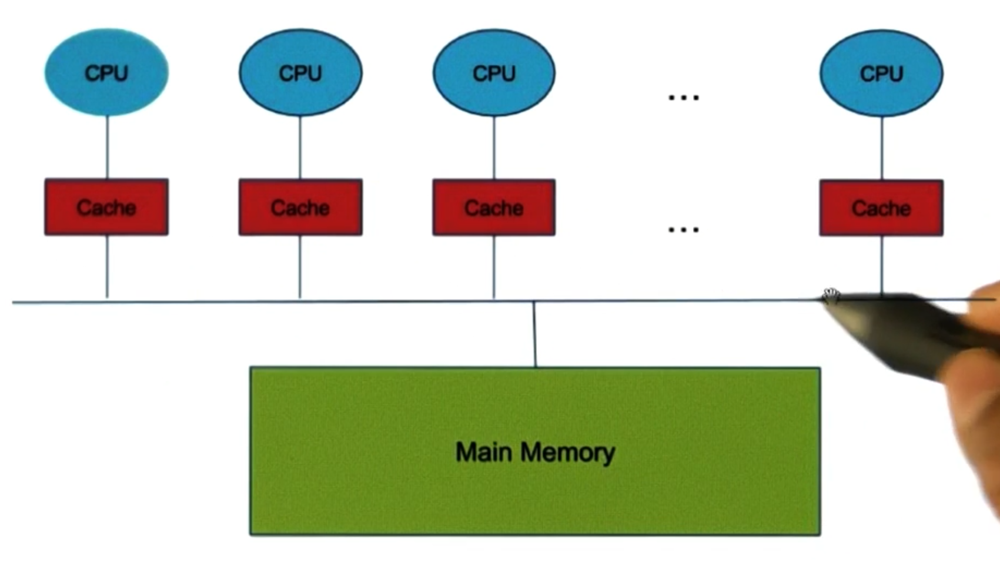
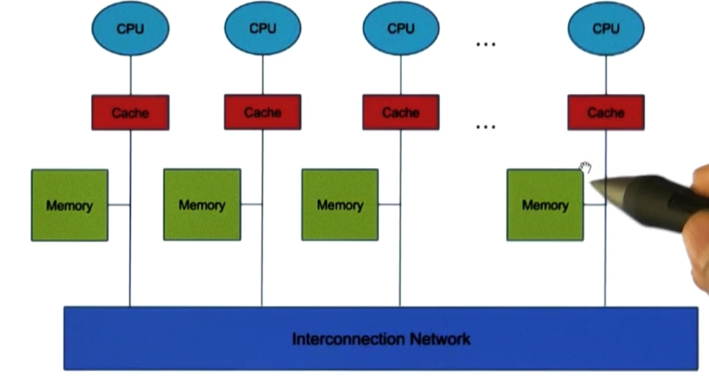

---
aliases:
checked: false
course: CS6210 Advanced Operating Systems
created: 2025-09-17
draft: true
last_edited: 2025-09-17
tags:
  - OMSCS
title: Week 4 - Parallel Systems
type: lecture
week: 4
---

# Week 4 - Parallel Systems

In modern computing, nearly all processors are multi-core.
This presents an interesting problem - how to share memory between them?

## Shared Memory Architectures

Here we detail 3 different approaches to shared memory architectures:

### 1. Dance Hall Architecture

In this architecture, CPUs and distributed memory sit on either side of an interconnection network.
All memory is accessible to all CPUs.



### 2. Symmetric Multiprocessor (SMP)

In this architecture, CPUs share a common bus to access a single memory.
Access time from each CPU to the memory is the same.
This is the most common architecture in modern systems.



### 3. Distributed Shared Memory (DSM)

In this architecture each CPU has its own local memory, but can also access memory on other CPUs.
These accesses are done via an interconnection network and take longer than accessing local memory.



## Caches

Within all the designs above, each CPU has its own cache.
This is important as (for example) in SMP cache access takes around 2 cycles - whereas memory access is around 100 cycles.
However, the existence of a cache creates a problem - what if two CPUs have a copy of the same memory location in their cache, and one CPU updates it?

### Memory Consistency Models

In my previous lectures we covered memory consistency models in detail.

[Week 15 - Distributed shared memory](../CS6200/week_15_-_distributed_shared_memory.md)

This course mainly focuses on sequential consistency.

[Sequential consistency](../../general/sequential_consistency.md)

### Cache Coherence

The memory model is the software engineers view of memory.
It mandates what you can expect when programming on multi-threaded systems.
The other side of this is cache coherence - the hardware engineers view of memory.
This is how the hardware ensures the memory model is upheld.

>[!note] Cache coherent processors
> One solution to this problem is for the hardware to make no promises of consistency.
> This, would be a cache incoherent processor - it is up to the software to implement consistency.
> However, below we detail methods for processors to be cache coherent.

Here are a couple methods to guarantee cache coherence:

- *Write-invalidate*: When a CPU writes to a memory location, it invalidates all other cached copies of that memory location.
- *Write-update*: When a CPU writes to a memory location, it updates all other cached copies of that memory location.

>[!warning] What happens for multiple writes?
> This will cause a race condition between writes.
> Not discussed in the lectures.

The downside to these approaches is they affect the 'scalability' of the systems.
With a good architecture, we would expect performance to scale linearly with the number of CPUs.
However, if messages need to be passed between CPUs for cache coherence (either invalidations or updates), this creates O(n²) communication overhead for n CPUs - not providing us with scalability.

#### Alternative Approach: Avoiding Shared Memory

Given the scalability challenges of cache coherence protocols, one radical solution emerges: simply avoid sharing memory between threads altogether. This approach eliminates the need for complex coherence protocols and their associated overhead.

>[!quote] Shared memory machines scale well when they don't share memory.
> This paradoxical statement highlights that the hardware capability for shared memory doesn't mean software must use it extensively.

## Synchronization Primitives

This was covered in CS6200 also:

[Week 10 - Synchronization Constructs](../CS6200/week_10_-_synchronization_constructs.md)

### Exclusive Locks

These are locks where at most one thread can have it at a time.

### Shared Locks

These are locks which have more complicated semantics of access, for example readers-writer locks.

### Barriers

This is a synchronization primitive where threads wait until all threads have reached the barrier before proceeding.

## Lock implementations

> [!reminder] Atomic Operations
> These are operations which are guaranteed to not be interrupted when running on the CPU.

When we want to implement a exclusive lock, read and write atomic operations are not enough and we need a RMW (read modify write) atomic operation.
Below are some of the usual suspects:

- Test-and-set: This operation gets the current value of a memory location and sets it to 1.
- Fetch-and-increment: This operation gets the current value of a memory location and increments it.
- Fetch-and-phi: This is a generic version of fetch-and-increment where phi is any function.

When we are assessing different lock implementations, we care about:

- Latency: If the lock is not currently used, how long does it take to acquire it.
- Waiting time: If the lock is currently used, how long does it take to acquire it.
- Contention: If the lock is currently used but then released, how long does it take to acquire it.
- Fairness: Do threads get the lock in the order they requested it.

Whilst waiting time is application specific, the other two can be used to compare different lock implementations.

### Spin lock (test-and-set)

This is the simplest lock implementation.
Here you have a shared memory address that represents if the lock is busy or not - lets call `locked`.

```c
LOCKED = 1;
UNLOCKED = 0;

void lock(){
  while(test_and_set(locked) == LOCKED); // spin
}

void unlock(){
  locked = UNLOCKED;
}
```

This is a pretty bad lock for 3 reasons:
- Blocks useful work from being done whilst spinning.
- Massive contention as multiple threads carry out test-and-set on the same memory location.
- Does not utilise caching in anyway.

### Cached spin lock

If we can assume the caches are kept cache consistent through the hardware, we can use these values to save us needing to perform the costly atomic operation.
This is similar to uncached version where we have a `locked` variable.

```c
LOCKED = 1;
UNLOCKED = 0;

void lock(){
  while(test_and_set(locked) == LOCKED){
    while(locked == LOCKED); // spin
  }
}

void unlock(){
  locked = UNLOCKED;
}
```

Whilst this dramatically reduces the number of test_and_set operations, if the hardware uses write-invalidate this is on the order of O(n^2) memory accesses as for each test_and_set every processor needs to get the new value of locked from memory.

### Spin locks with delay

To reduce the contention on the memory bus, we can add a delay between each test_and_set operation.

```c
LOCKED = 1;
UNLOCKED = 0;

EXP_CONST = 2;
INITIAL_DELAY = 1;
MAX_DELAY = ??;

void lock_with_fixed_delay(){
  while(locked == LOCKED or test_and_set(locked) == LOCKED){
    while(locked == LOCKED); // spin
    wait(d[P_i]); // wait for an amount of time that depends on the processor id
  }
}

// This does not use the cache, so we do not require a cache coherent system.
void lock_with_exponential_delay(){
  int delay = INITIAL_DELAY;
  while(test_and_set(locked) == LOCKED){
    wait(delay);
    delay = min(MAX_DELAY, delay*EXP_CONST); // exponential backoff
  }
}

void unlock(){
  locked = UNLOCKED;
}
```

This dramatically reduces contention on the memory bus, but increases latency of acquiring the lock.

### Ticket lock

This mimics getting a ticket in a shop to be served next.
You get a ticket number when you enter and you wait until your number comes up.

```c
struct lock{
  int next_ticket = 0; // The next ticket to be given out
  int now_serving = 0; // The ticket number currently being served
};

void lock(lock L){
  int my_ticket = fetch_and_increment(L->next_ticket);
  while(my_ticket != L->now_serving);// spin
}

void unlock(lock L){
  L->now_serving = L->now_serving + 1;
}
```

This lock is now fair but there is quite a bit of contention when the now_serving variable is updated as all threads will be trying to read it.
The issue here is that all threads are spinning on the same memory location - if we can instead only signal the next thread we can greatly reduce contention.

### Array-based queueing lock

To do this, we can create an array which acts a circular queue.

```c
MAX_THREADS = ??; // maximum number of threads that can use the lock
HAS_LOCK = 1;
LOCKED = 0;

struct queue_lock{
  int[MAX_THREADS] flag; // array of flags, initialise with flag[0] = HAS_LOCK and all others LOCKED
  int next_ticket = 0; // The next ticket to be given out
  int current_ticket = 0; // The ticket number currently being served
};

void lock(queue_lock L){
  int my_ticket = fetch_and_increment(L->next_ticket);
  while(L->flag[my_ticket % MAX_THREADS] == LOCKED); // spin
  L->flag[my_ticket % MAX_THREADS] = LOCKED; // reset for next use
}

void unlock(queue_lock L){
  L->current_ticket = L->current_ticket + 1;
  L->flag[L->current_ticket % MAX_THREADS] = HAS_LOCK; // set flag
}
```

This dramatically reduces contention as each thread is spinning on a different memory location.
However, this lock requires a large amount of memory - O(n) for the number of threads, which could be very large.

### Link list lock

For array-based queueing locks it used a lot of space even if only 2 threads are going to use it.
So instead it would be good to use a linked list to dynamically allocate memory.

```c
struct queue_node{
  int got_lock = 0;
  queue_node * next = NULL;
};

struct lock{
  queue_node * tail = NULL; // points to the last node in the queue
};

void lock(lock L, queue_node * my_node){
  queue_node *prev = fetch_and_store(L->tail, my_node); // atomically swap the tail with my_node
  if(prev == NULL){ // no one has the lock
    my_node->got_lock = 1; // set the flag
  } else {
    previous->next = my_node; // add myself to the end of the queue
    while(my_node->got_lock == 0); // spin
  }
}

void unlock(lock L, queue_node * my_node){
  bool someone_in_queue = compare_and_swap(L->tail, my_node, NULL); // If I am the tail node - swap it to null and return true, otherwise return false.
  if (someone_in_queue){
    while(my_node->next == NULL); // spin
    my_node->next->got_lock = 1; // signal the next node
  }
}
```

### Comparison

| Metric | Spin T&S | Spin on read | Spin w/ delay | Ticket | Array Q | List Q |
|--------|----------|--------------|---------------|--------|---------|--------|
|Latency | Low      | Low          | High          | Low    | Low     | Low    |
|Contention | High  | Medium       | Low           | Low    | Low     | Low    |
|Fairness | No      | No           | No            | Yes    | Yes     | Yes    |
|Spin on pvt variable | No | No    | No            | No     | Yes     | Yes    |
| RMW ops per lock | High | Medium | Low           | Low    | 1    | 1 (max 2) |
| Space  | Low      | Low          | Low           | Low    | High    | Medium |
| Signal one | No   | No           | No            | No     | Yes     | Yes    |
| Complex instructions | No | No   | No            | No     | Yes     | Yes    |


## Barrier implementations

With barrier implementations we are looking for:

- *Minimal contention*: We would like to reduce the amount of contention on the memory bus.
- *Latency*: We would like to minimise the amount of time the barrier mechanism takes.
... fill more in here.

### Centralised barrier

The simplest barrier implementation is to just count the threads in to the barrier and only release them when all threads have arrived.
One issue with this is when to release them, as some thread will need to reset the count.
This has to happen before threads are allowed to continue, otherwise they could finish the next section before the count is reset.

```c
struct barrier{
  int size = N;
  int count = N;
};

void bar(barrier B){
  decrement(B->count); // Atomic
  if(B->count == 0){
    B->count = B->size; // reset the count
  } else {
    while(B->count != B->size); // spin
  }
}
```

### Sense reversing barrier

The centralised barrier can only be used once, as each thread will need to notice that the count has been reset to the size.
Ideally, we would like to be able to reuse the barrier.
For this we can use a boolean flag to indicate if the barrier has been reset.
This means the barrier can be used in 'episodes'.

```c
struct barrier{
  int size = N;
  int count = N;
  bool sense = false;
};

void bar(barrier B){
  decrement(B->count); // Atomic
  if(B->count == 0){
    B->count = B->size; // reset the count
    B->sense = !B->sense; // flip the sense
  } else {
    bool my_sense = B->sense;
    while(B->sense == my_sense); // spin
  }
}
```

The issue with the centralised barriers are the contention on a single shared variables.
This means it has to be available to all threads and which is in a cache coherent system will generate lots of traffic.
Ideally, we would like to reduce contention by having multiple shared variables.

### Tree barrier

To reduce contention we will use a k-ary tree, and divide the threads up into groups of size less than or equal to some k.
These groups will be attached to a leaf node of a tree, and the last to arrive at each node will signal its parent node.
Once the root node has been released, this message will propagate down the tree to release all threads.

```c
struct barrier_node{
  int count = k; // number of children
  barrier_node * parent = NULL; // pointer to parent node
  bool sense = false; // sense for this node
};

// Some way to get the leaf node associated with the thread id.
barrier_node *get_leaf_node(int thread_id);

void bar_recursive(barrier_node * B){
  decrement(B->count); // Atomic
  if(B->count == 0){
    if(B->parent != NULL){
      B->sense = !B->sense; // flip the sense
    } else {
      bar_recursive(B->parent); // signal parent
    }
  } else {
    bool my_sense = B->sense;
    while(B->sense == my_sense); // spin
  }
}

void bar(int thread_id) {
  barrier_node *my_node = get_leaf_node(thread_id);
  bar_recursive(my_node);
}
```

The advantage of this approach is that contention is reduced as each node in the tree has its own count variable.
That means at most k threads will be trying to update it at once.
However, the node that signals the parent node is unknown at compile time.
This has the downside that the shared memory can not be optimised to be close to the CPU's that will need it.
So next we look at barriers where the memory locations are known at compile time.

### MCS Tree barrier

To pre-determine the memory locations each thread needs to access ahead of time, we build a 4-ary tree of the threads.
Then each thread knowns its parent thread before entering the barrier.
Then a parent thread has to wait for all its children to arrive before it can signal its parent.

For waking up, there is a separate binary tree to signal the children to wake up.
The root of the wakeup node and the barrier node are the same.

```c
struct barrier_node{
  bool has_children[4]; // Each location indicates if there is a child there
  bool child_not_read[4]; // The variable each child to flag that it has arrived
  bool *parent_not_ready = NULL; // pointer to parents child_not_read[child_index]
};

// The mapping from thread id to the node.
barrier_node *get_barrier_node(int thread_id);

struct wake_up_node{
  wake_up_node *left_child = NULL;
  wake_up_node *right_child = NULL;
  bool awake = false;
};

// The mapping from thread id to the wake up node.
wake_up_node *get_wake_up_node(int thread_id);

void bar(int thread_id) {
  barrier_node *my_barrier_node = get_barrier_node(thread_id);
  wake_up_node *my_wake_up_node = get_wake_up_node(thread_id);
  // Wait for all children to arrive
  for(int i = 0; i < 4; i++){
    if(my_barrier_node->has_children[i]){
      while(my_barrier_node->child_not_read[i] == false); // spin
      my_barrier_node->child_not_read[i] = false; // reset for next use
    }
  }

  // Signal parent and wait for wake up
  if(my_barrier_node->parent_not_ready != NULL){
    *(my_barrier_node->parent_not_ready) = true;
    while(my_wake_up_node->awake == false); // spin
  }

  // Wake up children
  if(my_wake_up_node->left_child != NULL){
    my_wake_up_node->left_child->awake = true;
  }
  if(my_wake_up_node->right_child != NULL){
    my_wake_up_node->right_child->awake = true;
  }
}
```

The numbers 4 and 2 were picked specifically as they have good theoretical properties.
The 4-ary trees mean that the flags for all threads can sit in one memory address.
The 2-ary tree means the signaling only takes $log_2(n)$ steps to wake up all threads.
Notice here that we do not need a complex atomic operation - just read and writes.

### Tournament barrier

The tournament barrier is similar to the MCS tree barrier, but instead of each thread having its own node, pairs of threads share a node.
Think of this node as a tournament which will have one 'winner' and 'loser' thread (which is pre-determined).
The winner thread will advance to the parent node and the loser thread will spin until the winner thread signals the tournament is over.

```c
struct tournament_node{
  bool loser_arrived = false; // flag for loser to indicate it has arrived
  bool tournament_over = false; // flag for winner to indicate it has arrived
  tournament_node * parent = NULL; // pointer to parent node
  bool is_winner; // indicates if this thread is the winner or loser
};

tournament_node *get_tournament_node(int thread_id);
bool is_winner(int thread_id);

void bar_recursive(tournament_node * B, bool is_winner){
  if (is_winner){
    while(B->loser_arrived == false); // spin
    if(B->parent != NULL){
      bar_recursive(B->parent, B->is_winner); // signal parent
    }
    B->tournament_over = true; // signal tournament is over
  } else {
    B->loser_arrived = true; // signal arrival
    while(B->tournament_over == false); // spin
  }
}

void bar(int thread_id) {
  tournament_node *start_node = get_tournament_node(thread_id);
  bool is_winner = is_winner(thread_id);
  bar_recursive(start_node, is_winner);
}
```

A major advantage of the tournament barrier is there is no need for a atomic operation (other than read/write), as no two threads are ever writing to the same memory location.
Also notice that the memory needed for each thread is known before hand - so this can be placed close to the required CPU.
The only interactions between threads is sending a signal that either they have arrived or the tournament is over, we do not actually need shared memory to run this system.
This means it can be implemented on a cluster which only has message passing between nodes.
A downside for the tournament barrier against MCS is that only 2 nodes can share the same cache line - whereas MCS can have 4.

### Dissemination barrier

Within the tree based barriers there are normally  a single thread which is responsible for kicking off the rest of the processes to wake up.
This also means that the level of parallelism is limited by the height of the tree.
In the dissemination barrier, instead all processes 'gossip' amongst one another to signal they have arrived at the barrier.
This is done in a number of rounds where each thread $i$ messages node $i + 2^k$ saying it has arrived and waits for a message from node $i - 2^k$ on round $k$ (starting from $k=0$).
This has the nice effect that to progress past round $k$, atleast $2^{k+1}$ nodes must have made it to the barrier.
Therefore after round $ceil(log_2(n))$ all nodes must have arrived at the barrier - and we can safely proceed.

```c
int THREAD_COUNT;
int ROUNDS = ceil(log_2(THREAD_COUNT));

struct barrier{
  int position;
  bool flags[ROUNDS];
};

// Mapping from position to the barrier structure.
barrier *get_barrier(int position);

void bar(barrier B) {
  for(int k = 0; k < ROUNDS; k++){
    barrier *partner = get_barrier((B->position + 2^k) % THREAD_COUNT);
    B->flags[k] = true; // signal partner I have arrived
    while(B->flags[k] == false); // spin
  }
}
```

This barrier takes $O(n log(n))$ messages to complete, but each thread only needs $O(log(n))$ space.
As these are just messages the thread do not need to share memory - so this can be implemented on a cluster.
There is no hierarchy, so there is no single point of contention.

### Aside: Architectures for the system

When considering which barrier or lock to use, we need to consider the architecture we are running on.
The 4 main ones discussed here are:

- Cache coherent Shared Memory Processors (CC-SMP): These systems have hardware support for cache coherence.
  This means that if one CPU updates a memory location, all other CPUs will see the updated value.
  This is the most common architecture in modern systems.

- Cache coherent Non-Uniform Memory Access (CC-NUMA): These systems have hardware support for cache coherence, but memory access time is not uniform.
  This means that some memory locations are closer to some CPUs than others.

- Non-Cache coherent Non-Uniform Memory Access (NC-NUMA): These systems do not have hardware support for cache coherence, and memory access time is not uniform.
  This means that some memory locations are closer to some CPUs than others.

- Message Passing clusters: These systems do not have shared memory, and all communication is done via message passing.

### Performance comparison

TODO: Read the MCS paper and fill in this.

# Remote Procedure Calls (RPC)

Within processes that are running on the same machine, we still use the client-server model.
This enables safety as the processes can be running in separate protection domains (address spaces).
When programming the client-server model between machines we would use RPC - however could we use it within the same machine?
The main concern here is performance.

> [!note] Procedure call
> Within a process, a procedure call is a function call that is made within the same address space.
> Normally, the arguments are moved from the scope of the caller within the stack for a procedure call and vice versa for the return value.
> This all happens in compile time and is very fast.
> However, within RPC this will all happen at run time and will be slower.

## RPC performance concerns

The main issue with RPC between processes is the involvement of the kernel and the copying of data.
Lets break down the steps involved in an RPC call using message passing through the kernel:

1. The client traps to the kernel to call the RPC method.
The arguments get copied from the clients address space to the kernel's address space.
The kernel may need to check that the client is allowed to communicate with the server process.

2. The kernel switches to the server to execute the RPC method.
The arguments get copied from the kernel's address space to the server's address space.

3. The server then executes the RPC method with the arguments and calculates the return value.

4. The server traps to the kernel to return the value.
The return value gets copied from the server's address space to the kernel's address space.

5. The kernel switches to the client to return the value.
The return value gets copied from the kernel's address space to the client's address space.

This is 4 copies of data and 4 context switches for a single RPC call.
This is all happening at run time and is very slow.

This is in fact slightly worse for RPC calls when you consider the different components of the RPC stack.
For this we consider one direction client -> server.

1. The client prepares the arguments for the RPC call in the clients stack.

2. The client stub serialises the arguments into a message format.

3. The kernel copies the serialised message from the clients address space to the kernel's address space.

4. The kernel copies the serialised message from the kernel space to the server address space.

5. The server stub deserialises the message into the server's stack.

## Reducing RPC overhead (Bindings)

To make this faster, we will used shared memory and optimise for the common case - which should be calling the RPC method.
However, for this we make setting up the RPC connection more expensive (what we will call a binding).
We follow this process below:

1. The server registers its procedures with a 'name server'.

2. The client uses the name server to try and call the RPC method, this traps to the kernel.

3. The kernel checks with the server that the client is allowed to communicate with the server process.
If so, the server grants permission to the client.

4. The kernel then sets up a data structure called a Procedure Descriptor (PD) within the kernel.
The PD stores which entrypoint within the server to use for this RPC, the size of the argument stack (A-stack), and the number of simultaneous calls that can be made to the method.

5. The kernel also creates a shared memory region between the client and server (called the A-stack) for them to communicate without the intervention of the kernel.

6. The kernel returns a Binding Object (BO) to the client - within the kernel this is lined to the PD but for the client acts as permission to call the RPC method.

The for the client to call the method the following happens:

1. The client stubs copies the arguments from the client stack into the A-stack (which have to be passed by value - not reference).

2. The client then traps into the kernel presenting BO to call the method.

3. The kernel uses the BO to find the PD and then switches to the server process on exactly the entry point specified for this method.

4. The server stub then uses the A-stack to copy the arguments out into the server stack and can call the method.

5. Once the server is done calculating the return value, it copies the return value into the A-stack.

6. The server then traps back to the kernel to return control to the client.

7. Finally, the client stub can use the A-stack to copy the return value into the client stack.

This has the following advantages:

- There are half as many copies of data, as we no longer need to pass the information through the kernel.

- The stubs need to do less serialisation, as the message is doing less travelling so can stay in a format closer to how they would be represented in the stack of a process.

- Simplified permissions, by presenting the BO the kernel does not need to validate the client has access to the server.

However, we still suffer from the context switches to the kernel and the implicit costs of these switches from the loss of locality within the caches.

## RPC using SMP

For highly used RPC methods, in a shared memory processor we can avoid the loss of locality by pinning the server to a CPU.
This way we can keep the caches on that CPU warm with the server process.
The shared memory allows for the quick transfer between the client and server of the call arguments and returns.

## Summary

Using RPC within a machine is possible, but there are performance concerns.
However, this opens up better protection between processes and a cleaner programming model.

# Scheduling in multi-core systems

Within scheduling in multi-core systems the main goal is to try and keep the caches as hot as possible to reduce overhead.

## Cache affinity scheduling

The difference between reading from the L1 cache to reading from memory is on the order of 100x slower.
Therefore, when scheduling a thread we want to keep in mind where it has been scheduled previously.
So we define 'cache affinity' as the property of a thread to run on the same CPU it has previously run on.
However, this is a weaker association if lots of other threads have ran on it since it was last ran.

> [!note] Cache importance
> Threads with a large memory footprint are much more effected by cache affinity.
> For small memory threads, the cache reload time is much more marginal compared to the total execution time.
> Whereas for large memory threads, the cache reload time is a significant portion of the total execution time.

This leads to the following scheduling algorithms:

- FCFS (First Come First Served): Choose the first thread that is ready to run.
  - Ignores all affinity.
  - Prioritises fairness.

- Fixed processor: Pin each thread to exactly one processor and always run it there.
  - Focuses on catch affinity.
  - Harder to load balance correctly.

- Last processor: Choose the last processor the thread ran on.
  - Focuses on cache affinity.
  - Harder to load balance correctly.

- Minimum Intervening: Choose the processor that has had the least number of other threads run on it since this thread last ran on it.
It achieves this by tracking for any given thread the Intervening index - the number of threads that ran on a processor since that thread last ran.
  - Focuses on cache affinity and cache pollution.
  - Could lead to large overheads.

- Limited Minimum Intervening: Don't track the intervening index for all processors, instead track it for the top few processors.
  - Focuses on cache affinity and cache pollution.

- Minimum Intervening plus queueing: Add the Intervening index to the current queue length to get a new index which is used to pick a processor.
  - Focuses on cache affinity and cache pollution.
  - Accounts for load balancing more.

We call policies like fixed and last processor 'thread centric' as we focus on prioritising the preferences of the thread, whereas the MI polices as 'processor centric' storing data relating to each processor instead.

## Implementation issues

When trying to implement these policies you may choose to go for a 'global' queue of threads that get chosen from by the processors.
However, this queue is a very large data structure that will need to be shared among all processors which is inefficient memory wise.

Instead, we can use processor based local queues.
Where each processor has a local queue of tasks, usually order using the thread priority.

$$
ThreadPriority_i = BasePriority_i + Age_i + Affinity_i
$$

The base priority is some dynamic or static priority given to each thread.
Age is how long it has been unscheduled - to ensure fairness.
Lastly Affinity will how we define affinity as above.

In the local queue setting, it may be that processors finish their queue and have no other tasks to run.
In this case, we can 'steal' tasks from other processors queues - and within the literature is called 'task stealing'.

## Metrics

For scheduling there are 3 key metrics:

- *Throughput*: How many threads get executed or computed pre unit time. (System centric.)

- *Response time*: How long on average does it take for a thread to complete. (User centric.)

- *Variance*: Does the time it takes for a thread to complete vary based on when it was scheduled. (User centric.)

Notice that these metrics may very for different strategies under different load.
If the tasks all have very small memory foot print then the throughput may be highest with FCFS as affinity plays a smaller role.
If there is a memory dense but light load throughput may be optimised by a cache affinity strategy.
Whereas if the load is incredibly heavy then fixing the processor for each thread may yield the best throughput.
There is not one optimal strategy, the best strategy will depend on the load and types of tasks.

> [!warning] Procrastination
> It may be the case that highest throughput is achieved by CPU's actively idling rather than scheduling ready tasks if these tasks require a large memory footprint.

## Multi-core multi-threaded processors

In modern systems, each core may have multiple thread contexts loaded on each core (hardware multi-threading) - they will still only have one CPU but this enables fast switching between threads when a thread is blocked on I/O.
These CPU's are normally grouped together on a chip where they all have different L1 caches but share an L2/3 cache.
This then increases the complexity of scheduling.
We not only have to map multiple threads to a single CPU, we will want to group these threads to maximise cache L1 hits.
Then we will want to select threads on the same chip that are likely to share the same context for the L2/3 cache.

### Cache aware scheduling

Now we have multiple threads on the same CPU sharing an L1 cache.
Multiple CPU's on the same chip sharing a L2/3 cache.
We know these caches have limited size - so we should try to schedule threads so the total size of the cache they require is less than the size of the cache available.
To this extent the OS can track the amount of cache size each thread uses, and charracterise them as either:

- *Cache frugal*: Doesn't use a lot of cache space.
- *Cache hungry*: Uses a lot of cache space.

This will enable better scheduling of threads to lower the amount of cache misses and therefore improve performance.

> [!note] OS's overhead
> If the OS spends too much time recording the memory usage of threads, any benefit maybe wiped out by that overhead.

# Parallel OS case studies

There are key challenges for OS's that run on large parallel systems.

- Size bloat: More features requires a larger OS.

- Memory latency: As the system increases in size the latency difference between the cache and going to RAM increases.
This is compounded in the NUMA setting, where some memory may be a lot slower to access than others.

- Deep memory hierarchy: As the CPU cache gets split up, between a single multi-threaded CPU and the chip with NUMA memory disjointed - managing where memory is stored becomes more complicated.

- False sharing: This is where two threads are using different memory locations, but these memory locations are on the same cache line.
This is made worse as modern processors tend to have larger cache blocks, to reduce the amount of times they go out to memory.

## Principles of good parallel OS design

- Cache conscious decisions: Be aware of the cache hierarchy and try to make decisions that will keep the caches hot.

- Limit shared system data structures: Shared data structures will cause contention and slow down the system.

- Keep memory access local: If you need to access memory across an ICN (Inter-Connect Network) this will be slow.

This issue breaks down into two opposite cases:

- *Multi-process workloads*: If all the threads running on different CPU's are different processes, then we are ok.
As they are difference processes, they do not share any data structures - so no sharing has to happen between CPU's.

- *Multi-thread workloads*: If all the threads running on different CPU's are the same process, then we have a problem.
Here a page-table update may effect multiple nodes or chips within the machine which means keeping state consistent between different memory locations.

### Recipe for scalable structure in parallel OS

For each subsystem:

- Determine needs of that service.

- To ensure concurrent execution of the service minimize shared data structures. (This is hard in practice.)

- Where shared data structures are required replicate/ partition system data structures leading to less locking and more concurrency.

## Page fault service

To see this in practice we look at how a CPU handles a page fault in a large parallel system.

1. (Thread specific) CPU request a VPN,

2. (Thread specific) TLB lookup results in a miss,

3. (Thread specific) PT lookup in memory results in a miss,

4. (System based) System locates the file on disk,

5. (System based) I/O operation happens and creates a page frame in memory,

6. (System based) PT update to reflect the new page frame and create VPN,

7. (Processor specific) TLB update to store new VPN -> PFN mapping,

8. (Processor specific) Page fault completed and CPU can continue.

The system based queries are the dangerous parts of this process.
If this has to happen in series for all the threads, this will cause a bottleneck.

## Tornado's innovation: Clustered object

A clustered object, is one that is replicated by the OS.
However, to the software programmer appears to be a single object.
This allows for it to be quickly available to everywhere that needs it.

The OS service designer can choose the level of replication:

- Singleton representation: Only one copy of the object exists, relies upon hardware cache consistency to replicate it across CPU's.

- One per core: This means it can be available in memory for each core and rely upon hardware consistency to keep the caches correct.

- One per CPU: This means it can be fresh in each CPU's cache with no reliance on hardware consistency.

- One representation per group of CPU's.

When you are replicating objects not using the hardware's cache consistency it is up to the OS service programmer to maintain consistency.
This is advantageous, as your service may not require the level of consistency guaranteed by the hardware.
This will allow for lower contention on the ICN.

In the Tornado paper, they propose using a protected procedure call when updating a clustered object - this will allow the OS and its services to make decisions about how the object should be updated.

The advantages of these clustered objects are:

- Allows incremental optimisation of the clustered object over time.

- Different instances of the same object reduce locking and contention on the ICN.

- Different instances can have different implementations depending on need.

### Implementation of clustered objects

The implementation of the clustered object on the tornado OS uses 3 critical objects, translation table (per clustered object), miss handling table (partitioned globally) and global miss handler (singledton replicated on every CPU).

**Translation table**

For each clustered object there is a translation table, the processes go to the translation table with their reference to the clustered object and if it exists it can return the local copy of the clustered object to the process.

**Miss handling table**

If the translation table does not have a local copy of the clustered object then it looks up that object in the miss handling table.
The miss handling table is partitioned and if this CPU has a copy of the miss handler for this clustered object it then calls this handler for the clustered object.
This will create a new instance of the clustered object and add this to the local translation table.

**Global miss handler**

However, as the miss handling table is partitioned, it may be the case that this CPU does not have a copy of the miss handler for this clustered object.
In this case the global miss handler is called, and its job is to get the correct miss handler locally for this object.
After this is done, then the proper miss handler can be called to create the object.

The advantage of this system is it allows the OS to optimise the location of the miss handlers and objects over time.
Used well this with the clustered object can increase the concurrency of the OS for its critical services.

### Non-hierarchical locking: Reference counting

When editing a shared data structure such as a PCB, your intuition maybe to lock it whilst you are editing it.
However, this is not good for concurrency.
If the object itself has been partitioned into multiple sub-regions when editing it you only need to guarantee that it is present whilst you are editing it.
This will allow multiple changes to difference parts of the same object.

So instead of locking objects, for clustered object you instead keep a reference count.
If the reference count is greater than zero the OS knows it can not move that data structure if it need to move a process from one node to another (similar to python).

## Case study: Virtual memory

For a virtual memory system we have the following levels of backing:

- Virtual memory: The abstraction of memory that the process sees.

- Page cache: In DRAM.

- Storage subsystem: On disk

The virtual memories data structures are, PCB, TLB, PT, and virtual pages on disk.

The tornado system 'objectizes' this process with the hope to break apart shared objects into smaller pieces.
Lets walk through each of these objects.

- PCB: The PCB is replicated per CPU as it is mostly read only - this allows for fast access to the PCB without contention.

- Region: The address space is broken down into regions, the idea being that each thread may only use on region of the address space each.
These can be partially replicated if two threads on different CPU's are uses the same part of the address space.
This being separated out means that the OS at run time can see the access patterns to each region and choose to break it apart if too much contention is on one region or join together if two regions are only used by threads on the same CPU.

- File Cache Manager: This knows the locations of the physical pages on the backing store for the references in the regions.
The File cache manager is partitioned globally, so each CPU has a subset of the file cache manager objects.

- DRAM manager: This is the physical memory, the FCM uses the DRAM to get the physical frame number it will use to load memory into.
This has several representations - per CPU, per chip, and globally.

- Cached Object Representation: This goes to the backing store on the disk to carry out the I/O whenever there is a page fault.
This is a true singleton which uses the hardware cache coherence.

This separation into different objects allows for memory access by different threads to not block one another when they are all running within the same process.
Also the page faulting system can run concurrently instead of serially.

Seperating out the responsibilities means these objects can have different levels or replication or partitioning as it is required.

## IPC in tornado

The Tornado OS is structured as a micro kernel, with the clustered objects enabling higher level OS services.
One of the critical services a microkernel needs to implement well is IPC.
This is implemented as a protected procedure call (PPC) - which is similar to RPC (particularly LRPC).

- Local PPC: Are just procedure calls with no context switching.

- Remote PPC: Requires a full context switch to the kernel.

## Tornado summary

- Object oriented design for scalability.

- Multiple implementations of OS objects for different needs.

- Allows optimisation for the common cases.

- No hierarchical locking, using reference counting instead.

- Limited sharing of OS data structures.

## Corey system ideas

The Corey system focuses on allowing the application telling the OS how it should treat the shared data structures.

The Corey system also uses address ranges within the address space.
However, this relies on the application to say where different threads will be operating, so the OS can choose to place these on the same node to share memory.

The Corey system allows for threads to tell the OS that some data is private too it through the shares mechanism.
This allows the OS to know this data will not be shared and so the OS does not need to maintain consistency between this object and the other threads within the same process.

Corey dedicates cores for kernel activities - this way it does not need to share core kernel data structures between multiple cores.

## Cellular disco: Virtualisation on a multi-core system

The design of the OS is a complicated task that is specialised to the architecture of the machine.
Though does this mean that for each architecture we need to redesign the OS?
Most of the OS code is device driver (3rd party) code - this is for managing the I/O subsystem.
Do these also need to be redesigned for each new architecture?

Cellular Disco shows that virtualisation via the trap+emulate strategy can be used with only 10% overhead to abstract away architecture and allow for the same device drivers to be used for different architectures.
It does this by handling the I/O calls for the guest OS's as if it was making them itself.
This means when the kernel traps to return the output of an I/O call it uses the handler installed in the Host OS to jump straight into Cellular disco without needing another context switch from the host OS.
