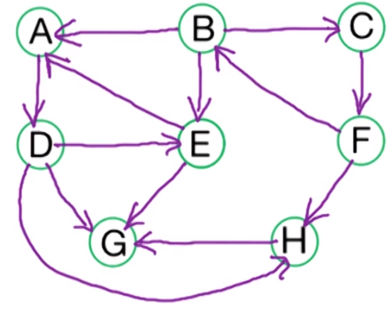

# Week 6 - Graph algorithms - strongly connected components

## DFS - not the sofa seller!

Recall the definition of [[Depth-first search (DFS)]] in the note. We used it there to find the [[Connected components (graph)|connected components]] of a graph.

![[DFS to find connected components in an undirected graph]]

## [[Find path in undirected graph|Find paths in undirected graph]] via [[Depth-first search (DFS)|DFS]]

First for [[Graph|undirected graphs]] we just keep track of the previous vertex and find a [[Spanning subgraph|spanning]] [[Subgraph|sub]]-[[Forest (graph)|forest]] for the [[Graph|graph]]. We can use this to find [[Path (graph)|paths]] between vertices by going back to the root vertices of the [[Tree (graph)|trees]].

```pseudocode
DFS(G)
  input: G = (V,E) in adjacency list representation
  output: Vertices labelled by connected components
    connected_component = 0
    for all v in V, set visited(v) = False, previous(v) = Null
    for all v in V
      if not visited(v) then
        connected_component++
        explore(v)
    return previous
```

```pseudocode
Explore(z)
  input: vertex z
    connected_component_number(z) = connected_component
    visited(z) = True
    for all (z, w) in E
      if not visited(w)
        previous(w) = z
        Explore(w)
```

## [[Find path in undirected graph|Find paths in undirected graph]] via [[Depth-first search (DFS)|DFS]]

To do this we are going to use a [[Depth-first search (DFS)|DFS]] algorithm like above but we are going to track pre/postorder numbers.

```pseudocode
DFS(G)
  input: G = (V,E) in adjacency list representation
  output: Vertices labelled by connected components
    clock = 1
    for all v in V, set visited(v) = False
    for all v in V
      if not visited(v) then
        explore(v)
  return post (defined in Explore)
```

```pseudocode
Explore(z)
  input: vertex z
    pre(z) = clock, clock ++
    visited(z) = True
    for all (z, w) in E
      if not visited(w)
        Explore(w)
	post(z) = clock, clock++
```

### Example

Suppose we have the following graph and let $B$ be the root node. Suppose we explore edges alphabetically and lets run the algorithm above on it.



As we are using [[Depth-first search (DFS)|DFS]] we explore far first and then slowly come back. Which gives us the following [[DFS tree (algorithm)|DFS tree]] with the pre/post numbers.


| Letter | Pre | Post |
| ------ | --- | ---- |
| A      | 2   | 11   |
| B      | 1   | 16   |
| C      | 12  | 15   |
| D      | 3   | 10   |
| E      | 4   | 7    |
| F      | 13  | 15   |
| G      | 5   | 6    |
| H      | 8   | 9    |

Lets try and classify the edges $(z,w)$ in this graph

- [[DFS tree (algorithm)|Tree edges]]
	- First explored edges (black) that form a [[Spanning subgraph|spanning]] [[Subgraph|subgraph]].
	- Examples: $B \rightarrow A$, $A \rightarrow D$
	- $post(z) > post(w)$
- [[DFS tree (algorithm)|Back edges]]
	- Edges going from a node further out from the root (in the black edges) to a node closer to it but still in the same branch.
	- Examples $E \rightarrow A$, $F \rightarrow B$
	- $post(z) < post(w)$
- [[DFS tree (algorithm)|Forward edges]]
	- Edges that go further down the tree.
	- Examples: $B \rightarrow E$, $D \rightarrow G$
	- $post(z) > post(w)$
- [[DFS tree (algorithm)|Cross edges]]
	- Edges that go from one branch to another.
	- Examples: $F \rightarrow H$, $H \rightarrow G$
	- $post(z) > post(w)$

Note here there the only type of edges to have $post(z) < post(w)$ are back edges.

![[Cycles in a graph via the DFS tree]]

## Topological sorting

![[Topological sorting (DAG)]]

Suppose we have a [[Directed acyclic graph (DAG)|DAG]] $D$ from [[Cycles in a graph via the DFS tree|the lemma above]] we can run a [[Depth-first search (DFS)|DFS]] algorithm starting at the root of $D$ and the post ordering will provide a [[Topological sorting (DAG)|topological sorting]] of the vertices of $D$.

## Vertices in a [[DAG]]

We can classify special vertices in a [[Directed acyclic graph (DAG)|DAG]]

- Source vertices: These have no incoming edges
- Sink vertices: no outgoing edges

Given a linear ordering we know the minimal vertex is a source and the maximal vertex is a sink. This gives us another algorithm to find a [[Topological sorting (DAG)|topologically sorting]]:

1. Find a sink vertex, label it and then delete it.
2. Repeat (1) until the graph is empty

## Strongly connected components

Recall the definitions

![[Strongly connected (directed graphs)|strongly connected]]

![[Strongly connected components (directed graphs)|strongly connected components]]

Then we can define the [[Strongly connected component graph (directed graph)|strongly connected component graph]]

![[Strongly connected component graph (directed graph)|strongly connected component graph]]

Which we can show is a [[DAG]].

![[The strongly connected component graph is a DAG]]

## Strongly connected component algorithm

The idea of the algorithm is the following:

- Find a sink [[Strongly connected components (directed graphs)|strongly connected component]],
- Remove it,
- Repeat!

We use sinks as if we start a [[Depth-first search (DFS)|DFS]] algorithm in a sink [[Strongly connected components (directed graphs)|strongly connected component]] we only discover vertices in that [[Strongly connected components (directed graphs)|strongly connected component]].

This is not true for source [[Strongly connected components (directed graphs)|strongly connected components]], here we discover everything.

## Finding a vertex in a sink SCC

We have the following two statements in a [[Directed acyclic graph (DAG)|DAG]]:
- The vertex with the lowest postorder number is a sink.
- Then vertex with the highest postorder number is a source.

We would hope for the analogous statements in a general [[Directed graph|directed graph]]:
- The vertex with the lowest post order number is in a sink [[Strongly connected components (directed graphs)|strongly connected component]]
- The vertex with the highest post order number is in a source [[Strongly connected components (directed graphs)|strongly connected component]]

The first statement is false consider the following counter example.

![[sink_counter_example]]

If we run a [[Depth-first search (DFS)|DFS]] algorithm starting at $A$ using an alphabetical ordering on the vertices then $B$ has the lowest post order number but is in the source [[Strongly connected components (directed graphs)|strongly connected component]].

![[A vertex with the highest post order number lies in a source SCC]]

Suppose we a directed graph $G$ define the [[Reverse directed graph|reverse directed graph]] $G^R$. Now observe

![[The strongly connected components are the same in a directed graph and its reverse]]

Moverover we have.

![[Taking the reverse respects going to the strongly connected component graph]]

Therefore if we can find a source vertex in $S_{G^R}$ then we have found a sink vertex in $S_G$. This is exactly what our algorithm will depend on.

## Algorithm for finding the strongly connected components

```pseudocode
SCC(G):
	Input: directed graph G = (V,E) in adjacency list
	Output: labeling of V by strongly connected component
		1. Construct G^R
		2. Run DFS on G^R
		3. Order V by decreasing post order number.
		4. Run directed DFS on G using the vertex ordering from before and
		   label the connected components we reach.
```

>[!note] Additional property
>In addition to labelling the connected components the order we have labelled them is in reverse topological ordering. This is because we always start at the next sink vertex after we have labelled a component.

This takes $O(\vert V \vert + \vert E \vert)$ as we do two runs of a [[Depth-first search (DFS)|DFS]] algorithm.

### Example

Suppose we want to find the strongly connected components of the graph $G$ below.


First we look at $G^R$ and run the [[DFS to find path in an undirected graph]] algorithm.


This gives us $post : V \rightarrow \mathbb{N}$ - in this example we started at $C$ and did a fairly random vertex ordering.


| Letter | Pre | Post |
| ------ | --- | ---- |
| A      | 7   | 8    |
| B      | 6   | 11   |
| C      | 1   | 12   |
| D      | 12  | 13   |
| E      | 9   | 10   |
| F      | 3   | 4    |
| G      | 2   | 5    |
| H      | 17  | 18   |
| I      | 19  | 20   |
| J      | 16  | 21   |
| K      | 15  | 22   |
| L      | 14  | 23     |

Then we order the vertices by reverse post order.

| Letter | L   | K   | J   | I   | H   | D   | C   | B   | E   | A   | G   | F   |
| ------ | --- | --- | --- | --- | --- | --- | --- | --- | --- | --- | --- | --- |
| Post   | 23  | 22  | 21  | 20  | 18  | 13  | 12  | 11  | 10  | 8   | 5   | 4   |

Now run a connected components [[DFS]] using the vertex ordering above.

| Letter | L   | K   | J   | I   | H   | D   | C   | B   | E   | A   | G   | F   |
| ------ | --- | --- | --- | --- | --- | --- | --- | --- | --- | --- | --- | --- |
| Post   | 23  | 22  | 21  | 20  | 18  | 13  | 12  | 11  | 10  | 8   | 5   | 4   |
| CC     | 1   | 1   | 1   | 1   | 1   | 2   | 3   | 4   | 4   | 5   | 3   | 3    |

Notice also that the [[Strongly connected component graph (directed graph)|strongly connected component graph]] is the following.


Giving that our ordering is exactly a reverse [[Topological sorting (DAG)|topological sorting]].
