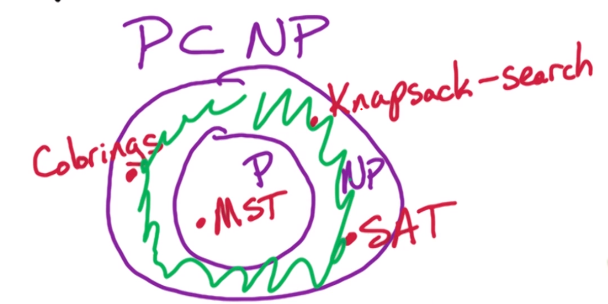
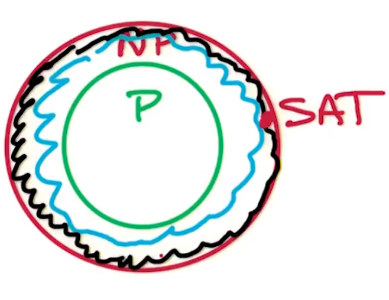

---
aliases:
checked: false
course_code: CS6215
course_name: Introduction to Graduate Algorithms
created: 2023-10-24
draft: false
last_edited: 2023-11-11
tags:
  - OMSCS
title: Week 10 - NP overview
type: lecture
week: 10
---
# Complexity classes

[Nondeterministic Polynomial time (NP)](../../general/nondeterministic_polynomial_time_(np).md)

In this class we use the [search problem](../../general/search_problems.md) definition.

[Search problems](../../general/search_problems.md)

Note here we have.

[Statement](../../general/polynomial_time_is_a_subset_of_np-complete.md#statement)

There is an open problem.

[P equals NP or P not equals NP](../../general/p_equals_np_or_p_not_equals_np.md#p-equals-np-or-p-not-equals-np)

# Satisfiability

[SAT problem](../../general/satisfiability_problem_(sat_problem).md#statement)

[The Satisfiability problem is in NP](../../general/the_satisfiability_problem_is_in_np.md)

# k-colourings problem

[Statement](../../general/k-colourings_problem_(graphs).md#statement)

[The k-colourings problem is in NP](../../general/the_k-colourings_problem_is_in_np.md)

# [MST](../../general/minimum_spanning_tree_problem_(mst).md)

[MST](../../general/minimum_spanning_tree_problem_(mst).md#statement)

[Minimum Spanning Tree problem is in NP](../../general/minimum_spanning_tree_problem_is_in_np.md)

This proof was relatively easy as [MST](../../general/minimum_spanning_tree_problem_(mst).md) is a [polynomial time](../../general/polynomial_time.md) problem. This is shown by what is above and [Kruskal's algorithm](../../general/kruskal's_algorithm.md).

# Knapsack problem

[Statement](../../general/knapsack_problem_(without_repetition).md#statement)

Whilst the [Knapsack problem](../../general/knapsack_problem_(without_repetition).md) is of the correct form to be a [search problem](../../general/search_problems.md) we can't currently check if a solution is correct in polynomial time. Therefore the [Knapsack problem](../../general/knapsack_problem_(without_repetition).md) isn't known to be in [NP](../../general/nondeterministic_polynomial_time_(np).md).

Similarly we say that the [Knapsack problem](../../general/knapsack_problem_(without_repetition).md) isn't known to be in [polynomial time](../../general/polynomial_time.md) either.

We say it isn't known to be as there might be a super clever algorithm that happens to solve the [Knapsack problem](../../general/knapsack_problem_(without_repetition).md) in polynomial time.

However, there is a variant of the problem that is in [NP](../../general/nondeterministic_polynomial_time_(np).md).

[Statement](../../general/knapsack-search_(without_replacement).md#statement)

Here instead of having to check if a solution is maximal we can instead just check if it has enough value.

[Knapsack-search is NP](../../general/knapsack-search_is_np.md)

# [Polynomial time](../../general/polynomial_time.md) and [Nondeterministic Polynomial time](../../general/nondeterministic_polynomial_time_(np).md)

Note that [NP](../../general/nondeterministic_polynomial_time_(np).md) isn't Not [Polynomial time](../../general/polynomial_time.md). In fact we have the following result.

[Polynomial time is a subset of NP-complete](../../general/polynomial_time_is_a_subset_of_np-complete.md)

The question is, are there problems that are in [NP](../../general/nondeterministic_polynomial_time_(np).md) but are not in [P](../../general/polynomial_time.md)?

# NP-complete

If [P not equal to NP](../../general/p_equals_np_or_p_not_equals_np.md) then we would have a problem in [NP](../../general/nondeterministic_polynomial_time_(np).md) that didn't lie in [P](../../general/polynomial_time.md). Therefore the green region above would be non-empty.

Therefore lets look at the hardest problems in [NP](../../general/nondeterministic_polynomial_time_(np).md).

[NP-hard](../../general/np-hard.md)

We define a [many-one reduction](../../general/many-one_reduction_(problem).md) as bellow.

[Many-one reduction](../../general/many-one_reduction_(problem).md)

However, we want to look at the hardest problems in [NP](../../general/nondeterministic_polynomial_time_(np).md).

[NP-Complete](../../general/np-complete.md)

A classic [NP-Complete](../../general/np-complete.md) problem is the [SAT problem](../../general/satisfiability_problem_(sat_problem).md).

# Reductions functionally

To show a [many-one reduction](../../general/many-one_reduction_(problem).md) from $A$ to $B$ you need to construct $f$ a way to transform an instance of problem $A$ into some input to the problem $B$. This needs to be done in polynomial time. Then the solution from solving $f(I)$ in problem $B$ should relate back to the solution of problem $A$. Either you should construct $h$ a way to transform the solution from problem $B$ into a solution to problem $A$ or forward on the fact that no solution can exist.

Therefore to show $A$ reduces to $B$ we need:
- **Define $f$:** Show how an instance of problem $A$ can be converted into an instance of problem $B$ in polynomial time.
- **Define $h$:** Show how a solution to the problem $B$ can be converted into a solution to problem $A$ in polynomial time.
- **Proof**: Show that a solution for $B$ exists if and only if a solution to $A$ exists.

# Showing [NP-Complete](../../general/np-complete.md)

To show a problem $A$ is [NP-Complete](../../general/np-complete.md) need to show
- $A$ is in [NP](../../general/nondeterministic_polynomial_time_(np).md), and
- $A$ is [NP-hard](../../general/np-hard.md).

Generically showing $A$ is [NP-hard](../../general/np-hard.md), is ironically quite hard. However we get around this by having some [NP-complete](../../general/np-complete.md) problems already, such as the [SAT problem](../../general/satisfiability_problem_(sat_problem).md). Then to show $A$ is [NP-hard](../../general/np-hard.md) we just need to show another [NP-Complete](../../general/np-complete.md) problem reduces to it. So functionally we show:

- $A$ is [NP](../../general/nondeterministic_polynomial_time_(np).md), and
- there is some [NP-complete](np-complete.md) problem $B$ that reduces to $A$.

# Practice problems

From [Algorithms](http://algorithmics.lsi.upc.edu/docs/Dasgupta-Papadimitriou-Vazirani.pdf) by S. Dasgupta, C. Papadimitriou, and U. Vazirani.

>[!question] 8.1 Optimisation vs Search problems

>[!question] 8.2 Search problems vs Decision problems

