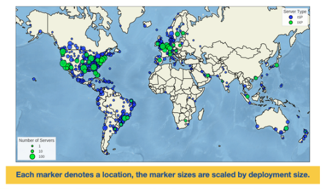
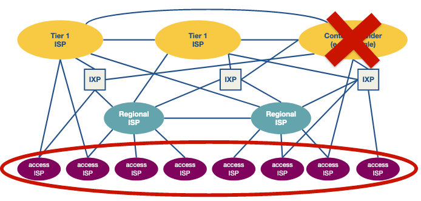
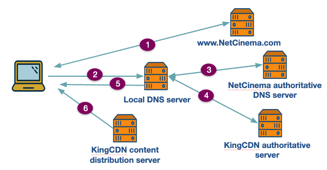
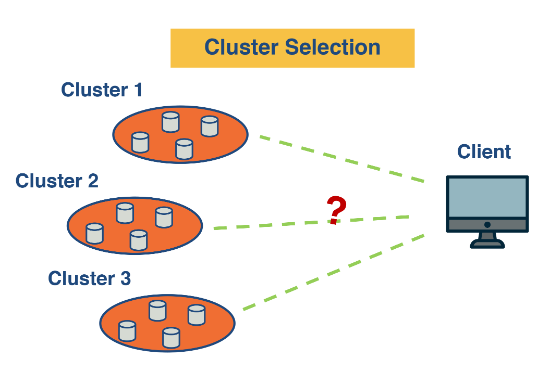
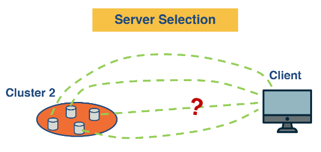
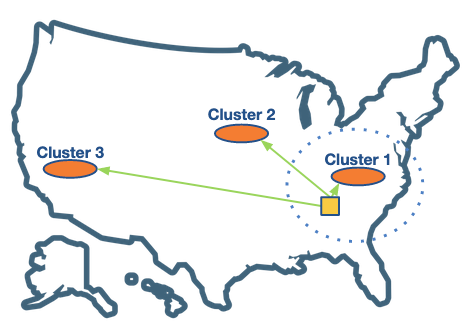
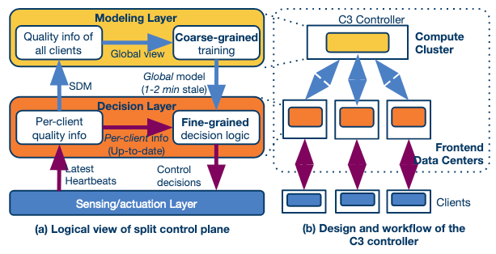
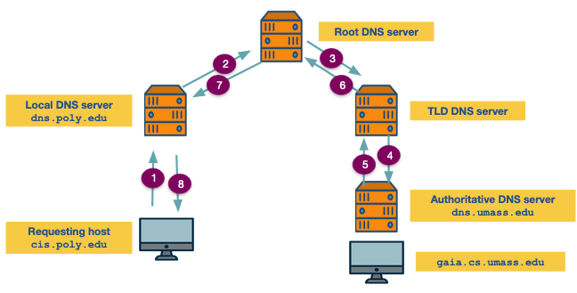

---
aliases:
checked: false
course: '[[CS6250 Computer Networks]]'
created: 2024-07-27
draft: false
last_edited: 2024-07-27
tags:
  - OMSCS
type: lecture
week: 11
---
# Week 11 - CDNs and overlay networks

## Reading

### Important Readings

The Akamai Network: A Platform for High-Performance Internet Applications
[https://dl.acm.org/doi/10.1145/1842733.1842736Links to an external site.](https://dl.acm.org/doi/10.1145/1842733.1842736)

Open Connect Everywhere: A Glimpse at the Internet Ecosystem through the Lens of the Netflix CDN
[https://arxiv.org/pdf/1606.05519.pdf Links to an external site.](https://arxiv.org/pdf/1606.05519.pdf)

### Book References

Kurose-Ross, 7e, Section 2.4, DNS—The Internet’s Directory Service

Kurose-Ross, 7e, Section 2.6, Video Streaming and Content Distribution Networks

### Optional Readings

**Server Selection**

C3: Internet-Scale Control Plane for Video Quality Optimization
[https://www.usenix.org/system/files/conference/nsdi15/nsdi15-paper-ganjam.pdf Links to an external site.](https://www.usenix.org/system/files/conference/nsdi15/nsdi15-paper-ganjam.pdf)

Shedding Light on the Structure of Internet Video Quality Problems in the Wild
[https://conferences.sigcomm.org/co-next/2013/program/p357.pdfLinks to an external site.](https://conferences.sigcomm.org/co-next/2013/program/p357.pdf)

Where Do You “Tube”? Uncovering YouTube Server Selection Strategy
[https://ieeexplore.ieee.org/document/6006028Links to an external site.](https://ieeexplore.ieee.org/document/6006028)

Google Data Centers
[https://www.google.com/about/datacenters/inside/locations/index.htmlLinks to an external site.](https://www.google.com/about/datacenters/inside/locations/index.html)

Understanding Hybrid CDN-P2P: Why Limelight Needs Its Own Red Swoosh,
[https://dl-acm-org.prx.library.gatech.edu/doi/10.1145/1496046.1496064Links to an external site.](https://dl-acm-org.prx.library.gatech.edu/doi/10.1145/1496046.1496064)

**User-perceived application experience**

Shedding Light on the Structure of Internet Video Quality Problems in the Wild
[https://conferences.sigcomm.org/co-next/2013/program/p357.pdfLinks to an external site.](https://conferences.sigcomm.org/co-next/2013/program/p357.pdf)

EONA: Experience-Oriented Network Architecture
[https://conferences.sigcomm.org/hotnets/2014/papers/hotnets-XIII-final121.pdfLinks to an external site.](https://conferences.sigcomm.org/hotnets/2014/papers/hotnets-XIII-final121.pdf)

Assessing Affinity Between Users and CDN Sites
[https://www.isi.edu/~johnh/PAPERS/Fan15a.pdfLinks to an external site.](https://www.isi.edu/~johnh/PAPERS/Fan15a.pdf)

Developing a Predictive Model of Quality of Experience for Internet Video
[https://www.cs.cmu.edu/~srini/papers/2013.Balachandran.sigcomm.pdf Links to an external site.](https://www.cs.cmu.edu/~srini/papers/2013.Balachandran.sigcomm.pdf)

Chord: A Scalable Peer-to-peer Lookup Service for Internet Applications
[https://pdos.csail.mit.edu/papers/chord:sigcomm01/chord_sigcomm.pdf Links to an external site.](https://pdos.csail.mit.edu/papers/chord:sigcomm01/chord_sigcomm.pdf)

Reverse Engineering the Youtube Video Delivery Cloud
[https://pdfs.semanticscholar.org/4c48/501e2aa3e9c3e2507617f8cec2db16b01490.pdf Links to an external site.](https://pdfs.semanticscholar.org/4c48/501e2aa3e9c3e2507617f8cec2db16b01490.pdf)

**On CDNs and ISPs Interplay**

Pushing CDN-ISP Collaboration to the Limit
[https://www.akamai.com/content/dam/site/en/documents/research-paper/pushing-cdn-isp-collaboration-to-the-limit-technical-publication.pdf Links to an external site.](https://www.akamai.com/content/dam/site/en/documents/research-paper/pushing-cdn-isp-collaboration-to-the-limit-technical-publication.pdf)

**P2P and Gaming:**

[http://ccr.sigcomm.org/online/files/p315.pdf Links to an external site.](http://ccr.sigcomm.org/online/files/p315.pdf)
[https://conferences.sigcomm.org/sigcomm/2011/papers/sigcomm/p474.pdf Links to an external site.](https://conferences.sigcomm.org/sigcomm/2011/papers/sigcomm/p474.pdf)
[http://ccr.sigcomm.org/online/files/p2p_gaming.pdf Links to an external site.](http://ccr.sigcomm.org/online/files/p2p_gaming.pdf)
[https://www.cs.cmu.edu/~junchenj/c3.pdfLinks to an external site.](https://www.cs.cmu.edu/~junchenj/c3.pdf)

## [[Content delivery network (CDN)|CDN]] revisited

The classic way to make a service available on the internet was to host it on a single machine and let users find that IP. This has a number of draw backs for larger service providers:
- Your users might be dispersed over a large geographical area causing:
	- Latency for clients a long way away.
	- Excessive use of bandwidth if multiple users far away are accessing the same data. (Literally the same packets are being transmitted multiple times across the same path.)
	- Relying on multiple [[Internet Service Provider (ISP)|ISPs]] to route your traffic to your consumers.
- Your single server is a massive single point of failure.

Therefore large content providers use [[Content delivery network (CDN)|CDNs]].

![[Content delivery network (CDN)|CDN]]

However even using [[Content delivery network (CDN)|CDNs]] there are still massive challenges content providers face:
- **Peering point congestion**: There is financial motives to speed up the "first mile" to web hosts and "last mile" to customers. However, the real bottleneck appears in the middle mile with peering points between networks.
- **Inefficient routing protocols**: [[Boarder gateway protocol (BGP)|BGP]] was not built for modern demands - it only uses [[Autonomous system (AS)|AS]] hop count not factors like congestion and latency and well-documented security vulnerabilities for misconfiguration and malicious attacks.
- **Unreliable networks**: You rely on everyone in-between you and your consumer. So natural disaster, configuration failures, severing of underwater cables are all problems that might effect you.
- **Inefficient communication protocols**: [[Transmission Control Protocol (TCP)|TCP]] is also not designed for the modern internet with its over head of ACKing packets and congestion control. Although a lot of research has been put into replacing it - it is slow to take on.
- **Scalability**: Scaling up infrastructure is expensive and takes time. Therefore responding to random surges in current demand or scheduled increases can be hard.
- **Application limitation and slow adaption**: As there is so much old infrastructure it takes a long time for new [[Protocol (networks)|protocols]] to be adopted by internet browsers, routers and firewalls.

There have been two massive shifts in the internet infrastructure recently:
1. The sheer scale of users - this has pushed old [[Protocol (networks)|protocols]] and infrastructure to its limits.
2. The flattening of the internet - the rise of [[Internet Exchange Points (IXPs)|IXPs]] has shifted us from having [[Internet Service Provider (ISP)|ISPs]] as the backbone of the internet with a few connection points into a more flat well connected structure.

Both these changes mean that more traffic is exchanged locally instead of traversing the whole hierarchy of the internet. This has been driven by large players such as google, facebook, and netfilx. For example see below netflixs [[Content delivery network (CDN)|CDN]] infrastructure across the globe.

[[Content delivery network (CDN)|CDNs]] can be privately owned like in Netflix's case or owned by a third party such as Akamai and Limelight.

Owning a [[Content delivery network (CDN)|CDN]] comes with many challenges:
- Owning lots of real-estate and physical hardware.
- Consuming a lot of power and requiring a lot of cooling.
- Staying well-connected to the internet.
- Managing performance and upgrading your infrastructure.

## [[Content delivery network (CDN)|CDN]] server placement

There is a spectrum with the philosophy on server placement. With the extremes represented below.

- **Enter deep**: Using lots of [[Content delivery network (CDN)|CDN]] access points close to end users.
	- This has the advantage of always being close to end users reducing latency and bandwidth usage.
	- This has the disadvantage of maintaining lots of different locations and distributing your content to them all quickly.

- **Bring home**: Using a few larger server clusters at key points.
	- Much easier to maintain and keep synchronised.
	- Larger latency and bandwidth use to get to end consumers.

There are lots of hybrid approaches. Such as Google with 16 mega data-centers and 50 smaller clusters deeper into the network.

## [[Domain Name System (DNS)|DNS]] with a [[Content delivery network (CDN)|CDN]]

In the traditional approach to hosting [[Domain Name System (DNS)|DNS]] was fairly simple. You would look up the domain of the server and it would provide the [[Internet Protocol (IP)|IP address]] of the cluster that provided the content. With a [[Content delivery network (CDN)|CDN]] there are multiple clusters that client could be directed to.

Below is and example for the site www.NetCinema.com who use [[Domain Name System (DNS)|DNS]] King[[Content delivery network (CDN)|CDN]].

1. The user is on the NetCinema website finding some content they want to watch.
2. User clicks on a link that has a subdomain linked to the [[Content delivery network (CDN)|CDN]] part of NetCinemas network i.e. video.netcinema.com. This sends a request to their local [[Domain Name System (DNS)|DNS]] server.
3. An iterative [[Domain Name System (DNS)|DNS]] lookup happens returning a [[DNS records|NS record]] first the the authoritative [[Domain Name System (DNS)|DNS]] server for netcinema. This redirects the to KingCDN's authoritative server.
4. KingDNS authorative server then has to work out what the best cluster to send the user to. Once it has done that it returns the [[Internet Protocol (IP)|IP address]] in a [[DNS records|DNS A record]].
5. Their local [[Domain Name System (DNS)|DNS]] then returns them the [[Internet Protocol (IP)|IP address]] of the selected [[Content delivery network (CDN)|CDN]] server.
6. The user then requests the content from the [[Content delivery network (CDN)|CDN]] content server.

This leaves the question - how does the authoritative [[Content delivery network (CDN)|CDN]] server decide which [[Content delivery network (CDN)|CDN]] content server to redirect the user to. Here there are really two major question.
- Which cluster to send the user too.

- Which server within that cluster to send the user to.

## Cluster selection

The most intuitive answer to this question is choose the cluster geographically closest to the end user.

This can work well in a lot of cases but it is harder and maybe more sub-optimal than you might expect.
- You do not know the IP of the end user only the IP of there local [[Domain Name System (DNS)|DNS]] server.
	- There is a proposition to propagate the IP of the requesting user through the [[Domain Name System (DNS)|DNS]] protocol but this has not caught on yet.
- This server might have the best connection.
	- The server might be congested due to the level of traffic getting directed towards it.
	- The local topology of the [[Autonomous system (AS)|AS]] might mean the geographically closest server is not the closest in terms of the internet.

This second limitation can be over-come using metrics and evaluating how good a connection each [[Content delivery network (CDN)|CDN]] cluster has to the local [[Domain Name System (DNS)|DNS]].

There are a couple metrics we can calculate to assess how good a fit each server is:
- Network delay.
- Available bandwidth.
- Application specific metrics.
	- How fast a [[Hyper Text Transfer Protocol (HTTP)|HTTP]] page loads.
	- Buffer rate for video applications.
Though to measure these we have two approaches:
- **Active measurements**: When each local [[Domain Name System (DNS)|DNS]] requests a record we calculate them for each [[Content delivery network (CDN)|CDN]] content server to the [[Domain Name System (DNS)|DNS]] server.
- **Passive measurements**: Clusters keep an index of these metrics for different [[Subnets]] that it passes back to the controller.

Implicitly in both these approaches there exists a central controller that determines where to send the client. However this has limitation when it comes to scaling.

Researchers have proposed the design of a distributed system that uses a two-layered system.

- A coarse-grained global layer operates at larger time scales (timescale of a few tens of seconds (or minutes)). This layer has a global view of client quality measurements. It builds a data-driven prediction model of video quality.
- A fine-grained per-client decision layer that operates at the millisecond timescale. It makes actual decisions upon a client request. This is based on the latest (but possibly stale) pre-computed global model and up-to-date per-client state.

A second challenge in the above approach is that it needs to have data for different subnet-cluster pairs. Thus, some of the clients deliberately need to be routed to sub-optimal clusters.

## Server selection

Once we have selected a cluster we need to choose a server inside that cluster. Lets go through the ideas we might have.
- The simplest approach is to round robin requests to available server.
Though due to the random nature of different requests this will likely cause one server to become overloaded.
- Load balance to the least utilised server.
However this is also not optimal in the [[Content delivery network (CDN)|CDN]] use case. As content servers will lazily load content - load balancing will mean all server will need to cauche most of the content they are offer. Each new request will have delay whilst the load it and free memory.
- Divide requests based on the content they are requesting through a hashing technique.
This idea is simple but slightly harder to implement as the nature of a data centre is that machines will come up and down fairly randomly. Therefore we need a fairly consistent and balanced way to hash the material to a server.

![[Consistent hashing]]

Consistent hashing was first used in peer-to-peer networks such as Napster and Bittorrent.

## Network protocols used for cluster/server selection

This whole process uses 3 [[Protocol (networks)|protocols]]:
- [[Domain Name System (DNS)|DNS]],
- [[HTTP redirection]], and
- [[IP Anycast]].

### [[Domain Name System (DNS)|DNS]]

![[Domain Name System (DNS)|DNS]]

An example of a recursive query can be found below.

The [[Domain Name System (DNS)|DNS]] system is speed up through caching with [[DNS records]] having a [[Time to live (TTL)|TTL]] field which determines the time they can be cached for.

![[DNS records]]

The key message types are:
- [[DNS records|DNS A record]]: The [[Internet Protocol (IP)|IP]] that relates to the domain.
- [[DNS records|NS record]]: The name of the server to go to next.
- [[DNS records|CNAME]]: An alias for another domain name.
- [[DNS records|MX record]]: Mail server name.

## [[IP Anycast]]

![[IP Anycast]]

Below is an example where we start [[IP Anycast]] from our content servers C1 and C2. We are trying to find the shortest [[Autonomous system (AS)|AS]]-path to client 1 and client 2.

[[Domain Name System (DNS)|DNS]] servers use this to find the closest [[Domain Name System (DNS)|DNS]] server to the client.

## [[HTTP redirection]]

![[HTTP redirection]]

Whilst this costs time in terms of completing the request it can be useful for load balancing.
