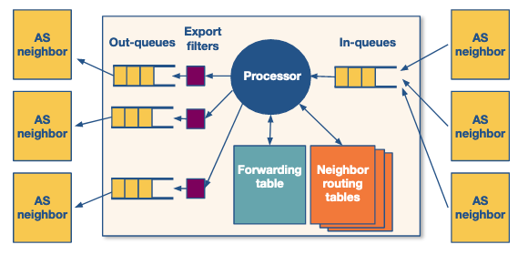
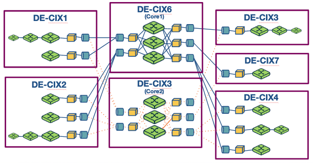
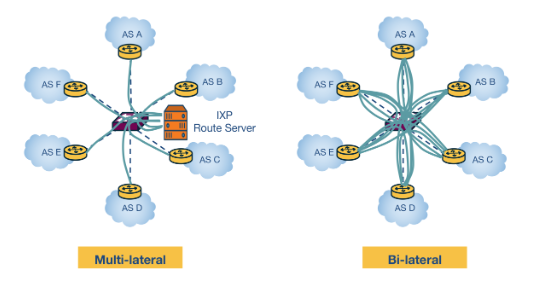

# Week 4 - AS relationships and interdomain routing

![[Interdomain routing]]

## Additional reading

### Important Readings

Interdomain Internet Routing  
[https://web.mit.edu/6.829/www/currentsemester/papers/AS-bgp-notes.pdfLinks to an external site.](https://web.mit.edu/6.829/www/currentsemester/papers/AS-bgp-notes.pdf)  

BGP routing policies in ISP networks  
[https://www.cs.princeton.edu/~jrex/papers/policies.pdfLinks to an external site.](https://www.cs.princeton.edu/~jrex/papers/policies.pdf)

On the importance of Internet eXchange Points for today’s Internet ecosystem  
[https://cryptome.wikileaks.org/2013/07/ixp-importance.pdfLinks to an external site.](https://cryptome.wikileaks.org/2013/07/ixp-importance.pdf)

Peering at Peerings: On the Role of IXP Route Servers  
[https://people.csail.mit.edu/richterp/imc238-richterA.pdfLinks to an external site.](https://people.csail.mit.edu/richterp/imc238-richterA.pdf "Link")  

### Book References

Kurose-Ross

**6th Edition**: Section 1.3.3 (A Network of Networks), Section 4.6.3 (Inter-AS Routing: BGP)  

**7th Edition**: Section 1.3.3 (A Network of Networks), Section 5.4.1 (The Role of BGP)

### Optional Readings

Investigating Interdomain Routing Policies in the Wild  
[https://people.cs.umass.edu/~phillipa/papers/AnwarIMC15.pdfLinks to an external site.](https://people.cs.umass.edu/~phillipa/papers/AnwarIMC15.pdf)

BGP Communities: Even more Worms in the Routing Can  
[https://people.mpi-inf.mpg.de/~fstreibelt/preprint/communities-imc2018.pdfLinks to an external site.](https://people.mpi-inf.mpg.de/~fstreibelt/preprint/communities-imc2018.pdf)

On the scalability of BGP: the roles of topology growth and update rate-limiting  
[https://www.cc.gatech.edu/home/dovrolis/Papers/bgp-scale-conext08.pdfLinks to an external site.](https://www.cc.gatech.edu/home/dovrolis/Papers/bgp-scale-conext08.pdf)

O Peer, Where Art Thou? Uncovering Remote Peering Interconnections at IXPs  
[https://www.inspire.edu.gr/wp-content/pdfs/uncovering_remote_peering_interconnections_v1.pdfLinks to an external site.](https://www.inspire.edu.gr/wp-content/pdfs/uncovering_remote_peering_interconnections_v1.pdf)

Detecting BGP Configuration Faults with Static Analysis  
[https://www.usenix.org/legacy/events/nsdi05/tech/feamster/feamster.pdfLinks to an external site.](https://www.usenix.org/legacy/events/nsdi05/tech/feamster/feamster.pdf)

##  Ecology of the internet

The internet has 3 major players:

![[Internet Service Provider (ISP)]]

![[Content delivery network (CDN)]]

![[Internet Exchange Points (IXPs)]]

Each of these may operate as one [[Autonomous system (AS)|AS]] or as multiple to allow different protocols to be used in different parts of the network.

## Cooperation and competition among networks

Whilst [[Internet Service Provider (ISP)|ISPs]] are in direct competition with eachother they also can not operate without cooperating with each other also. The [[Internet Service Provider (ISP)|ISP]] business model is based off selling access to internet - this is normally calculated via bandwidth used either for a fixed price with a cap or by taking the 95th percentile of measurements normally taken every 5 minutes. Either of these mean the [[Internet Service Provider (ISP)|ISP]] has incentives to make you use their service more. This relies on you having low latency connections to as many other [[Host (networks)|hosts]] as possible.

The cost to [[Internet Service Provider (ISP)|ISPs]] is maintaining a network with sufficient capacity to handle all that traffic. Therefore unless traffic is going to a [[Host (networks)|host]] paying them they will need a commercial incentive to carry it.

Therefore two types of relationships form between [[Internet Service Provider (ISP)|ISPs]]
- **Peering relationships**: If two providers see [[Host (networks)|hosts]] exchange traffic between there networks in roughly equal quantities they may agree to share traffic directly at no cost between the [[Internet Service Provider (ISP)|ISPs]].
- **Customer-Provider relationships**: If one [[Internet Service Provider (ISP)|ISP]] has considerably more [[Host (networks)|hosts]] receiving traffic then they can sell access to these hosts to other [[Internet Service Provider (ISP)|ISPs]]. Here the larger [[Internet Service Provider (ISP)|ISP]] becomes the provider to the smaller customer [[Internet Service Provider (ISP)|ISP]] and picks up a fee.

This has been the model since the beginning of the internet and was one of the main drivers for the hierarchical nature of [[Internet Service Provider (ISP)|ISPs]] and the internet as a whole. However [[Internet Exchange Points (IXPs)|IXPs]] are changing this. [[Internet Exchange Points (IXPs)|IXPs]] mean that [[Internet Service Provider (ISP)|ISPs]] don't need to go through eachother and instead can trade traffic directly. This is making the internet more flat. This is in part driven by [[Content delivery network (CDN)|CDNs]] using [[Internet Exchange Points (IXPs)|IXPs]] to have the lowest latency connections to their consumers.  

## Address exchange

First consider which addresses [[Autonomous system (AS)|AS]] want to exchange with other internet entities. 

### Exporting routes

First lets look at what routes an [[Autonomous system (AS)|AS]] would want to tell other internet entities about. This has financial repercussions as you will then have to carry that traffic on your network.

- **Routes form customers**: These are profitable for an [[Internet Service Provider (ISP)|ISP]] to share as they generate revenue from more traffic going to these. These are shared willingly to all.
- **Routes from peers**: Whilst there is the network cost of carrying this traffic sharing these addresses keeps the free agreements in place or can turn peers into customers. It may make sense to share routes learnt from peers but it is circumstantial.
- **Routes from providers**: A provider is paying for access to the provider. It has very little commercial incentive to share routes learnt from the provider.

### Importing routes

When an [[Autonomous system (AS)|AS]] decides which route to send its traffic down this again is a symmetric decision to exporting. The goal of the [[Autonomous system (AS)|AS]] is for the traffic of its customers to travel through the fewest other [[Autonomous system (AS)|AS]] as possible as each one will generate it some cost and potentially reduce capacity of the route.

- **Route offered by peer or customer**: These in the short term are completely free and so will preferably use these.
- **Route offered by provider**: These cost the [[Autonomous system (AS)|AS]] money so will be used as a last resort.

### [[Protocol (networks)|Protocols]]

![[Interdomain routing]]

![[Boarder gateway protocol (BGP)]]

The goals of [[Boarder gateway protocol (BGP)|BGP]] are:
- **Scalability**: How do you maintain a routing table when the size of the internet is expanding.
- **Expressing route policies**: How do we allow for [[Autonomous system (AS)|AS]] to control which routes to use and to broadcast.
- **Cooperation**: To let [[Autonomous system (AS)|AS]] to make local decisions with the information they are provided.
- **Security**: Whist not an initial design goal [[Boarder gateway protocol (BGP)|BGP]] did not include security as the internet has expanded it has become more important. This needs to protect [[Autonomous system (AS)|AS]] from malicious attacks, misconfiguration, and faults. This includes different protocols, registries for the domains an [[Autonomous system (AS)|AS]] owns, private keys for [[Autonomous system (AS)|AS]]. 

## The [[Boarder gateway protocol (BGP)|BGP]] [[Protocol (networks)|protocol]]

Two [[Router|routers]] connected over [[Boarder gateway protocol (BGP)|BGP]] are called BGP peers. They open a semi-permanent [[Transmission Control Protocol (TCP)|TCP]] connection where they exchange routes. There are two different varieties.
- iBGP: For internal communication about what external routes are available.
- eBGP: For communicating with other [[Autonomous system (AS)|AS]].

There are three important messages [[Boarder gateway protocol (BGP)|BGP]] has.
1. The **OPEN** message to start the conversation. 
2. The  **UPDATE** message that contains a change of available routes. This has two forms:
	1. *Announcements* about new routes or updates to old routes.
	2. *Withdrawls* messages about routes no longer available.
3. The **KEEPALIVE** messages that keep the connection going.

In the [[Boarder gateway protocol (BGP)|BGP]] the [[Router|routers]] exchange [[Subnets|IP prefixes]] that represent [[Subnets|subnets]] or collections of [[Subnets|subnets]] if the [[Router|router]] is using [[Route summarization|route summarization]]. For the routes agreed by the [[Autonomous system (AS)|AS]] the [[Router|router]] offers theses over [[Boarder gateway protocol (BGP)|eBGP]] and then shares the routes it has been offered over [[Boarder gateway protocol (BGP)|iBGP]].

Messages passed between [[Autonomous system (AS)|AS]] have some special properties, two of which are:
- **ASPATH**: A list of [[Autonomous system number (ASN)|ASN]] for each [[Autonomous system (AS)|AS]] the route has passed through. This is helpful to avoid loops.
- **NEXTHOP**: The [[Internet Protocol (IP)|IP address]] of the next router in the hop. 

## The router process

We can model a [[Router|router]] running [[Boarder gateway protocol (BGP)|BGP]] as follows.

This has 3 main steps.
1. Receive and store neighbours routing tables.
2. Decides its best routing options and updates the forwarding table.
3. Decides which routes it wants to advertise and updates neighbouring routers.

How a router decides which route to use depends on many factors. It ranks these and then compares routes.

| Step | Attribute                                            | Controller? |
| ---- | ---------------------------------------------------- | ----------- |
| 1    | Highest LocalPref                                    | local       |
| 2    | Lowest AS path length                                | neighbour   |
| 3    | Lowest origin type                                   | neither     |
| 4    | Lowest MED                                           | neighbour   |
| 5    | eBGP-learned over iBGP-learned                       | neither     |
| 6    | Lowest [[Interior gateway protocol (IGP)\|IGP]] cost | local       |
| 7    | Lowest router ID (break ties)                        | neither     |

There are two main ways [[Autonomous system (AS)|AS]] can control which routes it uses and its neighbours uses.

### LocalPref

This is how an [[Autonomous system (AS)|AS]] expresses its commercial best interest. It will set a value to neighbouring [[Autonomous system (AS)|AS]] based on the financial relationship it has with it. These normally are:

| Relationship to advertising [[Autonomous system (AS)\|AS]] | LocalPerf value |
| ---------------------------------------------------------- | --------------- |
| Customer                                                   | 90-99           |
| Peer                                                       | 80 - 89         |
| Provider                                                   | 70 - 79         |
| Backup links                                               | 60-69           |

This reflects the preferences we discussed above, customer then peer then provider.j

### Multi-exit Discriminator (MED)

If an [[Autonomous system (AS)|AS]] has two routers connecting to a neighbours [[Autonomous system (AS)|AS]] which are offering some of the same routes. Knowing the forwarding tables of these routers may give a preference for how a neighbouring [[Autonomous system (AS)|AS]] forwards traffic through your network. This is controlled by setting a MED value (for example as the [[Interior gateway protocol (IGP)|IGP]] cost to forward that traffic).

## Challenges with [[Boarder gateway protocol (BGP)|BGP]]: Misconfiguration and scalability 

Routers are vulnerable to misconfiguration and faults. This can lead to an excessively large number of updates leading to further faults from overloading the network. This can be mediated by limiting the size of the routing table.

To limit the size of the routing table it can filter out routes that are too specific. This encourages [[Route summarization|route summarization]]. The act of [[Route summarization|route summarization]] protects the whole network from getting overloaded and help with scalability. Small [[Autonomous system (AS)|AS]] sometimes just use a default gateway where they redirect all traffic without further knowledge.

If a route is repeatedly updated due to some route instability this can risk messages getting sent in error or a patchy connection. Routers can implement **flap damping** where it tracks the number of updates to a prefix. If this goes over a certain threshold in a time interval it will suppress that route until it stabilises. 

Routers can be strategic about what addresses it does this too and how sensitive it is. If it has addresses it needs to have high availability for it can have a much higher threshold whereas other addresses it can be much lower.

## Peering at an [[Internet Exchange Points (IXPs)|IXP]]

![[Internet Exchange Points (IXPs)|IXP]]

Below is an example of such and [[Internet Exchange Points (IXPs)|IXP]] is Frankfurt.

This shows how an [[Internet Exchange Points (IXPs)|IXP]] is a massive set of switches creating a giant [[Network|network]]. It is normally distributed over a region or globally with different connection points such as DE-CIX1,2,3,4,7 all connecting in to a fault tolerant core Core 1 with backup Core2.

To exchange with an [[Internet Exchange Points (IXPs)|IXP]] a [[Autonomous system (AS)|AS]] needs to physically connect with it. Which is why being distributed makes this easier though carries technical cost to it.

### [[Internet Exchange Points (IXPs)|IXPs]] have become increasingly popular, why?

1. [[Internet Exchange Points (IXPs)|IXP]] can handle large quantities of traffic rivalling that of tier-1 [[Internet Service Provider (ISP)|ISPs]].
2. [[Internet Exchange Points (IXPs)|IXP]] can mitigate [[Distributed Denial-of-Service (DDoS)|DDoS]] attacks by monitoring traffic to particular [[Autonomous system (AS)|ASs]].
3. They provide excellent research hubs due to their open and large scale nature.
4. They are active marketplaces offering services to the [[Autonomous system (AS)|ASs]] that participate in them. This offering is expanding as more research happens providing innovation to the internet.

### How to peer at an [[Autonomous system (AS)|AS]]

An [[Autonomous system (AS)|AS]] must have an [[Autonomous system number (ASN)|ASN]] to peer at an [[Internet Exchange Points (IXPs)|IXP]]. Then they will need to physically collocate a router in the [[Autonomous system (AS)|AS]] to one of the [[Internet Exchange Points (IXPs)|IXP]] access points. Lastly they must agree to the terms and conditions of using the [[Internet Exchange Points (IXPs)|IXP]]. To do this they pay:
- A one off access cost to locate the router at the access point,
- A monthly fee for renting a port - this cost normally scales based on the speed/capacity of that [[Port|port]].
- Sometimes there is a yearly subscription fee.

Once connected to the [[Internet Exchange Points (IXPs)|IXP]] there is normally no cost to publicly peer there. That means getting access to all the other networks also publicly peering there. 

Normally the terms of accessing do not forbid reselling of access to the [[Internet Exchange Points (IXPs)|IXP]]. Therefore some providers link with an [[Internet Exchange Points (IXPs)|IXP]] the resale access to that [[Internet Exchange Points (IXPs)|IXP]] if it is too hard for another [[Autonomous system (AS)|AS]] to collocate a router there. This is called remote peering and is an active area of study.

### Why peer in an [[Internet Exchange Points (IXPs)|IXP]]

- Keeps traffic local which is more reliable and faster.
- Lower costs than negotiating with other [[Autonomous system (AS)|ASs]] such as [[Internet Service Provider (ISP)|ISP]] for access.
- Incentives - large content providers prefer use of [[Internet Exchange Points (IXPs)|IXP]] as it guarantees more control of how their users receive their content. Therefore they connect via [[Internet Exchange Points (IXPs)|IXPs]] which motivates other actors to use them.

### Services offered by an [[Internet Exchange Points (IXPs)|IXP]]

1. **Public peering**: This allows you to directly connect with any other participant who is also public peering opening up a massive number of new routes but also direct connections with other [[Autonomous system (AS)|ASs]].
2. **Private peering**: This allows for direct connection between two parties who know eachother at the [[Internet Exchange Points (IXPs)|IXP]]. This won't use the pubic peering infrastructure. Though provides a high capacity stable connection.
3. **Route servers and Service level agreements**: Normally the [[Internet Exchange Points (IXPs)|IXP]] will offer free access to a route server which is a giant public route table. The [[Internet Exchange Points (IXPs)|IXP]] will also offer [[Service Level Agreements (SLAs)|SLAs]] with the services they offer.
4. **Mobile peering**: This is a scalable solution to mobile networks.
5. **DDoS black-holing**: This is a customer triggered black-holing of traffic coming towards their [[Autonomous system (AS)|AS]] to relieve the stress from [[Distributed Denial-of-Service (DDoS)|DDoS]] attacks.
6. **Free value add services**: Services that are for the public good like bandwidth testing, Internet Routing Registries,[[Domain Name System (DNS)|DNS]] servers, ect.

### How do route servers work

Two [[Autonomous system (AS)|ASs]] in a [[Internet Exchange Points (IXPs)|IXP]] to transfer route information need to establish a bilateral [[Boarder gateway protocol (BGP)|BGP]] connection. However with so many participants at an [[Internet Exchange Points (IXPs)|IXP]] the number of open connections would be massive - which would not scale.

Instead if the [[Internet Exchange Points (IXPs)|IXP]] offers a route server [[Autonomous system (AS)|ASs]] connect to this single entity instead. This offers the following services:
- It collects and shares routing information from its peers.
- It execute [[Boarder gateway protocol (BGP)|BGP]] decisions and re-advertises the resulting information.

The collection of addresses is called a Routing Information Base (RIB) which contains all [[Boarder gateway protocol (BGP)|BGP]] paths. There is a master RIB with all the information and an [[Autonomous system (AS)|AS]] specific RIB for each participant.

Route servers maintain two types of route filters. Import route filters that allow [[Autonomous system (AS)|ASs]] to only advertise routes they should advertise. Export route filters which are triggered by member [[Autonomous system (AS)|ASs]] to restrict which other [[Internet Exchange Points (IXPs)|IXP]] members can receive their routes.

For example suppose AS X and AS Y exchange routes through a multi-lateral peering session through a route server. This happens in the following steps.
1. First AS X advertises a prefix p1 to the route server, which is added to the route server's RIB for that [[Autonomous system (AS)|AS]].
2. The route server checks AS X import filters to see if it wants to advertise p1 - if so it is added to the master RIB.
3. The route server checks AS X's export filters to see if AS Y is allowed to recieve p1. If so it adds it to AS Y's RIB.
4. Lastly the route server advertises p1 to AS Y with AS X as the next hop.

