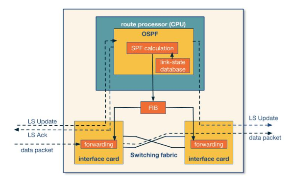
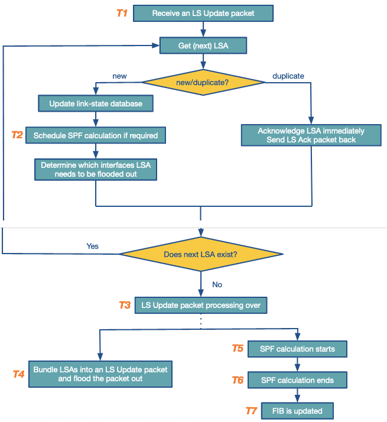

---
aliases:
checked: false
course: 'CS6250 Computer Networks'
created: 2024-05-29
draft: false
last_edited: 2024-05-29
title: Week 3 - Intradomain routing
tags:
  - OMSCS
type: lecture
week: 3
---
# Week 3 - Intradomain routing

### Important Readings

Experience in Black-box OSPF Measurements
[http://conferences.sigcomm.org/imc/2001/imw2001-papers/82.pdfLinks to an external site.](http://conferences.sigcomm.org/imc/2001/imw2001-papers/82.pdf)

## Book References

If you have access to the Kurose-Ross book and the Peterson book, you can find the list of chapters discussed in this lecture. As mentioned in the course schedule, purchasing the books is not required.

- Kurose-Ross (6e)
    - 4.5.1:The Link-State (LS) Routing Algorithm
    - 4.5.2: The Distance- Vector (DV) Routing Algorithm
    - 4.6.1: Intra-AS Routing in the Internet: RIP
    - 4.6.2: Intra-AS Routing in the Internet: OSPF
- Kurose-Ross (7e)
    - 5.2.1The Link-State (LS) Routing Algorithm
    - 5.2.2: The Distance- Vector (DV) Routing Algorithm
    - 5.3: Intra-AS Routing in the Internet: OSPF

- Kurose-Ross (8e)
    - 5.2.1: The Link-State (LS) Routing Algorithm
    - 5.2.2: The Distance- Vector (DV) Routing Algorithm
    - 5.3: Intra-AS Routing in the Internet: OSPF

## Optional Readings

Hot Potatoes Heat Up BGP Routing
[https://www.cs.princeton.edu/~jrex/papers/hotpotato.pdfLinks to an external site.](https://www.cs.princeton.edu/~jrex/papers/hotpotato.pdf "Link")

Traffic Engineering With Traditional IP Routing Protocols
[https://www.cs.princeton.edu/~jrex/teaching/spring2005/reading/fortz02.pdfLinks to an external site.](https://www.cs.princeton.edu/~jrex/teaching/spring2005/reading/fortz02.pdf "Link")

Dynamics of Hot-Potato Routing in IP Networks
[https://www.cs.princeton.edu/~jrex/papers/sigmetrics04.pdfLinks to an external site.](https://www.cs.princeton.edu/~jrex/papers/sigmetrics04.pdf "Link")

OSPF Monitoring: Architecture, Design and Deployment Experience
[https://www.cs.princeton.edu/~jrex/teaching/spring2005/reading/shaikh04.pdfLinks to an external site.](https://www.cs.princeton.edu/~jrex/teaching/spring2005/reading/shaikh04.pdf "Link")

## Routing

[Routing](../../general/routing.md)

[Intradomain routing](../../general/intradomain_routing.md)

[Interdomain routing](../../general/interdomain_routing.md)

## Intradomain routing

Here are two main algorithms, these use two different approaches to how route [packets](../../general/packets.md).

[Link-state routing algorithms](../../general/link-state_routing_algorithms.md)

[Distance vector routing algorithms](../../general/distance_vector_routing_algorithms.md)

[Count to infinity problem](../../general/count_to_infinity_problem.md)

[Routing Information Protocol (RIP)](../../general/routing_information_protocol_(rip).md)

[OSPF](../../general/open_shortest_path_first_(ospf).md)

When using [OSPF](../../general/open_shortest_path_first_(ospf).md) the computation is handled by the [router](../../general/router.md) processor as apposed to the [switching fabric](../../general/switching_fabric.md) which handles message forwarding.

The process the router goes through is:
1. Collect [LSA](../../general/open_shortest_path_first_(ospf).md)'s from other routers.
2. Use [Dijkstra's algorithm](../../general/dijkstra's_algorithm.md) to calculate new shortest paths and update [Forwarding information base (FIB)](../../general/forwarding_information_base_(fib).md)
3. Forward messages using the [switching fabric](../../general/switching_fabric.md)

This can be summarised by the following flow chart.

[Hot potato routing](../../general/hot_potato_routing.md)

## Traffic Engineering

The process of deciding the weights between [routers](../../general/router.md) can be complicated as small changes in weights can have a large impact to the traffic flow. There is a framework for this.

[Traffic Engineering Framework](../../general/traffic_engineering_framework.md)
