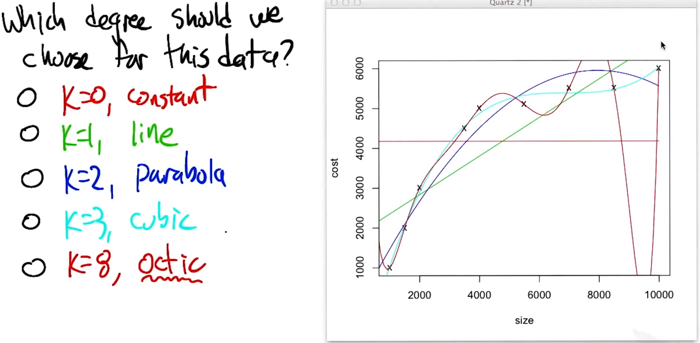
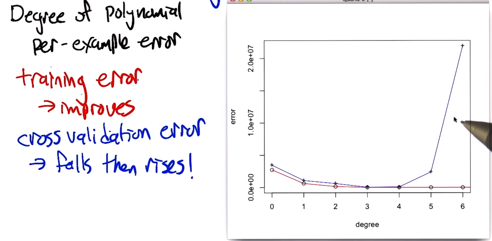

# Week 2 - Regression and classification

# Regression history

![[Regression problems]]

The name comes from [[Regression to the mean|regression to the mean]], this was the technique they used to first talk about it - then the word regression for the technique stuck.

# Polynomial Regression

![[Polynomial regression]]

Once we have an [[Objective function|objective function]] we can use training data to fit the parameters $c_{p}$.

Note that [[Linear regression|linear regression]] is [[Polynomial regression|polynomial regression]] but where $k=1$.

![[Linear regression|linear regression]]

## Polynomial regression using [[Mean squared error (MSE)|MSE]]

![[Mean squared error (MSE)|MSE]]

![[Calculate polynomial regression coefficients for MSE]]

## Picking a degree

Below is an example of [[Polynomial regression|polynomial regression]] done on different degree polynomials.

As we increase the degree the fitting polynomial, the fit to the points we are training on gets better. However, at a point the utility of the curve outside of these points gets less. 

This is easy to see by eye but how can we computationally infer this?

## Cross validation

![[Cross validation]]

When using cross validation to assess the accuracy of our fit in the example before, you can see it agrees with our intuition. Whilst the high order approximations are a closer fit for the [[Training data|training data]], they are a worse fit for the [[Testing data|test data]]. Therefore we could use [[Cross validation|cross validation]] to pick the best polynomial without breaking the integrity of the [[Testing data|testing data]]. 

Generally you need to find the right sweet spot between [[Underfitting|underfitting]] and [[Overfitting|overfitting]] by varying the degree of the polynomial.

![[Transforming discrete input for regression]]