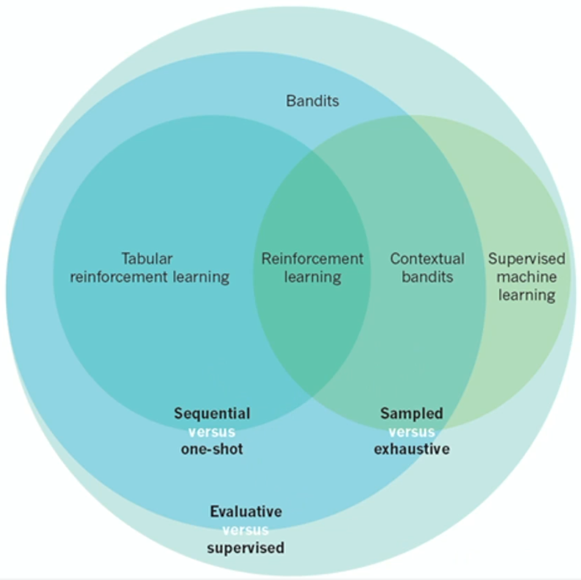
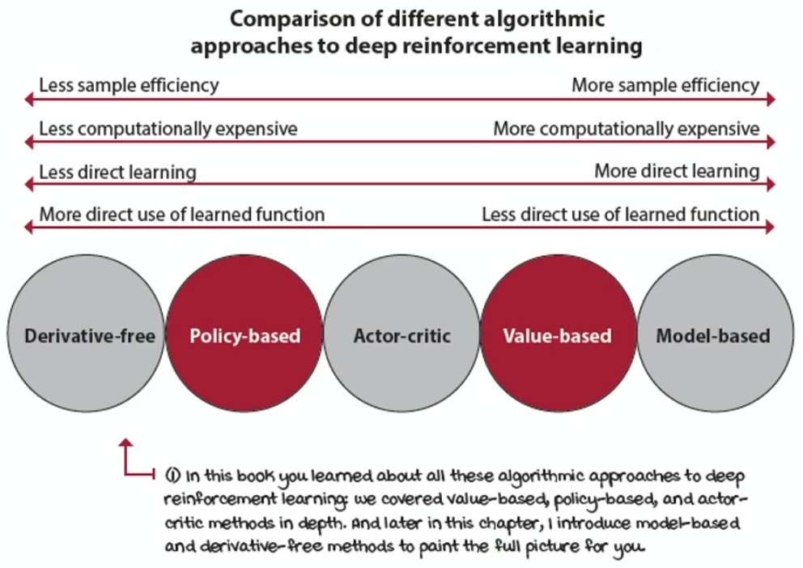

# Week 1 - Supplementary Introduction to Reinforcement Learning

Going down in levels of specificity:
- **Artificial intelligence**: The ability of machines to simulate human behavior.
- **Machine learning**: The ability of machines to simulate human behavior by learning from data.
- **Reinforcement Learning**: The ability of machines to simulate human behaviour by learning from data that is simultaneously *sequential*, *evaluative*, and *sampled*.

Later in the course we will be adding deep learning into our use of [[Reinforcement learning|reinforcement learning]]. This is mainly using large [[Neural network|neural networks]] to assist with the learning process.

Another theme we will hit on during the course is how to adapt reinforcement learning to work with a changing environment or other actors in the world who can change their approach.