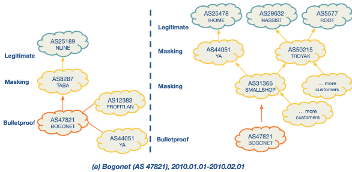
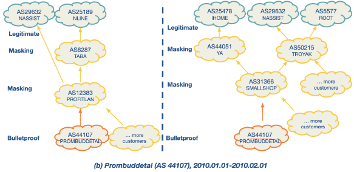
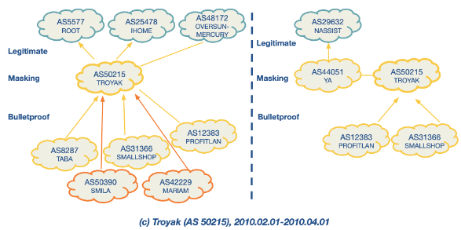

>[!tldr] ASwatch
>ASwatch is a system that identifies malicious [[Autonomous system (AS)]] by analysing their routing behaviour, focusing specifically on "bulletproof" networks run by cybercriminals. Unlike other approaches that might rely on data from network traffic or content, ASwatch exclusively examines control plane information, which pertains to how networks route data.
>
>**Bulletproof Networks**: These are malicious networks that change upstream providers frequently and connect with shady networks to avoid detection. They display distinct interconnection patterns and control plane behaviors compared to legitimate networks.
>
>ASwatch operates in two main phases:
>1. **Training Phase**:  
 >   - **Data Collection**: ASwatch collects data on known malicious and legitimate ASes, tracking their routing behavior and relationships with other networks over time.
>    - **Feature Extraction**: It extracts three main types of features from this data:
 >       - **Rewiring Activity**: Looks for frequent changes in customers/providers and connections with less popular or shady providers.
>        - **IP Space Fragmentation and Churn**: Malicious ASes often advertise smaller BGP prefixes and frequently change their advertised IP address ranges to evade detection.
>        - **BGP Routing Dynamics**: Analyzes patterns in BGP announcements and withdrawals, noting that malicious ASes have different patterns compared to legitimate ones.
>    - **Model Training**: Using supervised learning, ASwatch trains a model to distinguish between the behaviors of malicious and legitimate ASes based on the extracted features.
>2. **Operational Phase**:  
>    - **Feature Calculation**: For any unknown AS, ASwatch calculates the same set of features.
>    - **Reputation Scoring**: The trained model assigns a reputation score to the AS. An AS is flagged as malicious if it consistently receives a low reputation score over several days.
>
> There are some examples below of suspicious behaviour.
> 
> 
> 

