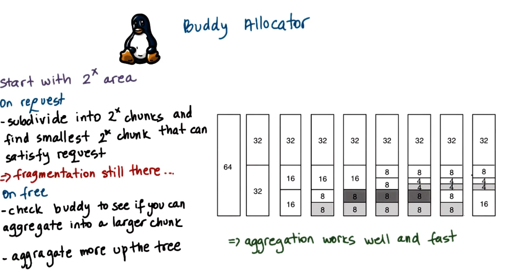

---
aliases:
checked: false
created: 2025-03-23
draft: false
last_edited: 2025-03-23
tags:
  - OS
type: definition
---
>[!tldr] Buddy Allocator
>The *buddy allocator* is a [[Memory allocator|memory allocator]] used in the [[Linux|linux]] kernel to efficiently manage contiguous blocks of memory. It works by dividing memory into blocks of sizes that are powers of 2.
>
>**How It Works**
>
>1. **Allocation:**
  >- Memory is initially available as large power-of-2 blocks.
>- When a request is made, the allocator finds the smallest block that fits the request.
>- If the block is too large, it recursively splits it into two equal "buddies" until the requested size is reached.
>2. **Deallocation & Merging ("Buddy System")**
>- When memory is freed, the allocator checks whether its **buddy (the adjacent block of the same size)** is also free.
>- If both buddies are free, they are **merged** back into a larger block.
>- This process continues up the hierarchy, helping to reduce fragmentation.
>
> **Advantages & Trade-offs**
>
> **Fast allocation & deallocation**: Simple bitwise operations track buddy pairs.
> **Merging reduces fragmentation**: Helps prevent [[External fragmentation|external fragmentation]].
> **[[Internal fragmentation]]** → Requests that don’t match a power-of-2 size may waste memory.
>
>

