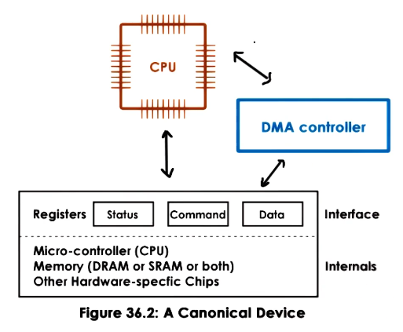

---
aliases:
  - DMA
  - direct memory access
checked: false
created: 2024-08-26
draft: false
last_edited: 2024-08-26
tags:
  - OS
  - computer-science
type: definition
---
>[!tldr] Direct memory access (DMA)
>Direct memory access instead of [[Programmed IO (PIO)]] uses a DMA controller to write data into and out of devices. Whilst the [[Central processing unit (CPU)|CPU]] still directly accesses the status and command registers.
>
>To utilize the DMA controller the [[Central processing unit (CPU)|CPU]] needs to configure it - which is not a small operation. Therefore for small data transfers it is not worth the operation. Another restriction is that the message to be used by the DMA controller needs to be kept in physical memory whilst the transfer happens.

