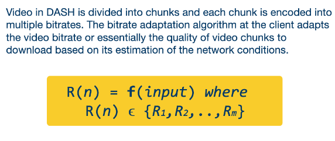

---
aliases:
  - Dynamic Adaptive Streaming over HTTP
  - DASH
checked: false
created: 2024-07-27
draft: false
last_edited: 2024-07-27
tags:
  - networks
type: definition
---
>[!tldr] Dynamic Adaptive Streaming over HTTP (DASH)
>This is a technique to implement [[Bitrate adaption|bitrate adaption]]. This has multiple implementations such as [[HTTP Live Streaming (HLS)]] or [[MPEG-DASH]]. These implementations differ in detail such as the encoding algorithms, segment sizes, DRM support, bitrate adaptation algorithms, etc.
>
>Here videos are cut into chunk and each chunk it encoded at different [[Bitrate|bitrates]]. Each time the some video is downloaded it calls the [[Bitrate adaption|bitrate adaption]] function $f$ to determine the [[Bitrate|bitrate]].
>
>
>
>Where $\{R_1, R_2, \ldots, R_m\}$ is the set of [[Bitrate|bitrates]].

