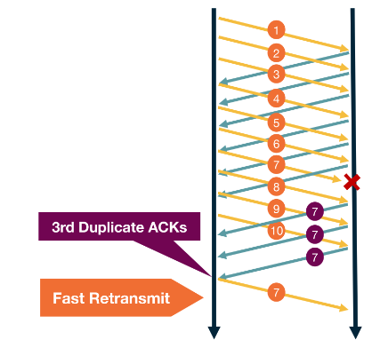

---
aliases:
  - fast retransmit
checked: false
created: 2024-05-27
draft: false
last_edited: 2024-05-27
tags:
  - networks
type: definition
---
>[!tldr] Fast retransmit
>This is a method of handling unacknowledged messages. The keeps sending packages until it sees a package hasn't be acknowledged 3 times. Then it restransmits that message before the timeout.
>

