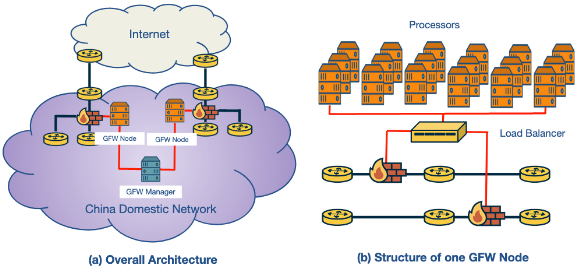

---
aliases:
  - Great Firewall of China
  - GFW
checked: false
created: 2024-07-22
draft: false
last_edited: 2024-07-22
tags:
  - networks
type: definition
---
>[!tldr] Great Firewall of China (GFW)
>China runs a massive firewall that covers the whole of the country. It uses DNS censorship by injecting fake DNS record responses into the network.
>

