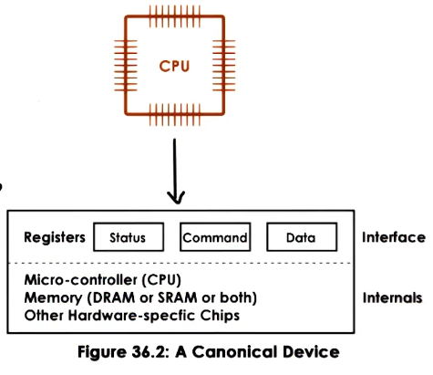

---
aliases:
  - PIO
checked: false
created: 2025-04-09
draft: false
last_edited: 2025-04-09
tags:
  - OS
type: definition
---
>[!tldr] Programmed IO (PIO)
>This is a method of IO access that the [[Operating system (OS)|OS]] can use without an additional hardware support. The [[Central processing unit (CPU)|CPU]] communicates directly with the device by writing to its command or data registers and introspects about the devices state through its status register.
>
