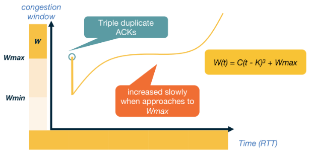

>[!tldr] TCP CUBIC
> In networks with large bandwidth or a long delay [[TCP Reno]] yields low network utilisation. TCP CUBIC is the more efficient implementation used within the linux kernal. 
>CUBIC still uses a reset for a timeout and halves when it gets a triple unacknowledged message. Though this implementation uses two different features to [[TCP Reno]]:
>- A cubic polynomial increase function.
>- Increase is based off the time since the last packet loss instead increasing when it gets an ACK packet.
>
>Let $W$ be the window size, and lets say we are given two constants $C$ and $\beta$. Suppose we get a packet loss when $W$ is at $W_{max}$ and let $t$ be the time since that event. First set $k = \sqrt[3]{\frac{W_{max} \beta}{C}}$ then we set our window size to be
>$$W(t) = C(t - K)^3 + W_{max}.$$
>

