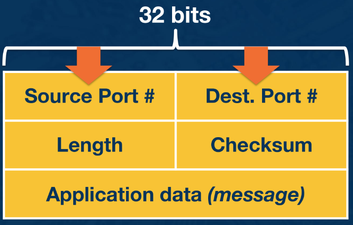

---
aliases:
  - UDP
checked: false
created: 2024-05-22
last_edited: 2024-05-22
draft: false
tags:
  - networks
type: definition
---
>[!tldr] User Datagram Protocol (UDP)
> This is a [[Layer 4 Transport|layer 4]] [[Protocol (networks)|protocol]] that optimises for simplicity over reliability. This is defined it [RFC768](https://datatracker.ietf.org/doc/html/rfc768) The header that gets attached includes:
> - source [[Port|port]],
> - destination [[Port|port]],
> - length of the header, and 
> - [[Checksum|checksum]] of the data.
> 
> This tends to be used in applications that are latency sensitive or have small number of messages to send.

