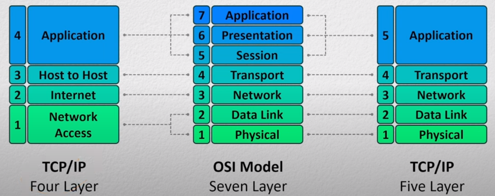

---
aliases:
checked: false
created: 2024-05-23
draft: false
last_edited: 2024-05-23
name: Connection between OSI and IPS models
tags:
  - networks
type: explainer
---
# Connection between [OSI](open_systems_interconnection_(osi)_model.md) and [IPS](internet_protocol_stack_(ips)_5_layers.md) models

The [OSI model](open_systems_interconnection_(osi)_model.md) was originally invented when the main computers where main frames. Making [layer 5](layer_5_session.md) more important however in modern applications the roles and responsibilities of the last 3 layers in the [OSI](open_systems_interconnection_(osi)_model.md) get very mixed and end up being combined into one in other. Some applications might not implement some of them.

For example [HTTP](hyper_text_transfer_protocol_(http).md) uses [cookies](cookies_(web).md) for [layer 5](layer_5_session.md), extended [ASCII](american_standard_code_for_information_interchange_(ascii).md) for [layer 6](layer_6_presentation.md), and keywords for [layer 7](layer_7_application.md). Whereas FTP doesn't have a way to implement [layer 5](layer_5_session.md), uses the same extended [ASCII](american_standard_code_for_information_interchange_(ascii).md) for [layer 6](layer_6_presentation.md) but different commands for [layer 7](layer_7_application.md).

This mix of these layers is normally dependent on the protocol - so normally rolled up into one thing.

