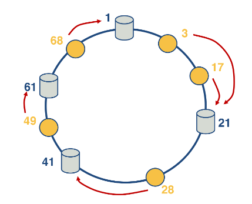
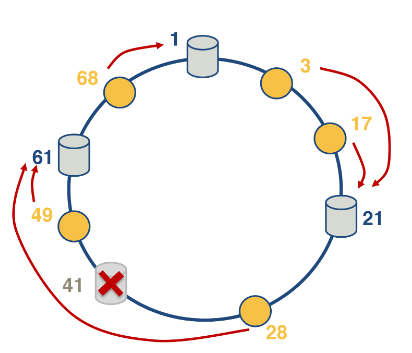

---
aliases:
checked: false
created: 2024-07-27
draft: false
last_edited: 2024-07-27
name: Consistent hashing
tags:
  - computer-science
type: definition
---
>[!tldr] Consistent hashing
>Consistent hashing is a distributed hash table that tends to balance load between multiple servers. In this we will use nodes to mean the hash bins and IDs to mean elements that are being hashed. This is achieved by assigning roughly the same number of IDs to each node and requires little movement when nodes join or leave the hash table.
>To understand the main idea consider a circle where we will allocate the IDs and nodes a number on this circle.
>
>We allocate IDs to nodes if they are the next highest node in the circle (looping back round once we get to the top). Then when a node exits all the IDs just overflow to the next node.
>

