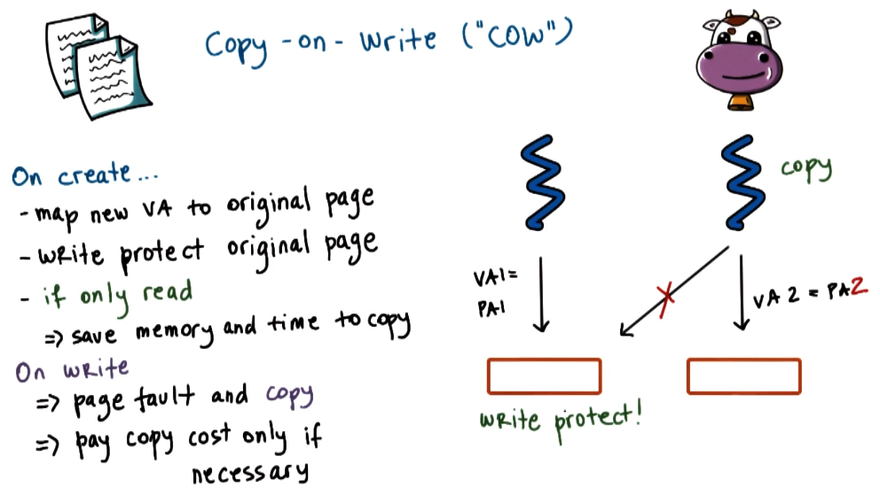

---
aliases:
  - COW
checked: false
created: 2025-03-23
draft: false
last_edited: 2025-03-23
name: Copy on write (COW)
tags:
  - OS
type: definition
---
>[!tldr] Copy on write (COW)
>If two [processes](process.md) are using the same memory the [operating system](operating_system_(os).md) can let them share access to the same [frame](memory_frame.md). Only needing to copy the data across if a write on the data is initialized by either process. This delays operations from the operating system until they are absolutely necessary.
>
>

