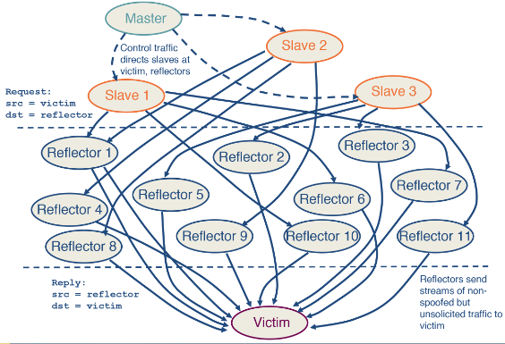

---
aliases:
checked: false
created: 2024-07-21
draft: false
last_edited: 2024-07-21
name: DDoS reflection and amplification
tags:
  - networks
  - security
type: definition
---
>[!tldr] DDoS reflection and amplification
>Instead of attacking your target directly in [DDoS](distributed_denial-of-service_(ddos).md) attack - you can instead find legitimate services that respond to requests (for example when opening a [TCP](transmission_control_protocol_(tcp).md) connection). You can make requests to such services where you [spoof](spoofing.md) the source [IP](internet_protocol_(ip).md) as your target. This has two advantages:
>- It is hard to block as the servers sending the request to the target could be services it relies upon or would need to talk to.
>- The services that could blocks the requests are not the same as the one that is suffering the damage causing a coordination issue.
>

