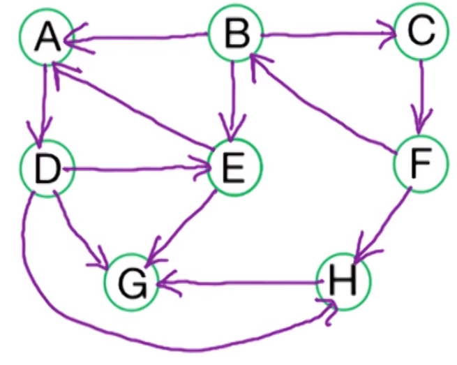
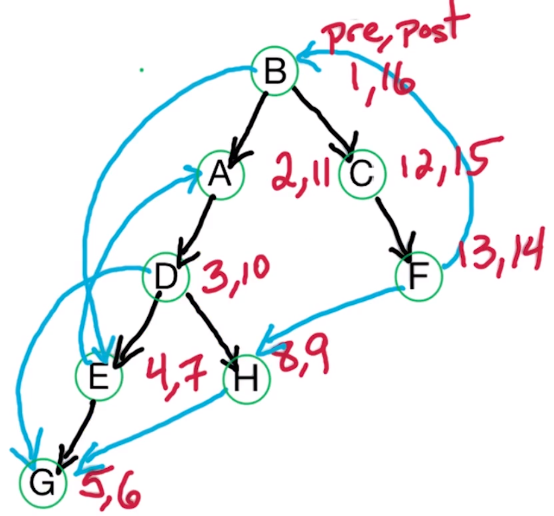

---
aliases:
checked: false
created: 2023-09-29
draft: false
last_edited: 2023-11-11
tags:
  - programming
title: DFS to find path in a directed graph
type: algorithm
---
## Finding paths in a [directed graph](directed_graph.md) via [DFS](depth-first_search_(dfs).md)

To do this we are going to use a [DFS](depth-first_search_(dfs).md) algorithm like [[]] but we are going to track pre/postorder numbers.

```pseudocode
DFS(G)
  input: G = (V,E) in adjacency list representation
  output: Vertices labelled by connected components
    clock = 1
    for all v in V, set visited(v) = False
    for all v in V
      if not visited(v) then
        explore(v)
  return post (defined in Explore)
```

```pseudocode
Explore(z)
  input: vertex z
    pre(z) = clock, clock ++
    visited(z) = True
    for all (z, w) in E
      if not visited(w)
        Explore(w)
	post(z) = clock, clock++
```

### Example

Suppose we have the following graph and let $B$ be the root node. Suppose we explore edges alphabetically and lets run the algorithm above on it.



As we are using [DFS](depth-first_search_(dfs).md) we explore far first and then slowly come back. Which gives us the following [DFS tree](dfs_tree_(algorithm).md) with the pre/post numbers.



| Letter | Pre | Post |
| ------ | --- | ---- |
| A      | 2   | 11   |
| B      | 1   | 16   |
| C      | 12  | 15   |
| D      | 3   | 10   |
| E      | 4   | 7    |
| F      | 13  | 15   |
| G      | 5   | 6    |
| H      | 8   | 9    |
