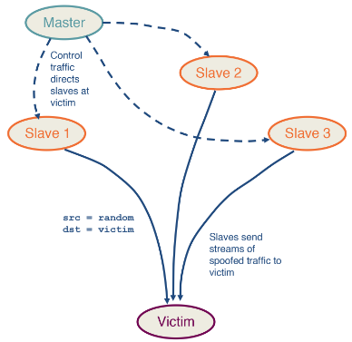

---
aliases:
  - DDoS
checked: false
created: 2024-06-09
draft: false
last_edited: 2024-06-09
tags:
  - networks
  - security
title: Distributed Denial-of-Service (DDoS)
type: definition
---
>[!tldr] Distributed Denial-of-Service (DDoS)
>This is an attack against a service where you flood it with requests that it can not handle. This cause the service to crash denying access to it for other users.
>
>The diagram demonstrates the simplest form of attack but this has many variants such as [Spoofing](spoofing.md) and [DDoS reflection and amplification](ddos_reflection_and_amplification.md).

