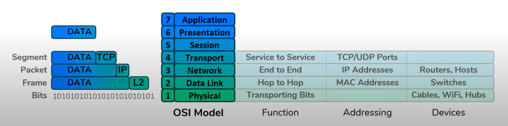

---
aliases:
  - encapsulation
  - de-encapsulation
  - encapsulate
checked: false
created: 2024-05-23
draft: false
last_edited: 2024-05-23
tags: []
title: Encapsulation
type: definition
---
>[!tldr] Encapsulation
>Once an application has generated some data *encapsulation* is the process of wrapping that data with headers so it can traverse through the internet to make it to it's destination.
>
>[Layer 4](layer_4_transport.md) takes the data and adds the source and destination [ports](port.md) to the data to make it a *[segment](segment.md)*.
>
>[Layer 3](layer_3_network.md) takes the [segment](segment.md) and adds a source and destination [Internet Protocol (IPv4)](internet_protocol_(ipv4).md) to make it a *[packet](packets.md)*.
>
>[Layer 2](layer_2_data_link.md) takes the [packet](packets.md) and adds a source and destination [MAC address](mac_address.md) to make it a *[frame](frame_(networks).md)*.
>
>This is moved onto [layer 1](layer_1_physical.md) to be passed along to its destination.
>
>The reverse process is called *de-encapsulation*.
>
>

