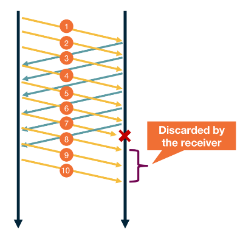

---
aliases:
checked: false
created: 2024-05-27
draft: false
last_edited: 2024-05-27
tags:
  - networks
title: Go back N
type: definition
---
>[!tldr] Go back N
> This is a method of handling unacknowledged messages. When a sequence number is either skipped or timed out the send starts re-sending [segments](segment.md) from the missing number.
> 

