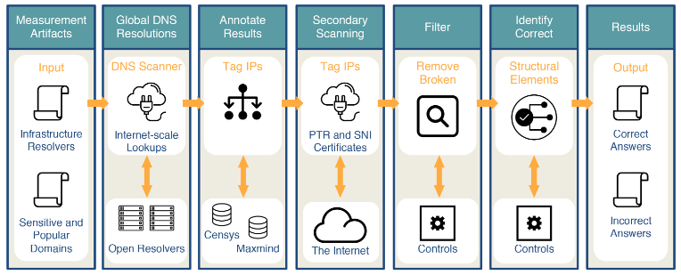

---
aliases:
checked: false
created: 2024-07-23
draft: false
last_edited: 2024-07-23
name: Iris
tags:
  - networks
  - security
type: definition
---
>[!tldr] Iris
>This is a system that detects [DNS censorship](dns_censorship.md). It does this by comparing the responses of open [DNS](domain_name_system_(dns).md) resolvers on the internet. This is done in a multi-step process as shown below.
>
>This first looks for open [DNS](domain_name_system_(dns).md) resolvers that are part of the internet infrastructure (i.e. not home routers that are sometimes open due to misconfiguration).
>1. Scan [IPv4](internet_protocol_(ipv4).md) space for open resolvers.
>2. Identify infrastructure [DNS](domain_name_system_(dns).md) resolvers.
>
>Then we query them all for the same set of domains and compare the responses.
>
>3. Perform global [DNS](domain_name_system_(dns).md) queries - establish a based line using 3 of them within the control of the Iris team.
>4. Annotate [DNS](domain_name_system_(dns).md) responses with auxiliary information to assist classification.
>5. Additional [PTR](dns_records.md) and [TLS](transport_layer_security_(tls).md) scanning - this is to allow inconsistencies due to virtual hosting to be resolved.
>
> After the dataset is gathered we then calculate two types of metrics:
> - **Consistency metrics**: Checking if the same look up in different locations provides different responses for [IP address](internet_protocol_(ip).md), [AS](autonomous_system_(as).md), [HTTP](hyper_text_transfer_protocol_(http).md) content, ect.
> - **Independent verifiable metrics**: These are metrics that use other datasets to verify they are correct such as [HTTPS](hypertext_transfer_protocol_secure_(https).md) certificates.
>
> If both of these metrics are satisfied then the response is considered correct otherwise it is labelled as incorrect.
