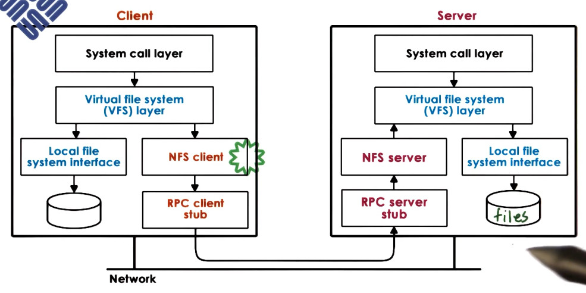

---
aliases:
  - NFS
checked: false
created: 2025-04-13
draft: false
last_edited: 2025-04-13
title: Network file system (NFS)
tags:
  - OS
type: definition
---
>[!tldr] Network file system (NFS)
>This is a [distributed file system](distributed_file_system_(dfs).md) developed by Sun. This uses [Remote Procedure Calls (RPC)](remote_procedure_calls_(rpc).md) to communicate between servers and client. When the client opens a request to a file, it creates a virtual file descriptor which contains details about the server and file. This is used by the client to read/write to the server. If the server dies that descriptor returns an error so the client knows there was an issue with the request.
>

