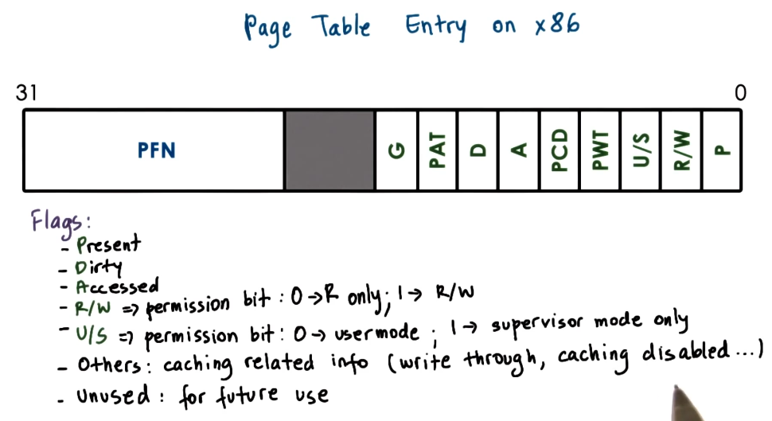

---
aliases:
  - page table entry
checked: false
created: 2025-03-22
draft: false
last_edited: 2025-03-22
title: Page table entry
tags:
  - OS
type: definition
---
>[!tldr] Page table entry
>A *page table entry* is indexed by the [virtual page number](virtual_page_number_(vpn).md) and contains the [physical frame number](physical_frame_number_(pfn).md) which is how the mapping between the two is carried out. However, the entry also contains some other management fields such as:
>- Present: If mapping is still valid or not. As the [frame](memory_frame.md) may have been reclaimed.
>- Dirty: If the [frame](memory_frame.md) has been written too. For example if it represents something on disk we know it still need to be copied down to disk.
>- Access: If the [frame](memory_frame.md) has been accessed by the [process](process.md) for read or write operations.
>- Protection: If the [process](process.md) has read/write/execute permissions on the memory.
>
>Though these differ by architecture. See below for a particular example.
>

