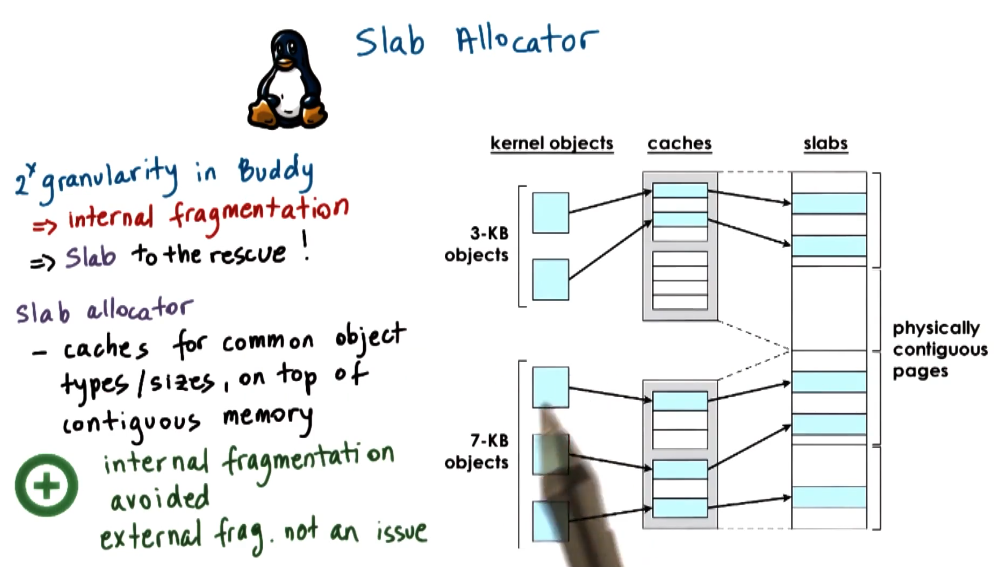

---
aliases:
checked: false
created: 2025-03-23
draft: false
last_edited: 2025-03-23
title: Slab allocator
tags:
  - OS
type: definition
---
>[!tldr] Slab allocator
>The *slab allocator* is a [memory allocator](memory_allocator.md) used in the [linux](linux.md) kernel to efficiently allocate and reuse small, fixed-size objects (e.g., process descriptors, file system inodes).
>
>**How It Works**
>
>1. **Preallocation of Objects**
> - Memory is divided into **large contiguous regions** called **slabs**.
> - Each slab is further divided into **fixed-size chunks**, each designed to hold **a specific type of kernel object** (e.g., task structs, buffers).
>2. **Object Reuse & Caching**
> - Instead of frequently allocating and freeing memory from the general heap, the slab allocator maintains a **cache of preallocated objects**.
> - When a new object is needed, it is taken from an available slot in a slab, avoiding costly memory allocation operations.
>3. **Memory Efficiency**
>- Because objects fit exactly into slab slots, there is no [internal fragmentation](internal_fragmentation.md) or [external fragmentation](external_fragmentation.md).
> - Slabs can be **partially filled**, fully allocated, or completely free. Fully free slabs can be **released back to the system**, reclaiming memory.
>
>**Advantages & Trade-offs**
>
>**Fast allocation & deallocation**: Objects are preallocated and reused.
>**No fragmentation**: Objects fit precisely into preallocated slabs.
>**Efficient for frequently used objects**: Great for kernel structures like inodes, task structs, and buffers.
>**Not ideal for variable-sized allocations**: Works best when objects are of predictable, uniform sizes.
>
>

