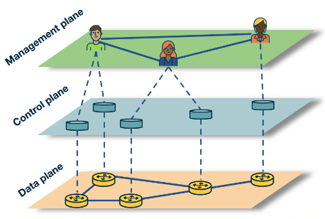

---
aliases:
  - SDN
  - Software defined networks
checked: false
created: 2024-07-19
draft: false
last_edited: 2024-07-19
title: Software defined networks (SDN)
tags:
  - networks
type: definition
---
>[!tldr] Software defined networks (SDN)
>This is a paradigm of networking where you use a remote SDN-controller for the control plane for network devices. This has API's for communicating with the data plane of the controlled devices but also an outward API to talk to a further management plane. This allows for central control over a whole [autonomous system](autonomous_system_(as).md) or [network](network.md).
>

