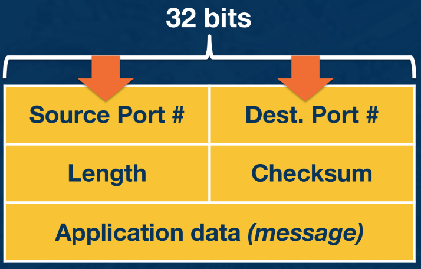

---
aliases:
  - UDP
checked: false
created: 2024-05-22
draft: false
last_edited: 2024-05-22
title: User Datagram Protocol (UDP)
tags:
  - networks
type: definition
---
>[!tldr] User Datagram Protocol (UDP)
> This is a [layer 4](layer_4_transport.md) [protocol](protocol_(networks).md) that optimises for simplicity over reliability. This is defined it [RFC768](https://datatracker.ietf.org/doc/html/rfc768) The header that gets attached includes:
> - source [port](port.md),
> - destination [port](port.md),
> - length of the header, and
> - [checksum](checksum.md) of the data.
> 
> This tends to be used in applications that are latency sensitive or have small number of messages to send.

